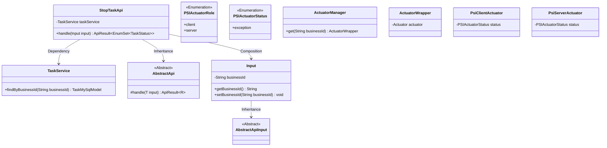

# Basic Information

|      |      |
|------|------|
| Name | StopTaskApi |
| Language | .java |
| Code Path | WeFe/fusion/fusion-service/src/main/java/com/welab/wefe/data/fusion/service/api/task/StopTaskApi.java |
| Package Name | com.welab.wefe.data.fusion.service.api.task |
| Dependencies | ['com.welab.wefe.common.StatusCode.DATA_NOT_FOUND', 'java.util.EnumSet', 'org.springframework.beans.factory.annotation.Autowired', 'com.welab.wefe.common.exception.StatusCodeWithException', 'com.welab.wefe.common.fieldvalidate.annotation.Check', 'com.welab.wefe.common.web.api.base.AbstractApi', 'com.welab.wefe.common.web.api.base.Api', 'com.welab.wefe.common.web.dto.AbstractApiInput', 'com.welab.wefe.common.web.dto.ApiResult', 'com.welab.wefe.data.fusion.service.actuator.rsapsi.AbstractPsiActuator', 'com.welab.wefe.data.fusion.service.actuator.rsapsi.PsiClientActuator', 'com.welab.wefe.data.fusion.service.actuator.rsapsi.PsiServerActuator', 'com.welab.wefe.data.fusion.service.database.entity.TaskMySqlModel', 'com.welab.wefe.data.fusion.service.enums.PSIActuatorRole', 'com.welab.wefe.data.fusion.service.enums.PSIActuatorStatus', 'com.welab.wefe.data.fusion.service.enums.TaskStatus', 'com.welab.wefe.data.fusion.service.manager.ActuatorManager', 'com.welab.wefe.data.fusion.service.service.TaskService'] |
| Brief Description | Pause Task API (requires login), which searches for a task by its ID and changes the executor status to "abnormal," then returns a success result. |

# Description

The code defines a StopTaskApi class for pausing tasks, which inherits from AbstractApi with the endpoint path as task/stop and requires login. The API accepts input parameters containing a task ID, searches for the task via TaskService, and throws an exception if the task doesn't exist. Depending on the task role (client or server), it updates the corresponding PSI executor status to abnormal and logs the event. Successful processing returns an empty result. The Input class includes a mandatory task ID field along with its getter and setter methods.

# Class Summary

| Name   | Type  | Description |
|-------|------|-------------|
| StopTaskApi | class | Pause task API, requires login, searches for the task by task ID, modifies the executor status to abnormal based on the role, and returns a successful result. |

## Class StopTaskApi

|      |      |
|------|------|
| Access Modifier | @Api(path = "task/stop", name = "暂停任务", desc = "暂停任务", login = true);public |
| Type | class |
| Name | StopTaskApi |
| Description | Pause task API, requires login, searches for the task by task ID, modifies the executor status to abnormal based on the role, and returns a successful result. |

### UML Class Diagram

This code implements a task suspension API interface, whose primary function is to locate tasks by ID and modify their actuator status to "exception". The class diagram shows StopTaskApi inheriting from the generic abstract class AbstractApi, containing the nested class Input, and relying on TaskService for task queries. ActuatorManager retrieves actuator instances, while the role type (Client/Server) determines which actuator's status gets modified. The layered design implements input validation logic through inheritance from AbstractApiInput.

### Internal Method Call Graph

This code implements a task suspension API interface. The main workflow involves querying a task by businessId, verifying its existence, setting exception status based on the actuator role (client/server), logging, and returning success. The Input subclass encapsulates the required business ID parameter and its validation logic. The flowchart clearly illustrates the complete processing chain from parameter validation to status changes, particularly highlighting branch handling for non-existent tasks and different actuator roles.

### Field List

| Name  | Type  | Description |
|-------|-------|------|
| taskService | TaskService | Automatically inject the TaskService instance. |

### Method List

| Name  | Type  | Description |
|-------|-------|------|
| handle | ApiResult<EnumSet<TaskStatus>> | The method processes the input and checks whether the task exists. If the task role is a client, it sets the executor status to abnormal; otherwise, it sets the server-side executor status to abnormal. Finally, it returns a successful result. |

