# Basic Information

|      |      |
|------|------|
| Name | TaskStatusApi |
| Language | .java |
| Code Path | WeFe/fusion/fusion-service/src/main/java/com/welab/wefe/data/fusion/service/api/task/TaskStatusApi.java |
| Package Name | com.welab.wefe.data.fusion.service.api.task |
| Dependencies | ['com.welab.wefe.common.exception.StatusCodeWithException', 'com.welab.wefe.common.web.api.base.AbstractApi', 'com.welab.wefe.common.web.api.base.Api', 'com.welab.wefe.common.web.dto.AbstractApiInput', 'com.welab.wefe.common.web.dto.ApiResult', 'com.welab.wefe.data.fusion.service.enums.TaskStatus', 'java.util.EnumSet'] |
| Brief Description | Task Status API class, requires login for access, returns all task status enumeration values. No input parameters required, output is an enumeration collection. |

# Description

The code defines an API class named `TaskStatusApi` for handling task status-related requests. This class inherits from `AbstractApi`, specifies the path as `"task/status"`, the name as `"Task Status"`, the description as `"Task Status"`, and requires login authentication. The input parameter is of type `Input`, and the output is of type `EnumSet<TaskStatus>`. The `handle` method returns a collection of all `TaskStatus` enumeration values. The `Input` class inherits from `AbstractApiInput` and does not define any additional fields. The overall functionality of this API is to retrieve all supported task status enumeration values in the system.

# Class Summary

| Name   | Type  | Description |
|-------|------|-------------|
| TaskStatusApi | class | Task Status API, requires login, returns all task status enumeration values. No input parameters, output is EnumSet<TaskStatus>. |


## Class TaskStatusApi

|      |      |
|------|------|
| Access Modifier | @Api(path = "task/status", name = "任务状态", desc = "任务状态", login = true);public |
| Type | class |
| Name | TaskStatusApi |
| Description | Task Status API, requires login, returns all task status enumeration values. No input parameters, output is EnumSet<TaskStatus>. |


### UML Class Diagram

```mermaid
classDiagram
    class AbstractApi~T, R~ {
        <<abstract>>
        +handle(T input) ApiResult~R~
    }

    class TaskStatusApi {
        +handle(Input input) ApiResult~EnumSet~TaskStatus~~
    }

    class AbstractApiInput {
        <<abstract>>
    }

    class Input {
    }

    class ApiResult~T~ {
    }

    class TaskStatus {
        <<enumeration>>
    }

    AbstractApi <|-- TaskStatusApi
    AbstractApiInput <|-- Input
    TaskStatusApi --> Input : uses
    TaskStatusApi --> ApiResult~EnumSet~TaskStatus~~ : returns
    TaskStatusApi --> TaskStatus : depends on
```

Class Diagram Description: The diagram illustrates the class structure of a task status API, where TaskStatusApi inherits from the generic abstract class AbstractApi, processes Input parameters, and returns an ApiResult containing an EnumSet of TaskStatus. Input is a subclass of AbstractApiInput, used to encapsulate input parameters. The design demonstrates clear hierarchical relationships and type-safe data processing flow, with generics ensuring API flexibility and type constraints.


### Internal Method Call Graph

```mermaid
graph TD
    A["Class TaskStatusApi"]
    B["Annotation: @Api"]
    C["Parent Class: AbstractApi<Input, EnumSet<TaskStatus>>"]
    D["Method: handle(Input input)"]
    E["Create EnumSet: EnumSet.allOf(TaskStatus.class)"]
    F["Return Result: success(statuses)"]
    G["Nested Class: Input"]
    H["Parent Class: AbstractApiInput"]

    A --> B
    A --> C
    A --> D
    D --> E
    D --> F
    A --> G
    G --> H
```



This flowchart illustrates the structure of the TaskStatusApi class and its key components. The class is defined with the @Api annotation for API metadata, inherits from the AbstractApi parent class, and implements the handle method to process input. Internally, the handle method uses EnumSet.allOf to retrieve all task status enum values and returns the result via the success method. The nested Input class, which inherits from AbstractApiInput, defines the API's input parameter structure. The overall flow clearly demonstrates the data processing path from request handling to result return.

### Field List

| Name  | Type  | Description |
|-------|-------|------|

### Method List

| Name  | Type  | Description |
|-------|-------|------|
| handle | ApiResult<EnumSet<TaskStatus>> | Override the method `handle`, returning an `ApiResult` containing all `TaskStatus` enum values, and returning the `statuses` collection upon success. |


