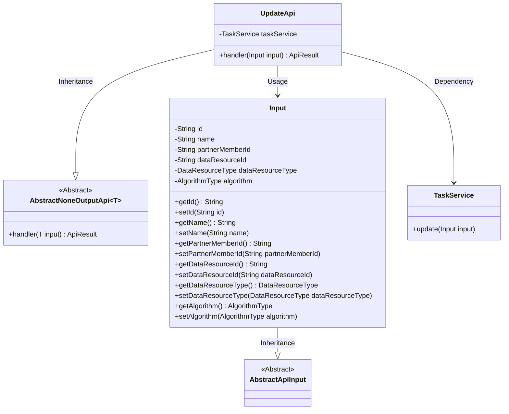

# Basic Information

|      |      |
|------|------|
| Name | UpdateApi |
| Language | .java |
| Code Path | WeFe/fusion/fusion-service/src/main/java/com/welab/wefe/data/fusion/service/api/task/UpdateApi.java |
| Package Name | com.welab.wefe.data.fusion.service.api.task |
| Dependencies | ['com.welab.wefe.common.exception.StatusCodeWithException', 'com.welab.wefe.common.fieldvalidate.annotation.Check', 'com.welab.wefe.common.web.api.base.AbstractNoneOutputApi', 'com.welab.wefe.common.web.api.base.Api', 'com.welab.wefe.common.web.dto.AbstractApiInput', 'com.welab.wefe.common.web.dto.ApiResult', 'com.welab.wefe.data.fusion.service.enums.AlgorithmType', 'com.welab.wefe.data.fusion.service.enums.DataResourceType', 'com.welab.wefe.data.fusion.service.service.TaskService', 'org.springframework.beans.factory.annotation.Autowired'] |
| Brief Description | This is an API class for modifying alignment tasks, requiring login, with mandatory fields including task ID, name, partner ID, data resource ID, and type. The default algorithm is RSA_PSI. |

# Description

This is an API class for modifying alignment tasks, with the path "task/update" and requiring login for access. The API inherits from AbstractNoneOutputApi, and its input parameters are defined by the internal class Input. Input includes mandatory or optional fields such as task ID, name, partner ID, data resource ID, data resource type, and algorithm type, which are validated through annotations. The API processing logic invokes the update method of taskService to modify the task and returns the result upon success.

# Class Summary

| Name   | Type  | Description |
|-------|------|-------------|
| UpdateApi | class | This is an API class for modifying alignment tasks, requiring login, with mandatory fields including task ID, name, partner ID, data resource ID, and type. The default algorithm is RSA_PSI. |

## Class UpdateApi

|      |      |
|------|------|
| Access Modifier | @Api(path = "task/update", name = "修改对齐任务", desc = "修改对齐任务", login = true);public |
| Type | class |
| Name | UpdateApi |
| Description | This is an API class for modifying alignment tasks, requiring login, with mandatory fields including task ID, name, partner ID, data resource ID, and type. The default algorithm is RSA_PSI. |

### UML Class Diagram

This code demonstrates the implementation structure of a task update API. UpdateApi inherits from the generic AbstractNoneOutputApi class, uses Input as the parameter type, and executes the actual update operation through TaskService. The Input class contains multiple validated fields including task ID, name, partner ID, etc., and provides complete getter/setter methods. The class diagram clearly shows inheritance and dependency relationships between classes, with UpdateApi serving as the core class to coordinate input processing and task update service invocation.

### Internal Method Call Graph

```mermaid
graph TD
    A["Class UpdateApi"]
    B["Annotation: @Api"]
    C["Inheritance: AbstractNoneOutputApi<Input>"]
    D["Dependency Injection: @Autowired TaskService"]
    E["Overridden Method: handler(Input input)"]
    F["Inner Class: Input"]
    G["Field: String id"]
    H["Field: String name"]
    I["Field: String partnerMemberId"]
    J["Field: String dataResourceId"]
    K["Field: DataResourceType dataResourceType"]
    L["Field: AlgorithmType algorithm"]
    M["Method: getter/setter"]
    N["Invocation: taskService.update(input)"]
    O["Return: ApiResult.success()"]

    A --> B
    A --> C
    A --> D
    A --> E
    A --> F
    F --> G
    F --> H
    F --> I
    F --> J
    F --> K
    F --> L
    F --> M
    E --> N
    E --> O
```

This flowchart illustrates the structure of the UpdateApi class, which is a REST interface class annotated with @Api and inherits from the AbstractNoneOutputApi template class. The core is the handler method that executes update operations through TaskService and returns a success result. The Input inner class contains 6 fields with validation annotations and corresponding getter/setter methods, used to receive task modification parameters from the frontend. The overall design follows layered architecture and dependency injection principles.

### Field List

| Name  | Type  | Description |
|-------|-------|------|
| taskService | TaskService | Automatically inject the TaskService instance. |

### Method List

| Name  | Type  | Description |
|-------|-------|------|
| handler | ApiResult | Override method processes input, invokes task service for updates, and returns successful results, potentially throwing status code exceptions. |

