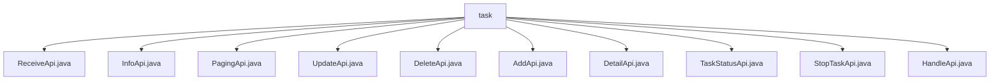

# Basic Information

|      |      |
|------|------|
| Name | task |
| Language | .java |
| Code Path | WeFe/fusion/fusion-service/src/main/java/com/welab/wefe/data/fusion/service/api/task |
| Package Name | docs.fusion.fusion-service.src.main.java.com.welab.wefe.data.fusion.service.api.task |
| Brief Description | ReceiveApi receives alignment requests, path task/receive, requires signature. InfoApi retrieves task information, path task/info. PagingApi handles paginated lists, path task/paging. UpdateApi modifies tasks, path task/update. DeleteApi deletes tasks, path task/delete. AddApi adds tasks, path task/add. DetailApi queries details, path task/detail. TaskStatusApi fetches status enums, path task/status. StopTaskApi pauses tasks, path task/stop. HandleApi processes tasks, path task/handle. |

# Description

## Overview  
This module serves as the core API component of the task management system, primarily responsible for CRUD operations and state management of alignment tasks. All APIs inherit from abstract base classes (e.g., `AbstractApi`) and adopt a standardized input-output structure. For instance, `ReceiveApi` handles task reception, `InfoApi` retrieves task details, and `PagingApi` provides paginated queries. Key data structures include `TaskOutput`, the `Input` inner class, and `EnumSet<TaskStatus>`, with business logic implemented via `TaskService`. External dependencies are limited to `TaskService` and `ActuatorManager`. Examples include `AddApi` supporting complex validation logic and `StopTaskApi` enabling task interruption.  

## Core Business Scenarios  
The module supports full lifecycle task management, including creation (`AddApi`), querying (`DetailApi`/`InfoApi`), updates (`UpdateApi`), deletion (`DeleteApi`), and state control (`StopTaskApi`). The interaction model resembles RESTful design, such as `PagingApi` for paginated queries and `TaskStatusApi` for enumerated state sets. Typical use cases include: submitting alignment requests via `ReceiveApi` during multi-party collaboration and processing data resources using `HandleApi`. All APIs validate inputs through annotations—e.g., `businessId` as mandatory, `description` limited to 1024 characters—mirroring form validation mechanisms.

### Package Internal Structure View

This flowchart illustrates the hierarchical relationships of 11 API interface files under the `task` directory. All Java files are directly subordinate to the `task` node, encompassing core functional interfaces such as receiving, information, pagination, updating, deletion, addition, details, task status, task termination, and handling, forming a flat structure. Each file represents a distinct business operation endpoint, collectively constituting the complete API set for the task management module.

# File List

| Name   | Type  | Description |
|-------|------|-------------|
| [ReceiveApi.java](ReceiveApi.md) | file | API for receiving alignment requests requires parameters such as businessId, task name, partner member ID, data volume, alignment role, algorithm, and description. The request is then processed by invoking taskService. |
| [InfoApi.java](InfoApi.md) | file | Task Information API class, retrieves task information via businessId. The input must include the mandatory field taskId. |
| [PagingApi.java](PagingApi.md) | file | Task pagination query API, which accepts business ID, status, and role parameters, and returns a paginated task list. |
| [UpdateApi.java](UpdateApi.md) | file | This is an API class for modifying alignment tasks, requiring login, with mandatory fields including task ID, name, partner ID, data resource ID, and type. The default algorithm is RSA_PSI. |
| [DeleteApi.java](DeleteApi.md) | file | Delete the partner's API interface, login required, call taskService to delete the partner with the specified ID, and return an empty result upon success. The input parameter is a mandatory ID string. |
| [AddApi.java](AddApi.md) | file | Add an API interface for alignment tasks, including parameters such as task name, description, partner member ID, data resource ID, etc., and perform parameter validation. |
| [DetailApi.java](DetailApi.md) | file | Task Details API class, which queries task details by taskId, inherits from the abstract API class, uses TaskService to process requests, and returns the task output results. |
| [TaskStatusApi.java](TaskStatusApi.md) | file | Task Status API class, requires login for access, returns all task status enumeration values. No input parameters, output is an enumeration collection. |
| [StopTaskApi.java](StopTaskApi.md) | file | Suspend Task API (requires login): Locates a task by its ID and updates its executor status to "abnormal," then returns a success result. |
| [HandleApi.java](HandleApi.md) | file | Task Processing API class, which receives parameters such as task ID, data resource ID, type, sample size, etc., validates primary keys and traceability fields, and then invokes the task service for processing. |

