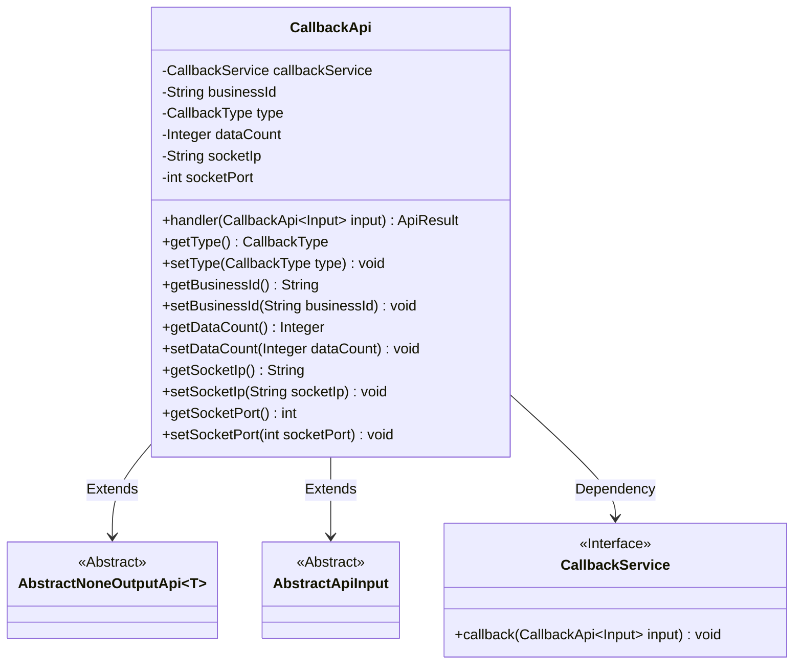

# Basic Information

|      |      |
|------|------|
| Name | CallbackApi |
| Language | .java |
| Code Path | WeFe/fusion/fusion-service/src/main/java/com/welab/wefe/data/fusion/service/api/thirdparty/CallbackApi.java |
| Package Name | com.welab.wefe.data.fusion.service.api.thirdparty |
| Dependencies | ['com.welab.wefe.common.exception.StatusCodeWithException', 'com.welab.wefe.common.fieldvalidate.annotation.Check', 'com.welab.wefe.common.web.api.base.AbstractNoneOutputApi', 'com.welab.wefe.common.web.api.base.Api', 'com.welab.wefe.common.web.dto.AbstractApiInput', 'com.welab.wefe.common.web.dto.ApiResult', 'com.welab.wefe.data.fusion.service.enums.CallbackType', 'com.welab.wefe.data.fusion.service.service.CallbackService', 'org.springframework.beans.factory.annotation.Autowired'] |
| Brief Description | Receive message interface, requires businessId and message type, with optional parameters for data volume, IP, and port. Calls CallbackService to process input and returns success. |

# Description

This is a third-party callback interface class named CallbackApi, located at thirdparty/callback, which allows signature-based access. It inherits from AbstractNoneOutputApi and uses CallbackService to process input data. The input class Input includes required fields businessId and CallbackType, as well as optional fields dataCount, socketIp, and socketPort. The handler method invokes callbackService to process the input and returns a successful result. All fields have corresponding getter and setter methods.

# Class Summary

| Name   | Type  | Description |
|-------|------|-------------|
| CallbackApi | class | Message receiving interface class, path thirdparty/callback, requires signature authentication. Input includes fields such as businessId and message type, invokes callbackService for processing. |

## Class CallbackApi

|      |      |
|------|------|
| Access Modifier | @Api(path = "thirdparty/callback", name = "接收消息接口", allowAccessWithSign = true);public |
| Type | class |
| Name | CallbackApi |
| Description | Message receiving interface class, path thirdparty/callback, requires signature authentication. Input includes fields such as businessId and message type, invokes callbackService for processing. |

### UML Class Diagram

This class diagram illustrates the core structure of a callback interface system. CallbackApi inherits from the generic abstract class AbstractNoneOutputApi, handling requests with input type as nested class Input. The Input class extends AbstractApiInput and contains five fields with validation annotations. CallbackApi utilizes the CallbackService interface through dependency injection to implement callback logic, demonstrating clear hierarchical structure and dependency relationships.

### Internal Method Call Graph

```mermaid
graph TD
    A["Class CallbackApi"]
    B["Annotation: @Api"]
    C["Inheritance: AbstractNoneOutputApi<Input>"]
    D["Dependency Injection: @Autowired CallbackService"]
    E["Overridden Method: handler(Input input)"]
    F["Invocation: callbackService.callback(input)"]
    G["Return: success()"]
    H["Nested Class Input"]
    I["Inheritance: AbstractApiInput"]
    J["Fields: businessId, type, dataCount, socketIp, socketPort"]
    K["Validation Annotations: @Check"]
    L["Getter/Setter Methods"]

    A --> B
    A --> C
    A --> D
    A --> E
    E --> F
    F --> G
    A --> H
    H --> I
    H --> J
    J --> K
    J --> L
```

This flowchart illustrates the core structure of the CallbackApi class, including API annotations, service injection, and request processing flow. The nested Input class inherits from AbstractApiInput and contains five fields with validation annotations along with their accessor methods. The main class invokes the callback service through the handler method and returns a success result, demonstrating a typical API controller pattern.

### Field List

| Name  | Type  | Description |
|-------|-------|------|
| callbackService | CallbackService | Automatically inject callback service instances. |

### Method List

| Name  | Type  | Description |
|-------|-------|------|
| handler | ApiResult | This is a Java method that overrides the parent class's handler method, invokes the callbackService to process the input parameter 'input', and returns an ApiResult upon success. |

