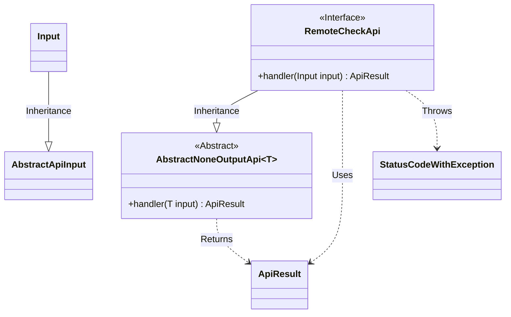

# Basic Information

|      |      |
|------|------|
| Name | RemoteCheckApi |
| Language | .java |
| Code Path | WeFe/fusion/fusion-service/src/main/java/com/welab/wefe/data/fusion/service/api/thirdparty/RemoteCheckApi.java |
| Package Name | com.welab.wefe.data.fusion.service.api.thirdparty |
| Dependencies | ['com.welab.wefe.common.exception.StatusCodeWithException', 'com.welab.wefe.common.web.api.base.AbstractNoneOutputApi', 'com.welab.wefe.common.web.api.base.Api', 'com.welab.wefe.common.web.dto.AbstractApiInput', 'com.welab.wefe.common.web.dto.ApiResult'] |
| Brief Description | Remote Check API, path third_party/remote/check, tests service status, allows signed access, no output, input is empty. |

# Description

The code defines an API class named RemoteCheckApi for testing service status. It inherits from AbstractNoneOutputApi, with the generic parameter being the inner class Input. The API path is third_party/remote/check, allowing access with a signature. The class contains a handler method that returns a successful result. The Input class inherits from AbstractApiInput without defining additional fields. The entire API design is concise and solely intended for status detection functionality.

# Class Summary

| Name   | Type  | Description |
|-------|------|-------------|
| RemoteCheckApi | class | This is an API for testing service status, with the path "third_party/remote/check", allowing signed access and having no output parameters. |

## Class RemoteCheckApi

|      |      |
|------|------|
| Access Modifier | @Api(path = "third_party/remote/check", name = "测试服务状态", desc = "测试服务状态", allowAccessWithSign = true);public |
| Type | class |
| Name | RemoteCheckApi |
| Description | This is an API for testing service status, with the path "third_party/remote/check", allowing signed access and having no output parameters. |

### UML Class Diagram

This class diagram illustrates the structural relationships of RemoteCheckApi and its associated classes. RemoteCheckApi inherits from the generic class AbstractNoneOutputApi<Input> and implements the handler method. The Input class inherits from AbstractApiInput and serves as the parameter type for RemoteCheckApi. ApiResult is the return type of the handler method, while StatusCodeWithException represents the potential exception type that may be thrown. The overall structure reflects a fundamental API processing framework, where the abstract base class provides generic handling logic, and concrete API implementations focus on business processing.

### Internal Method Call Graph

```mermaid
graph TD
    A["Class RemoteCheckApi"]
    B["Annotation: @Api"]
    C["Parent Class: AbstractNoneOutputApi<Input>"]
    D["Method: handler(Input input)"]
    E["Nested Class: Input"]
    F["Parent Class: AbstractApiInput"]
    G["Return: ApiResult.success()"]

    A --> B
    A --> C
    A --> D
    A --> E
    E --> F
    D --> G
```

This flowchart illustrates the structure of the RemoteCheckApi class, including class annotations, inheritance relationships, core methods, and nested class definitions. The class is defined with the @Api annotation for interface metadata, inherits from AbstractNoneOutputApi with the Input generic parameter. The handler method processes input parameters and returns a success result, while the Input nested class inherits from AbstractApiInput. The overall structure clearly reflects the encapsulation design pattern of the API interface.

### Field List

| Name  | Type  | Description |
|-------|-------|------|

### Method List

| Name  | Type  | Description |
|-------|-------|------|
| handler | ApiResult | Rewrite the handler method to process input and return a successful result, potentially throwing exceptions. |

