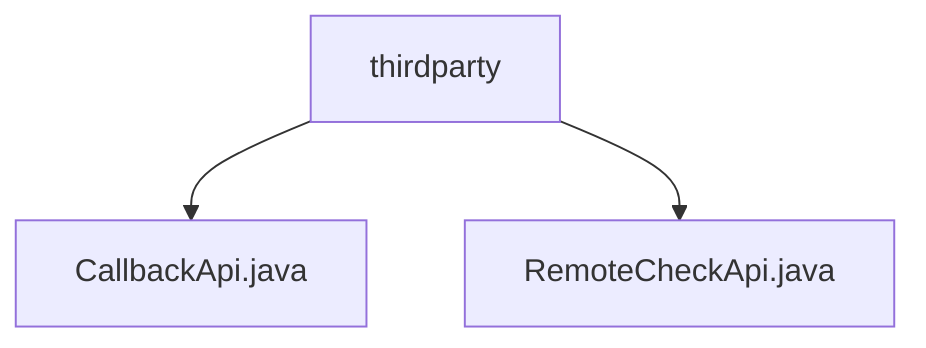

# Basic Information

|      |      |
|------|------|
| Name | thirdparty |
| Language | .java |
| Code Path | WeFe/fusion/fusion-service/src/main/java/com/welab/wefe/data/fusion/service/api/thirdparty |
| Package Name | docs.fusion.fusion-service.src.main.java.com.welab.wefe.data.fusion.service.api.thirdparty |
| Brief Description | CallbackApi is a third-party callback interface class, located at thirdparty/callback, inheriting from AbstractNoneOutputApi, handling inputs with mandatory businessId and CallbackType fields along with optional fields. RemoteCheckApi is used to test service status, located at third_party/remote/check, inheriting from AbstractNoneOutputApi, with no additional input fields required. |

# Description

## Overview  
The core responsibility of this module is to provide third-party service interaction capabilities, including callback notification and remote status detection functionalities. The interface specifications follow a signature-based access mechanism, with all paths prefixed by `thirdparty`. Key data structures include an Input class with a business ID (containing a CallbackType enum) and an empty parameter detection class. Dependencies include the AbstractNoneOutputApi base class and the CallbackService processor. For example, CallbackApi needs to handle socket connection information, while RemoteCheckApi only returns empty responses.  

## Key Business Scenarios  
The module supports two typical interactions: asynchronous callback notifications (similar to a Webhook mechanism) and heartbeat detection. In the business workflow, CallbackApi triggers service processing after receiving business data, while RemoteCheckApi implements a minimal status probe. Integration cases demonstrate the consistent use of JAX-RS-style APIs, such as the signed `third_party/remote/check` path returning 200 to indicate service availability. All interactions inherit from abstract classes to ensure consistency, resembling the foundational channel design in a gateway pattern.

### Package Internal Structure View

This flowchart illustrates two Java files under the thirdparty directory: CallbackApi.java and RemoteCheckApi.java. Both files are directly subordinate to the thirdparty directory without any deeper nesting structure, forming a simple two-level tree relationship.

# File List

| Name   | Type  | Description |
|-------|------|-------------|
| [CallbackApi.java](CallbackApi.md) | file | The message receiving interface requires businessId and message type, with optional parameters including data volume, IP, and port. It invokes the CallbackService to process the input and returns a success response. |
| [RemoteCheckApi.java](RemoteCheckApi.md) | file | Remote Check API, path third_party/remote/check, tests service status, allows signed access, no output, input is empty. |

