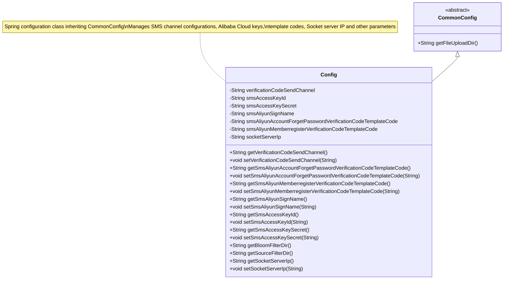

# Basic Information

|      |      |
|------|------|
| Name | Config |
| Language | .java |
| Code Path | WeFe/fusion/fusion-service/src/main/java/com/welab/wefe/data/fusion/service/config/Config.java |
| Package Name | com.welab.wefe.data.fusion.service.config |
| Dependencies | ['com.welab.wefe.common.web.config.CommonConfig', 'org.springframework.beans.factory.annotation.Value', 'org.springframework.boot.context.properties.ConfigurationProperties', 'org.springframework.context.annotation.PropertySource', 'org.springframework.stereotype.Component', 'java.nio.file.Paths'] |
| Brief Description | The Config class inherits from CommonConfig, loads external configuration files via @PropertySource, and contains properties such as SMS verification code sending channels, Alibaba Cloud SMS configurations, and server IPs, providing getter/setter methods. |

# Description

This is a Java configuration class named Config, which extends CommonConfig. The class is marked as a Spring component using the @Component annotation, loads external configuration files via @PropertySource, and supports configuration binding with @ConfigurationProperties. It defines multiple configuration properties, including the SMS verification code sending channel, Alibaba Cloud SMS service's access key ID and secret key, signature name, verification code template codes for password recovery and member registration, as well as the Socket server IP address. Additionally, it provides methods to retrieve the Bloom filter directory and source file filtering directory. All properties are equipped with corresponding getter and setter methods, enabling the reading and modification of property values.

# Class Summary

| Name   | Type  | Description |
|-------|------|-------------|
| Config | class | Java configuration class, extending CommonConfig, loading external configuration files, containing properties such as SMS verification code sending channels, Alibaba Cloud SMS configuration, Socket server IP, and providing getter/setter methods. |

## Class Config

|      |      |
|------|------|
| Access Modifier | @Component;@PropertySource(value = {"file:${config.path}"}, encoding = "utf-8");@ConfigurationProperties;public |
| Type | class |
| Name | Config |
| Description | Java configuration class, extending CommonConfig, loading external configuration files, containing properties such as SMS verification code sending channels, Alibaba Cloud SMS configuration, Socket server IP, and providing getter/setter methods. |

### UML Class Diagram

Class diagram description: The Config class inherits from the abstract CommonConfig class and serves as a Spring configuration class, injecting external configuration parameters via @Value annotations. It primarily manages SMS sending channel selection, Alibaba Cloud SMS service access keys, signature names, verification code template codes for password recovery and member registration, as well as Socket server IP address configurations. The class provides complete getter/setter methods and extends the parent class's file directory handling methods.

### Internal Method Call Graph

This code represents a Spring configuration class named Config, which inherits from CommonConfig. It manages parameters such as SMS verification code sending channels, Alibaba Cloud SMS service configurations, and Socket server IP. The class loads external configuration files via the @PropertySource annotation, injects property values using @Value annotations, and provides a series of getter and setter methods. It also includes two special methods, getBloomFilterDir() and getSourceFilterDir(), for constructing file storage paths. The configuration class is managed by the Spring container through the @Component annotation, facilitating dependency injection for other components.

### Field List

| Name  | Type  | Description |
|-------|-------|------|
| smsAliyunMemberregisterVerificationCodeTemplateCode | String | Alibaba Cloud SMS Service member registration verification code template configuration item, default value xxx. |
| smsAccessKeyId | String | Configuration item: SMS service access key ID, default value xxx. |
| smsAliyunSignName | String | Alibaba Cloud SMS service signature name configuration, default value "xxx". |
| verificationCodeSendChannel | String | The configuration item `verificationCodeSendChannel` has a default value of `sms`, which is used to specify the channel for sending verification codes. |
| smsAccessKeySecret | String | Configuration item: SMS service key, default value xxx. |
| smsAliyunAccountForgetPasswordVerificationCodeTemplateCode | String | Alibaba Cloud SMS service configuration item, used to specify the SMS template code for the forgot password verification code, with a default value of xxx. |
| socketServerIp | String | The code snippet defines a private String variable socketServerIp, whose value is injected from the configuration property socket.server.ip via the @Value annotation. |

### Method List

| Name  | Type  | Description |
|-------|-------|------|
| getSmsAliyunSignName | String | This method returns the signature name of Alibaba Cloud SMS service. |
| getSmsAliyunAccountForgetPasswordVerificationCodeTemplateCode | String | Retrieve the template code for the forgot password verification code in Alibaba Cloud SMS service. |
| getSmsAccessKeyId | String | Method to Obtain SMS Service Access Key ID. |
| getVerificationCodeSendChannel | String | Methods for obtaining verification code delivery channels. |
| getSmsAliyunMemberregisterVerificationCodeTemplateCode | String | How to obtain the Alibaba Cloud SMS service member registration verification code template. |
| setSmsAliyunAccountForgetPasswordVerificationCodeTemplateCode | void | Set the template code for the forgot password verification code in Alibaba Cloud SMS service. |
| setVerificationCodeSendChannel | void | The method for setting the verification code sending channel assigns the parameter value to the class member variable `verificationCodeSendChannel`. |
| setSmsAliyunMemberregisterVerificationCodeTemplateCode | void | Method for setting up Alibaba Cloud SMS member registration verification code template code. |
| setSmsAccessKeySecret | void | Set the access key for SMS service. |
| getBloomFilterDir | String | This method returns the full path string of the "bloom_filter" subdirectory under the file upload directory. |
| setSmsAccessKeyId | void | Method to set the SMS service access key ID. |
| setSmsAliyunSignName | void | Methods for setting up Alibaba Cloud SMS signature names. |
| getSmsAccessKeySecret | String | Method to obtain the SMS service access key, returns the stored key string. |
| getSourceFilterDir | String | The method returns the full path string of the "file" subdirectory under the file upload directory. |
| getSocketServerIp | String | Methods to obtain the socket server IP address, returns the stored IP string. |
| setSocketServerIp | void | Method for setting the socket server IP address. |

