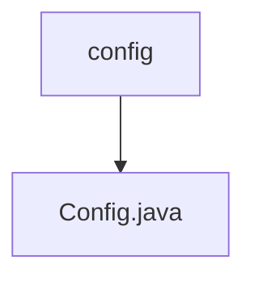

# Basic Information

|      |      |
|------|------|
| Name | config |
| Language | .java |
| Code Path | WeFe/fusion/fusion-service/src/main/java/com/welab/wefe/data/fusion/service/config |
| Package Name | docs.fusion.fusion-service.src.main.java.com.welab.wefe.data.fusion.service.config |
| Brief Description | The Config class inherits from CommonConfig, loads external configuration files via @PropertySource, and contains properties such as SMS verification code sending channels, Alibaba Cloud SMS configurations, and server IPs, providing getter/setter methods. |

# Description

This is a Java configuration class named Config, which extends CommonConfig. The class is annotated with @Component to mark it as a Spring component, loads external configuration files via @PropertySource, and supports configuration binding with @ConfigurationProperties. The class defines multiple configuration properties, including the SMS verification code sending channel, access key ID and secret key for Alibaba Cloud SMS service, signature name, verification code template codes for password recovery and member registration, as well as the Socket server IP address. Additionally, it provides methods to retrieve the Bloom filter directory and source file filtering directory. All properties are equipped with corresponding getter and setter methods, enabling the reading and modification of property values.

### Package Internal Structure View

This flowchart illustrates the configuration directory structure of the fusion-service module in the WeFe project. The root node is the config folder, which contains a Config.java configuration file. This is a typical single-layer Java project configuration structure, where the configuration class is directly stored under the configuration directory without deeper nesting relationships.

# File List

| Name   | Type  | Description |
|-------|------|-------------|
| [Config.java](Config.md) | file | The Config class inherits from CommonConfig, loads external configuration files via @PropertySource, and includes properties such as SMS verification code sending channels, Alibaba Cloud SMS configurations, and server IPs, providing getter/setter methods. |

