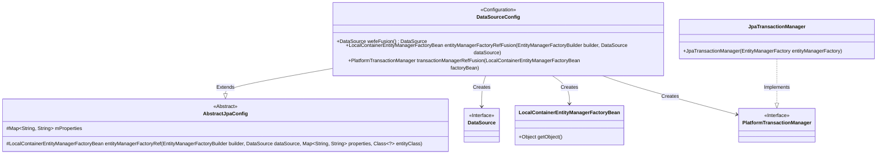
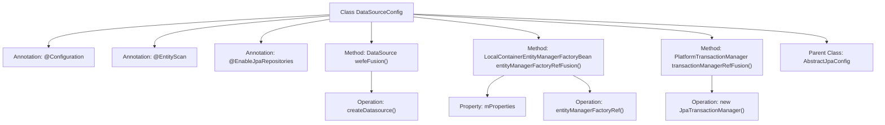

# Basic Information

|      |      |
|------|------|
| Name | DataSourceConfig |
| Language | .java |
| Code Path | WeFe/fusion/fusion-service/src/main/java/com/welab/wefe/data/fusion/service/database/DataSourceConfig.java |
| Package Name | com.welab.wefe.data.fusion.service.database |
| Dependencies | ['com.welab.wefe.common.data.mysql.config.AbstractJpaConfig', 'com.welab.wefe.data.fusion.service.FusionService', 'com.welab.wefe.data.fusion.service.database.repository.base.BaseRepositoryFactoryBean', 'org.springframework.beans.factory.annotation.Qualifier', 'org.springframework.boot.autoconfigure.domain.EntityScan', 'org.springframework.boot.context.properties.ConfigurationProperties', 'org.springframework.boot.orm.jpa.EntityManagerFactoryBuilder', 'org.springframework.boot.orm.jpa.hibernate.SpringImplicitNamingStrategy', 'org.springframework.boot.orm.jpa.hibernate.SpringPhysicalNamingStrategy', 'org.springframework.context.annotation.Bean', 'org.springframework.context.annotation.Configuration', 'org.springframework.context.annotation.Primary', 'org.springframework.data.jpa.repository.config.EnableJpaRepositories', 'org.springframework.orm.jpa.JpaTransactionManager', 'org.springframework.orm.jpa.LocalContainerEntityManagerFactoryBean', 'org.springframework.transaction.PlatformTransactionManager', 'javax.sql.DataSource', 'java.util.Map'] |
| Brief Description | This is a Spring Boot JPA data source configuration class that defines the primary data source "fusion", entity manager factory, and transaction manager, while specifying the entity scanning path and JPA repository configuration. |

# Description

This is a Java configuration class named DataSourceConfig, used to set up data sources and JPA-related configurations. It extends AbstractJpaConfig and is annotated with @Configuration, indicating it's a configuration class. The @EntityScan annotation specifies the entity scanning package path, while @EnableJpaRepositories configures JPA repository-related parameters. The class defines three Beans: the primary data source "fusion", the primary entity manager factory "entityManagerFactoryRefFusion", and the primary transaction manager "transactionManagerRefFusion". The entity manager factory is configured with Hibernate's physical and implicit naming strategies, and the transaction manager is JPA-based. The entire configuration is customized for the package where the FusionService class resides.

# Class Summary

| Name   | Type  | Description |
|-------|------|-------------|
| DataSourceConfig | class | This is a Spring Boot JPA data source configuration class that defines the primary data source, entity manager, and transaction manager, including custom naming strategies and MySQL configuration. |

## Class DataSourceConfig

|      |      |
|------|------|
| Access Modifier | @Configuration;@EntityScan("com.welab.wefe.data.fusion.service");@EnableJpaRepositories(basePackageClasses = FusionService.class,;        repositoryFactoryBeanClass = BaseRepositoryFactoryBean.class,;        entityManagerFactoryRef = "entityManagerFactoryRefFusion",;        transactionManagerRef = "transactionManagerRefFusion");public |
| Type | class |
| Name | DataSourceConfig |
| Description | This is a Spring Boot JPA data source configuration class that defines the primary data source, entity manager, and transaction manager, including custom naming strategies and MySQL configuration. |

### UML Class Diagram

This code demonstrates a Spring Boot JPA data source configuration class DataSourceConfig, which inherits from the AbstractJpaConfig abstract class. Its main functionalities include: 1) Configuring the primary data source via @Bean annotation; 2) Creating an entity manager factory and setting Hibernate naming strategies; 3) Configuring the JPA transaction manager. The class creates instances of DataSource, LocalContainerEntityManagerFactoryBean, and PlatformTransactionManager through multiple @Bean methods, where JpaTransactionManager implements the PlatformTransactionManager interface. The entire configuration class uses @Primary annotation to ensure these beans are injected as primary candidates.

### Internal Method Call Graph

This code represents a Spring Boot JPA data source configuration class, primarily used for configuring entity scanning, repository enabling, and transaction management in multi-data-source environments. The class inherits from AbstractJpaConfig and defines the primary data source (fusion), entity manager factory (entityManagerFactoryRefFusion), and transaction manager (transactionManagerRefFusion) through @Bean annotations. The entityManagerFactoryRefFusion method also configures Hibernate's naming strategy to ensure entity and table naming conforms to specifications. The entire class marks primary data source configurations with @Primary annotation, ensuring correct identification of the default data source in multi-data-source environments.

### Field List

| Name  | Type  | Description |
|-------|-------|------|

### Method List

| Name  | Type  | Description |
|-------|-------|------|
| entityManagerFactoryRefFusion | LocalContainerEntityManagerFactoryBean | Define the primary entity manager factory bean, configure custom naming strategies, and create it using the specified data source and properties. |
| wefeFusion | DataSource | In the Java configuration class, define the primary data source "fusion" using MySQL prefix configuration, and create it through the createDatasource method. |
| transactionManagerRefFusion | PlatformTransactionManager | Define the primary transaction manager, creating a JPA transaction manager using the designated entity manager factory. |

