# Basic Information

|      |      |
|------|------|
| Name | database |
| Language | .java |
| Code Path | WeFe/fusion/fusion-service/src/main/java/com/welab/wefe/data/fusion/service/database |
| Package Name | docs.fusion.fusion-service.src.main.java.com.welab.wefe.data.fusion.service.database |
| Brief Description | A universal repository framework based on Spring Data JPA, providing standardized data access and native SQL extensions, supporting multi-entity CRUD, transactional operations, and complex queries. Includes the MySqlModel series of entities, dependent on Spring Data JPA and Hibernate. Used for data fusion services, covering the entire lifecycle including task management and dataset processing. The configuration class DataSourceConfig sets up data sources and JPA parameters. |

# Description

## Overview  
This module serves as the core persistence layer architecture for data fusion services, implementing multi-business-domain ORM mapping and standardized data access based on Spring Data JPA. Its core responsibilities include: 1) providing a generic repository framework (e.g., BaseRepository supporting native SQL extensions); 2) building the foundational infrastructure for data fusion entities (e.g., AbstractMySqlModel-derived business models). The interface specifications uniformly adopt JPA annotations, such as @Query for conditional statistics and @Modifying for transactional operations. Key data structures encompass business entities like tasks (TaskMySqlModel) and datasets (DataSetMySqlModel), all featuring UUID primary keys and encrypted fields (e.g., GlobalConfigMysqlModel configuration items). External dependencies primarily focus on Spring Data JPA/Hibernate, database encryption components, and UUID generators.  

## Key Business Scenarios  
The module supports full lifecycle management of data fusion, akin to a distributed ETL console. A typical workflow involves: performing CRUD operations via JPA repositories (e.g., PartnerRepository) → combining @Query extended queries (e.g., countByName statistics) → transactional operations (e.g., account status updates). Interaction patterns include: 1) multi-institution collaboration (achieving private set intersection via BloomFilterMySqlModel); 2) task flow control (TaskMySqlModel records algorithm types/execution roles); 3) security auditing (OperationLogMysqlModel tracks operations). Integration cases span from basic configurations (e.g., DataSourceConfig class for multi-data-source setup) to complex business scenarios (e.g., DataSetRepository handling data sources/progress).

### Package Internal Structure View

```mermaid
graph TD
    database --> repository
    database --> entity
    database --> DataSourceConfig.java
    repository --> DataSetRepository.java
    repository --> base
    repository --> DataSourceRepository.java
    repository --> BloomFilterRepository.java
    repository --> OperationLogRepository.java
    repository --> GlobalConfigRepository.java
    repository --> GlobalSettingRepository.java
    repository --> PartnerRepository.java
    repository --> TaskRepository.java
    repository --> FieldInfoRepository.java
    repository --> AccountRepository.java
    repository --> TaskResultRepository.java
    repository --> VerificationCodeRepository.java
    base --> BaseRepositoryFactoryBean.java
    base --> BaseRepositoryImpl.java
    base --> BaseRepository.java
    entity --> AbstractBaseMySqlModel.java
    entity --> TaskMySqlModel.java
    entity --> DataSetMySqlModel.java
    entity --> TaskResultMySqlModel.java
    entity --> GlobalSettingMySqlModel.java
    entity --> DataSetColumnOutputModel.java
    entity --> GlobalConfigMysqlModel.java
    entity --> BloomFilterMySqlModel.java
    entity --> PartnerMySqlModel.java
    entity --> OperationLogMysqlModel.java
    entity --> VerificationCodeMysqlModel.java
    entity --> FieldInfoMySqlModel.java
    entity --> AccountMysqlModel.java
    entity --> DataSourceMySqlModel.java
    entity --> AbstractMySqlModel.java
```

This flowchart illustrates the complete structure of the database module in WeFe's data fusion service. The top level is the database directory, which is divided into three main components: repository, entity, and DataSourceConfig.java. The repository contains multiple concrete repository implementations and base foundational repository components, while the entity includes all database entity model classes. The entire structure clearly reflects the organization of the data access layer, comprising approximately 25 concrete implementation classes.

# File List

| Name   | Type  | Description |
|-------|------|-------------|
| [DataSourceConfig.java](DataSourceConfig.md) | file | This is a Spring Boot JPA data source configuration class that defines the primary data source "fusion", entity manager factory, and transaction manager, while specifying the entity scanning path and JPA repository configuration. |
| [entity](entity/_module.md) | package | AbstractBaseMySqlModel is an abstract base class containing creator/updater fields. TaskMySqlModel describes task information. DataSetMySqlModel stores dataset information. TaskResultMySqlModel records task results. GlobalSettingMySqlModel stores global settings. DataSetColumnOutputModel represents dataset column output. GlobalConfigMysqlModel stores encryption configurations. BloomFilterMySqlModel describes a Bloom filter. PartnerMySqlModel stores partner data. OperationLogMysqlModel records operation logs. VerificationCodeMysqlModel stores verification codes. FieldInfoMySqlModel describes field information. AccountMysqlModel represents an account entity. DataSourceMySqlModel describes a data source. AbstractMySqlModel is a generic parent class containing ID and timestamp fields. |
| [repository](repository/_module.md) | package | Multiple Spring Data JPA repository interfaces inherit from BaseRepository, providing CRUD and custom SQL query capabilities, supporting various entity types such as DataSet, Account, etc. |

