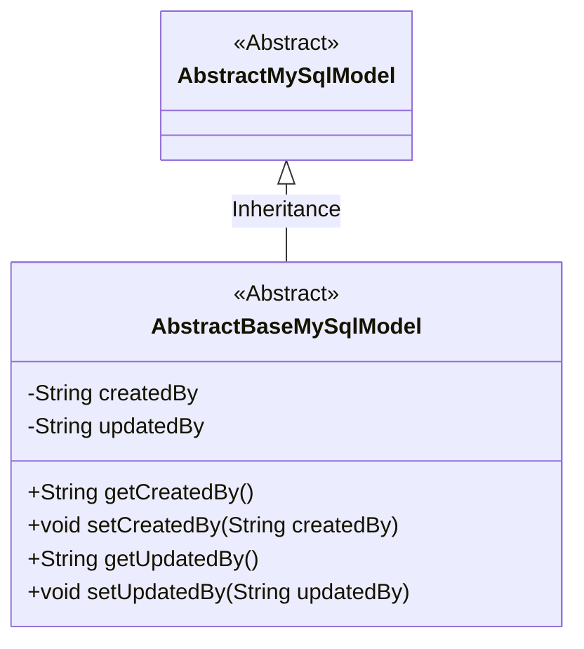
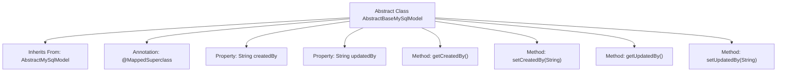

# Basic Information

|      |      |
|------|------|
| Name | AbstractBaseMySqlModel |
| Language | .java |
| Code Path | WeFe/fusion/fusion-service/src/main/java/com/welab/wefe/data/fusion/service/database/entity/AbstractBaseMySqlModel.java |
| Package Name | com.welab.wefe.data.fusion.service.database.entity |
| Dependencies | ['javax.persistence.MappedSuperclass'] |
| Brief Description | The abstract class AbstractBaseMySqlModel extends AbstractMySqlModel and includes creator and updater fields along with their getter/setter methods. |

# Description

This is an abstract class named AbstractBaseMySqlModel, which inherits from AbstractMySqlModel and is annotated with the @MappedSuperclass annotation. The class defines two private string fields: createdBy represents the creator, and updatedBy represents the updater. Public getter and setter methods are provided for these two fields, used to retrieve and set their values, respectively. This class serves as a base model and may be extended by other entity classes.

# Class Summary

| Name   | Type  | Description |
|-------|------|-------------|
| AbstractBaseMySqlModel | class | The abstract class `AbstractBaseMySqlModel` extends `AbstractMySqlModel` and includes creator and updater fields along with their getter/setter methods. |

## Class AbstractBaseMySqlModel

|      |      |
|------|------|
| Access Modifier | @MappedSuperclass;public abstract |
| Type | class |
| Name | AbstractBaseMySqlModel |
| Description | The abstract class `AbstractBaseMySqlModel` extends `AbstractMySqlModel` and includes creator and updater fields along with their getter/setter methods. |

### UML Class Diagram

This class diagram illustrates an inheritance structure of MySQL base model classes. The AbstractBaseMySqlModel, as an abstract class, inherits from AbstractMySqlModel and adds two core fields, createdBy and updatedBy, to track creator and updater information, along with corresponding getter and setter methods. This design pattern embodies the Template Method Pattern, standardizing the data model structure of subclasses through an abstract base class, making it particularly suitable for business scenarios requiring operation audit trails.

### Internal Method Call Graph

This code demonstrates an abstract class named AbstractBaseMySqlModel, which inherits from AbstractMySqlModel and is annotated with @MappedSuperclass. The class contains two String-type properties, createdBy and updatedBy, representing the creator and updater respectively, and provides standard getter and setter methods for these properties. Designed as a base class, it primarily serves to extend other concrete data model classes, offering common functionality for managing creator and updater fields.

### Field List

| Name  | Type  | Description |
|-------|-------|------|
| updatedBy | String | The field updatedBy records the information of the last updater. |
| createdBy | String | Private string type variable, recording creator information. |

### Method List

| Name  | Type  | Description |
|-------|-------|------|
| getCreatedBy | String | Methods to obtain creator information, returning a string-type variable `createdBy`. |
| setCreatedBy | void | Defined a public method setCreatedBy for setting the value of the createdBy property. |
| getUpdatedBy | String | Methods to obtain the information of the updater, returning the value of the updatedBy field. |
| setUpdatedBy | void | Set the updater method to assign the parameter updatedBy to the class member variable updatedBy. |

