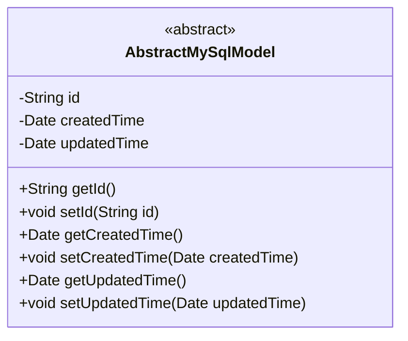
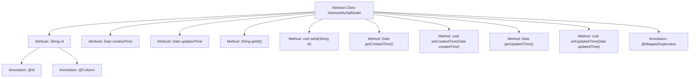

# Basic Information

|      |      |
|------|------|
| Name | AbstractMySqlModel |
| Language | .java |
| Code Path | WeFe/fusion/fusion-service/src/main/java/com/welab/wefe/data/fusion/service/database/entity/AbstractMySqlModel.java |
| Package Name | com.welab.wefe.data.fusion.service.database.entity |
| Dependencies | ['javax.persistence.Column', 'javax.persistence.Id', 'javax.persistence.MappedSuperclass', 'java.io.Serializable', 'java.util.Date', 'java.util.UUID'] |
| Brief Description | Abstract MySQL model base class, including ID (UUID generation), creation time and update time fields along with their corresponding getter/setter methods. |

# Description

This is an abstract base class named AbstractMySqlModel, annotated with @MappedSuperclass and implementing the Serializable interface. The class contains three core fields: id as a non-updatable primary key field, generated using UUID with hyphens removed; createdTime recording the creation time with a default value of the current time; updatedTime recording the update time. The class provides standard getter and setter methods for these three fields to facilitate data access and modification. This design can serve as a universal parent class for MySQL entity classes.

# Class Summary

| Name   | Type  | Description |
|-------|------|-------------|
| AbstractMySqlModel | class | The abstract class `AbstractMySqlModel` defines the base class for MySQL models, including fields such as ID, creation time, and update time, and implements the serialization interface. The ID is automatically generated as a UUID without hyphens, and the creation time defaults to the current time. It provides getter and setter methods for each field. |

## Class AbstractMySqlModel

|      |      |
|------|------|
| Access Modifier | @MappedSuperclass;public abstract |
| Type | class |
| Name | AbstractMySqlModel |
| Description | The abstract class `AbstractMySqlModel` defines the base class for MySQL models, including fields such as ID, creation time, and update time, and implements the serialization interface. The ID is automatically generated as a UUID without hyphens, and the creation time defaults to the current time. It provides getter and setter methods for each field. |

### UML Class Diagram

This code defines an abstract class named `AbstractMySqlModel`, which implements the `Serializable` interface and serves as a base class for MySQL database models. The class contains three private fields: `id` (generated using UUID with hyphens removed), `createdTime` (automatically initialized upon creation), and `updatedTime` (set during updates), along with their corresponding getter and setter methods. The `@MappedSuperclass` annotation indicates that this is a JPA entity base class, and its fields will be inherited by subclasses. This design provides common primary key and audit field management functionality, suitable for persistent entities that require creation/modification timestamps.

### Internal Method Call Graph

This code defines an abstract class named AbstractMySqlModel, which implements the Serializable interface and is marked with the @MappedSuperclass annotation. The class contains three main attributes: id (generated using UUID with hyphens removed), createdTime (creation time), and updatedTime (update time), each with corresponding getter and setter methods. The id attribute is further configured with @Id and @Column annotations. The class is designed to serve as a base class for other entity classes, providing common fields and functionality.

### Field List

| Name  | Type  | Description |
|-------|-------|------|
| createdTime = new Date() | Date | Declare a private Date type variable named createdTime, initialized to the current time. |
| updatedTime | Date | Field updatedTime, type Date, indicates the update time. |
| id = UUID.randomUUID().toString().replaceAll("-", "") | String | Entity class ID field, using UUID to generate unique identifiers with hyphens removed, updates are prohibited. |

### Method List

| Name  | Type  | Description |
|-------|-------|------|
| setUpdatedTime | void | The method `setUpdatedTime` is used to set the `updatedTime` property, with the parameter being of type `Date`. |
| getUpdatedTime | Date | Methods to obtain the update time, returning the updatedTime variable. |
| getCreatedTime | Date | Methods to get the creation time, returns a Date type. |
| setId | void | Methods for setting object ID: Assign the parameter id to the id property of the object. |
| setCreatedTime | void | The method for setting the creation time assigns the parameter to the createdTime property of the object. |
| getId | String | The method getId returns a string-type id value. |

