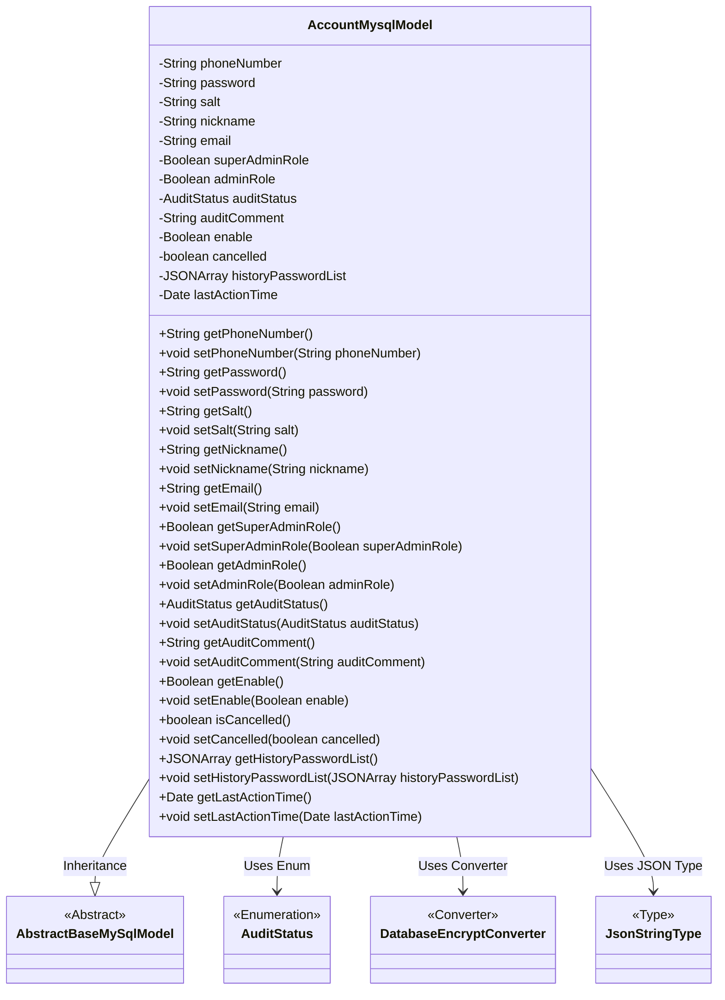

# Basic Information

|      |      |
|------|------|
| Name | AccountMysqlModel |
| Language | .java |
| Code Path | WeFe/fusion/fusion-service/src/main/java/com/welab/wefe/data/fusion/service/database/entity/AccountMysqlModel.java |
| Package Name | com.welab.wefe.data.fusion.service.database.entity |
| Dependencies | ['com.alibaba.fastjson.JSONArray', 'com.vladmihalcea.hibernate.type.json.JsonStringType', 'com.welab.wefe.common.web.util.DatabaseEncryptConverter', 'com.welab.wefe.common.wefe.enums.AuditStatus', 'org.hibernate.annotations.Type', 'org.hibernate.annotations.TypeDef', 'javax.persistence', 'java.util.Date'] |
| Brief Description | The `AccountMysqlModel` class defines the account entity, containing basic information such as phone number, password, nickname, and email, along with attributes like administrator role, review status, and availability. It supports storing historical passwords in JSON format. |

# Description

This is a Java class named AccountMysqlModel, representing an account entity. It inherits from AbstractBaseMySqlModel and is marked as a database entity with the @Entity annotation. The class defines multiple attributes, including encrypted phone number, password, salt value, nickname, email, administrator role identifier, review status and comments, account status, deletion flag, historical password list, and last activity time. Each attribute has corresponding getter and setter methods. The phone number uses an encryption converter, and the historical password list is stored in JSON format.

# Class Summary

| Name   | Type  | Description |
|-------|------|-------------|
| AccountMysqlModel | class | Account entity class, including basic information such as mobile number, password, salt, nickname, email, etc., as well as attributes like administrator role, audit status, historical passwords, and last activity time. |

## Class AccountMysqlModel

|      |      |
|------|------|
| Access Modifier | @Entity(name = "account");@TypeDef(name = "json", typeClass = JsonStringType.class);public |
| Type | class |
| Name | AccountMysqlModel |
| Description | Account entity class, including basic information such as mobile number, password, salt, nickname, email, etc., as well as attributes like administrator role, audit status, historical passwords, and last activity time. |

### UML Class Diagram

This code defines an entity class named `AccountMysqlModel`, which inherits from `AbstractBaseMySqlModel` and represents account information. The class includes multiple private fields such as phone number, password, nickname, etc., along with corresponding getter and setter methods. JPA annotations are used for database mapping, including entity marking, type definitions, and field conversion. The `phoneNumber` field is encrypted and stored via `DatabaseEncryptConverter`, while the `historyPasswordList` field is stored in JSON format using `JsonStringType`. The class also utilizes the `AuditStatus` enumeration to represent audit statuses. The overall design reflects the core data structure and secure storage requirements for account management.

### Internal Method Call Graph

```mermaid
graph TD
    A["Class AccountMysqlModel"]
    B["Annotation: @Entity('account')"]
    C["Annotation: @TypeDef(name='json', typeClass=JsonStringType.class)"]
    D["Inheritance: AbstractBaseMySqlModel"]
    E["Field: @Convert phoneNumber"]
    F["Field: password"]
    G["Field: salt"]
    H["Field: nickname"]
    I["Field: email"]
    J["Field: superAdminRole"]
    K["Field: adminRole"]
    L["Field: @Enumerated auditStatus"]
    M["Field: auditComment"]
    N["Field: enable"]
    O["Field: cancelled"]
    P["Field: @Type('json') historyPasswordList"]
    Q["Field: lastActionTime"]
    R["Method section: getter/setter"]

    A --> B
    A --> C
    A --> D
    A --> E
    A --> F
    A --> G
    A --> H
    A --> I
    A --> J
    A --> K
    A --> L
    A --> M
    A --> N
    A --> O
    A --> P
    A --> Q
    A --> R
```

This code defines a JPA entity class named `AccountMysqlModel`, which maps to the `account` table in the database. The class contains multiple fields such as phone number, password, nickname, etc., and utilizes various annotations to define special handling for fields, such as `@Convert` for encrypting phone numbers and `@Type` for JSON-type field storage. All fields are equipped with standard getter and setter methods for accessing and modifying the properties. The class inherits from `AbstractBaseMySqlModel`, which may include some base fields or methods.

### Field List

| Name  | Type  | Description |
|-------|-------|------|
| lastActionTime | Date | Private date type variable, recording the last operation time. |
| cancelled | boolean | The boolean variable `cancelled` indicates whether it has been canceled. |
| superAdminRole | Boolean | Private boolean variable indicating whether it is a super administrator role. |
| historyPasswordList | JSONArray | The entity class field `historyPasswordList` uses JSON type to store the historical password list, and the database column is defined in JSON format. |
| email | String | Declare a private string variable email. |
| salt | String | The private string variable salt is used to store the encryption salt value. |
| auditComment | String | The private string variable auditComment is used to store audit comments. |
| password | String | private string variable password |
| enable | Boolean | Private boolean variable 'enable', used to control the feature switch. |
| phoneNumber | String | The field phoneNumber uses the DatabaseEncryptConverter class for database encryption conversion. |
| auditStatus | AuditStatus | The enumeration type field `auditStatus` is stored in string format. |
| adminRole | Boolean | Boolean type variable, indicating the status of the administrator role. |
| nickname | String | Declare a private string variable nickname. |

### Method List

| Name  | Type  | Description |
|-------|-------|------|
| setSalt | void | Set the salt attribute of string type. |
| getPhoneNumber | String | Methods to obtain the phone number, returning a string-type phoneNumber. |
| getSuperAdminRole | Boolean | Methods to obtain the super administrator role status, returning a boolean value indicating whether the permission is granted. |
| getEnable | Boolean | Public method to obtain the boolean value of enable. |
| getAuditStatus | AuditStatus | The method to obtain the current audit status returns the value of the auditStatus property. |
| setNickname | void | This is a Java method used to set the nickname property of an object. The method takes a string parameter named nickname and assigns it to the member variable of the same name in the current object. |
| getNickname | String | Methods to obtain the nickname, returns a string-type variable nickname. |
| getPassword | String | Public method to retrieve the password, returns the password as a string type. |
| getSalt | String | Public method to obtain the salt value. |
| isCancelled | boolean | The method isCancelled returns a boolean value cancelled, indicating whether it has been cancelled. |
| setAuditStatus | void | The method to set the audit status assigns the passed-in `auditStatus` to the `auditStatus` field of the current object. |
| setPhoneNumber | void | Method for setting a phone number, assigning the input parameter to the class member variable phoneNumber. |
| setEmail | void | Method for setting the object's email attribute, with the parameter being a string type email. |
| getHistoryPasswordList | JSONArray | The method to retrieve the historical password list returns data in JSONArray format. |
| setHistoryPasswordList | void | The method `setHistoryPasswordList` accepts a JSONArray parameter, which is used to set the historical password list. |
| getLastActionTime | Date | The method returns the last operation time. |
| setLastActionTime | void | The method to set the last action time assigns the parameter `lastActionTime` to the object's property of the same name. |
| getEmail | String | Methods to obtain the email string. |
| setCancelled | void | Public method to set the cancellation status, with a boolean parameter `cancelled` for updating the internal state. |
| setAdminRole | void | Define the method setAdminRole, with the boolean parameter adminRole, to set the adminRole property of the class. |
| setSuperAdminRole | void | Method to set whether a user has the super administrator role. |
| getAuditComment | String | Methods to obtain audit comments, returning the auditComment string. |
| getAdminRole | Boolean | Methods to obtain the administrator role status, returning a boolean value adminRole. |
| setAuditComment | void | This is a Java method used to set the value of the auditComment property. The method takes a string parameter auditComment and assigns it to the class member variable of the same name. |
| setEnable | void | This is a Java method used to set the boolean value of the enable property. The method takes a Boolean parameter and assigns it to the class's member variable enable. |
| setPassword | void | Method for setting password, assigns the input string to the class member variable password. |

