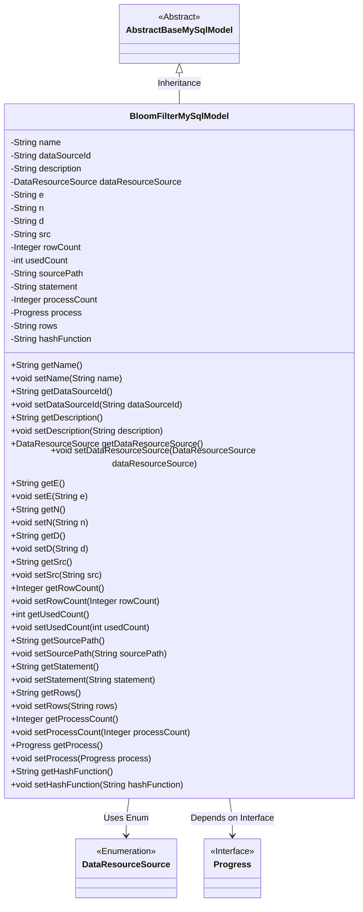

# Basic Information

|      |      |
|------|------|
| Name | BloomFilterMySqlModel |
| Language | .java |
| Code Path | WeFe/fusion/fusion-service/src/main/java/com/welab/wefe/data/fusion/service/database/entity/BloomFilterMySqlModel.java |
| Package Name | com.welab.wefe.data.fusion.service.database.entity |
| Dependencies | ['com.welab.wefe.data.fusion.service.enums.DataResourceSource', 'com.welab.wefe.data.fusion.service.enums.Progress', 'javax.persistence.Entity', 'javax.persistence.EnumType', 'javax.persistence.Enumerated'] |
| Brief Description | The `BloomFilterMySqlModel` class defines the MySQL model for the Bloom filter, including fields such as name, data source ID, description, public-private key parameters, file path, SQL statements, progress status, and their corresponding getter and setter methods. |

# Description

The content defines a Java entity class named `BloomFilterMySqlModel`, which represents the MySQL data model for a Bloom filter. The class includes multiple fields, such as name, data source ID, description, data resource origin, public key exponent `e`, public key modulus `n`, private key exponent `d`, source file address `src`, row count `rowCount`, usage count `usedCount`, file path `sourcePath`, SQL statement `statement`, progress count `processCount`, progress status `process`, selected columns `rows`, and hash function `hashFunction`. Each field has corresponding getter and setter methods for accessing and modifying the field values. The class inherits from `AbstractBaseMySqlModel`, indicating that it is an extension of a base model class.

# Class Summary

| Name   | Type  | Description |
|-------|------|-------------|
| BloomFilterMySqlModel | class | The BloomFilterMySqlModel class includes attributes such as name, data source ID, description, data source, public and private key parameters, source file address, row count, usage count, file path, SQL statement, progress status, selected columns, and hash function. |

## Class BloomFilterMySqlModel

|      |      |
|------|------|
| Access Modifier | @Entity(name = "bloom_filter");public |
| Type | class |
| Name | BloomFilterMySqlModel |
| Description | The BloomFilterMySqlModel class includes attributes such as name, data source ID, description, data source, public and private key parameters, source file address, row count, usage count, file path, SQL statement, progress status, selected columns, and hash function. |

### UML Class Diagram

This class diagram illustrates that BloomFilterMySqlModel inherits from AbstractBaseMySqlModel and contains multiple private fields with corresponding getter/setter methods. The class utilizes the DataResourceSource enumeration type and Progress interface. Its primary functionality is to manage metadata information of Bloom filters, including attributes such as name, data source ID, description, encryption key parameters, file paths, SQL statements, etc. It is used to store and manipulate Bloom filter-related configuration and state information in MySQL databases.

### Internal Method Call Graph

```mermaid
graph TD
    A["Class BloomFilterMySqlModel"]
    B["Inherits: AbstractBaseMySqlModel"]
    C["Annotation: @Entity('bloom_filter')"]
    D["Property: String name"]
    E["Property: String dataSourceId"]
    F["Property: String description"]
    G["Property: DataResourceSource dataResourceSource"]
    H["Property: String e"]
    I["Property: String n"]
    J["Property: String d"]
    K["Property: String src"]
    L["Property: Integer rowCount"]
    M["Property: int usedCount"]
    N["Property: String sourcePath"]
    O["Property: String statement"]
    P["Property: Integer processCount"]
    Q["Property: Progress process"]
    R["Property: String rows"]
    S["Property: String hashFunction"]
    T["Method: getName/setName"]
    U["Method: getDataSourceId/setDataSourceId"]
    V["Method: getDescription/setDescription"]
    W["Method: getDataResourceSource/setDataResourceSource"]
    X["Method: getE/setE"]
    Y["Method: getN/setN"]
    Z["Method: getD/setD"]
    AA["Method: getSrc/setSrc"]
    AB["Method: getRowCount/setRowCount"]
    AC["Method: getUsedCount/setUsedCount"]
    AD["Method: getSourcePath/setSourcePath"]
    AE["Method: getStatement/setStatement"]
    AF["Method: getRows/setRows"]
    AG["Method: getProcessCount/setProcessCount"]
    AH["Method: getProcess/setProcess"]
    AI["Method: getHashFunction/setHashFunction"]

    A --> B
    A --> C
    A --> D
    A --> E
    A --> F
    A --> G
    A --> H
    A --> I
    A --> J
    A --> K
    A --> L
    A --> M
    A --> N
    A --> O
    A --> P
    A --> Q
    A --> R
    A --> S
    A --> T
    A --> U
    A --> V
    A --> W
    A --> X
    A --> Y
    A --> Z
    A --> AA
    A --> AB
    A --> AC
    A --> AD
    A --> AE
    A --> AF
    A --> AG
    A --> AH
    A --> AI
```

This flowchart illustrates the complete structure of the BloomFilterMySqlModel class, including its inheritance relationship, entity annotation, 18 property fields, and corresponding getter/setter methods. This class is a MySQL data model used for storing Bloom filter-related configuration information, containing business attributes such as data source identifiers, cryptographic parameters, file paths, SQL statements, etc. It inherits basic database operation capabilities from AbstractBaseMySqlModel. All properties are equipped with complete access methods, reflecting the standard Java Bean design pattern.

### Field List

| Name  | Type  | Description |
|-------|-------|------|
| description | String | Private string type variable description. |
| n | String | Declare a private string variable n. |
| processCount = 0 | Integer | Define a private integer variable processCount with an initial value of 0. |
| name | String | Private string type variable name |
| sourcePath | String | The private string variable sourcePath is used to store path information. |
| dataResourceSource | DataResourceSource | Use the @Enumerated annotation to store the enum type DataResourceSource as a string in the database. |
| process | Progress | Private progress object `process` |
| src | String | Private string variable src |
| statement | String | Private string variable statement. |
| d | String | Declare a private string variable d. |
| rowCount = 0 | Integer | Declare a private integer variable rowCount with an initial value of 0. |
| rows | String | Declare a private string variable rows. |
| usedCount = 0 | int | The private integer variable usedCount has an initial value of 0. |
| hashFunction | String | The private string variable `hashFunction` is used to store the name of the hash function. |
| dataSourceId | String | Declare a private string variable dataSourceId. |
| e | String | Private string variable e. |

### Method List

| Name  | Type  | Description |
|-------|-------|------|
| setSrc | void | Method for setting source string, which assigns the input parameter to the src member variable of the class. |
| getRows | String | Methods to obtain the rows string. |
| getUsedCount | int | Method returns the number of times used. |
| getStatement | String | Methods to obtain the statement string. |
| setN | void | This is a Java method used to set the value of variable n. The method is named setN, which takes a string parameter n and assigns it to the class member variable this.n. |
| getDataResourceSource | DataResourceSource | This is a Java method that returns an object of type DataResourceSource named dataResourceSource. |
| getN | String | This is a Java method that returns the value of the member variable n of type String. |
| setDataSourceId | void | The method to set the data source ID assigns the input parameter to the class member variable `dataSourceId`. |
| setDataResourceSource | void | This method is used to set the data resource source by assigning the passed DataResourceSource object to the class member variable dataResourceSource. |
| getName | String | The method returns the value of the name variable, which is of string type. |
| setProcessCount | void | Methods for setting the number of processes, with the parameter being of integer type. |
| getSourcePath | String | String methods for obtaining source paths. |
| getD | String | The method getD returns the value of the string-type variable d. |
| setRowCount | void | The method `setRowCount` is used to set the number of rows, with the parameter being an Integer type `rowCount`, which is assigned to the class's member variable `rowCount`. |
| getSrc | String | This is a Java method that returns the value of the member variable `src` of type String. |
| getDescription | String | Public method to retrieve the description information, returns the description value of string type. |
| setStatement | void | Methods for setting the statement content, assigning the input parameters to the class member variable `statement`. |
| getProcess | Progress | Methods to obtain the progress object, returning the process variable. |
| setProcess | void | Methods for setting the progress object, assigning the incoming `process` to the `process` property of the current object. |
| getHashFunction | String | Methods to Obtain Hash Function Names. |
| setHashFunction | void | Java method: Set the hash function, with a parameter of string type, and assign it to the class member variable hashFunction. |
| getDataSourceId | String | This is a Java method that returns the string-type dataSourceId member variable value. |
| getProcessCount | Integer | This is a Java method that returns the value of the integer variable processCount. |
| setSourcePath | void | The method to set the source path assigns the input string to the sourcePath member variable of the class. |
| getRowCount | Integer | Methods to obtain the number of rows, returning the value of the integer variable rowCount. |
| setUsedCount | void | The method to set the number of times used assigns the parameter `usedCount` to the member variable `this.usedCount`. |
| setD | void | Set the value of string d. |
| getE | String | Methods to obtain the value of a string-type variable e. |
| setDescription | void | The method for setting the object description assigns the input string to the description property of the object. |
| setName | void | Methods for setting object names, assigning the parameter `name` to the `name` property of the object. |
| setRows | void | Set the row attribute value of string type. |
| setE | void | This is a Java method used to set the value of the class member variable e. The method is named setE, which takes a string parameter e and assigns it to the e property of the current object. |

