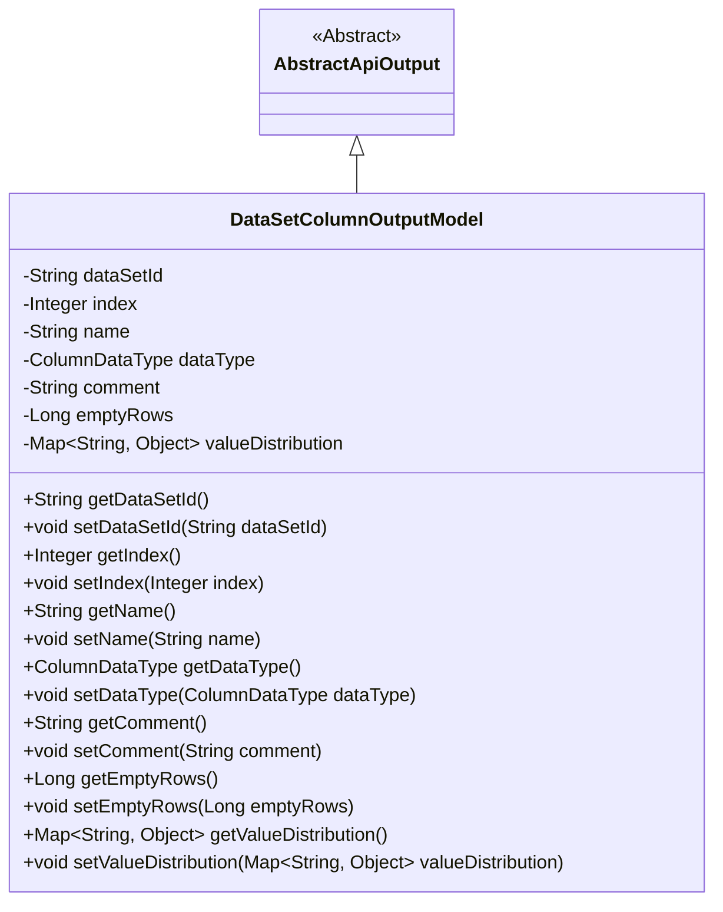

# Basic Information

|      |      |
|------|------|
| Name | DataSetColumnOutputModel |
| Language | .java |
| Code Path | WeFe/fusion/fusion-service/src/main/java/com/welab/wefe/data/fusion/service/database/entity/DataSetColumnOutputModel.java |
| Package Name | com.welab.wefe.data.fusion.service.database.entity |
| Dependencies | ['com.welab.wefe.common.web.dto.AbstractApiOutput', 'com.welab.wefe.common.wefe.enums.ColumnDataType', 'java.util.Map'] |
| Brief Description | Dataset column output model class, containing attributes such as dataset ID, sequence number, field name, data type, comments, number of empty rows, and value distribution, along with corresponding getter/setter methods. |

# Description

The `DataSetColumnOutputModel` class inherits from `AbstractApiOutput` and is used to represent the output model of a dataset column. It includes the following fields: `dataSetId` represents the dataset ID, `index` represents the sequence number, `name` represents the field name, `dataType` represents the data type, `comment` represents the comment, `emptyRows` represents the number of empty data rows, and `valueDistribution` represents the value distribution. Each field has corresponding getter and setter methods.

# Class Summary

| Name   | Type  | Description |
|-------|------|-------------|
| DataSetColumnOutputModel | class | The dataset column output model class includes attributes such as dataset ID, sequence number, field name, data type, comments, number of empty rows, and value distribution, along with their corresponding getter/setter methods. |

## Class DataSetColumnOutputModel

|      |      |
|------|------|
| Access Modifier | public |
| Type | class |
| Name | DataSetColumnOutputModel |
| Description | The dataset column output model class includes attributes such as dataset ID, sequence number, field name, data type, comments, number of empty rows, and value distribution, along with their corresponding getter/setter methods. |

### UML Class Diagram

This code defines a `DataSetColumnOutputModel` class that inherits from the abstract class `AbstractApiOutput`. The class represents an output model for dataset columns, containing attributes such as dataset ID, index, field name, data type, comment, empty row count, and value distribution, along with corresponding getter and setter methods. These attributes are primarily used to describe the metadata and statistical information of dataset columns, facilitating the return of structured column information in APIs.

### Internal Method Call Graph

```mermaid
graph TD
    A["Class DataSetColumnOutputModel"]
    B["Inheritance: AbstractApiOutput"]
    C["Property: String dataSetId"]
    D["Property: Integer index"]
    E["Property: String name"]
    F["Property: ColumnDataType dataType"]
    G["Property: String comment"]
    H["Property: Long emptyRows"]
    I["Property: Map<String,Object> valueDistribution"]
    J["Method: getDataSetId/setDataSetId"]
    K["Method: getIndex/setIndex"]
    L["Method: getName/setName"]
    M["Method: getDataType/setDataType"]
    N["Method: getComment/setComment"]
    O["Method: getEmptyRows/setEmptyRows"]
    P["Method: getValueDistribution/setValueDistribution"]

    A --> B
    A --> C
    A --> D
    A --> E
    A --> F
    A --> G
    A --> H
    A --> I
    A --> J
    A --> K
    A --> L
    A --> M
    A --> N
    A --> O
    A --> P
```

This flowchart illustrates the structure of the DataSetColumnOutputModel class, which inherits from the AbstractApiOutput class and contains 7 private properties with corresponding getter/setter methods. The properties include dataset ID (dataSetId), sequence number (index), field name (name), data type (dataType), comment (comment), empty row count (emptyRows), and value distribution (valueDistribution). Each property has corresponding accessor methods to encapsulate data access logic. The class structure is clear, compliant with JavaBean specifications, and suitable for API data output scenarios.

### Field List

| Name  | Type  | Description |
|-------|-------|------|
| valueDistribution | Map<String, Object> | A mapping that stores key-value pairs, where the key is of string type and the value is of any object type. |
| name | String | Declare a private string variable named name. |
| index | Integer | Private integer variable index |
| dataType | ColumnDataType | The private field `dataType`, of type `ColumnDataType`. |
| emptyRows | Long | Number of blank lines, long integer variable. |
| dataSetId | String | The private string-type variable dataSetId is used to store the dataset ID. |
| comment | String | Private string type variable comment. |

### Method List

| Name  | Type  | Description |
|-------|-------|------|
| getComment | String | The method returns the value of the comment variable, which is of type String. |
| getEmptyRows | Long | Method to obtain the number of blank lines, returns the count of blank lines. |
| setDataType | void | This is a Java method used to set the data type of a column. The method takes a ColumnDataType parameter and assigns it to the dataType member variable of the class. |
| getIndex | Integer | The method returns the value of the integer variable index. |
| setDataSetId | void | Methods for setting the dataset ID, assigning the input parameter to the `dataSetId` member variable of the class. |
| setIndex | void | Methods for setting integer index values. |
| getDataSetId | String | This is a Java method that returns the value of a string variable named dataSetId. |
| setName | void | The method for setting the object name assigns the input parameter `name` to the `name` property of the object. |
| getValueDistribution | Map<String, Object> | Method to obtain value distribution mapping, returns a Map with keys as strings and values as objects. |
| getName | String | Methods to obtain the name, returning the value of the name variable of string type. |
| getDataType | ColumnDataType | Get the data type of the current column. |
| setComment | void | Java Method: Set the comment attribute value to the input parameter. |
| setEmptyRows | void | Method to set the number of empty lines, with the parameter as emptyRows, assigned to the emptyRows property of the current object. |
| setValueDistribution | void | Java method: Set key-value pairs to map to the valueDistribution property of the class. |

