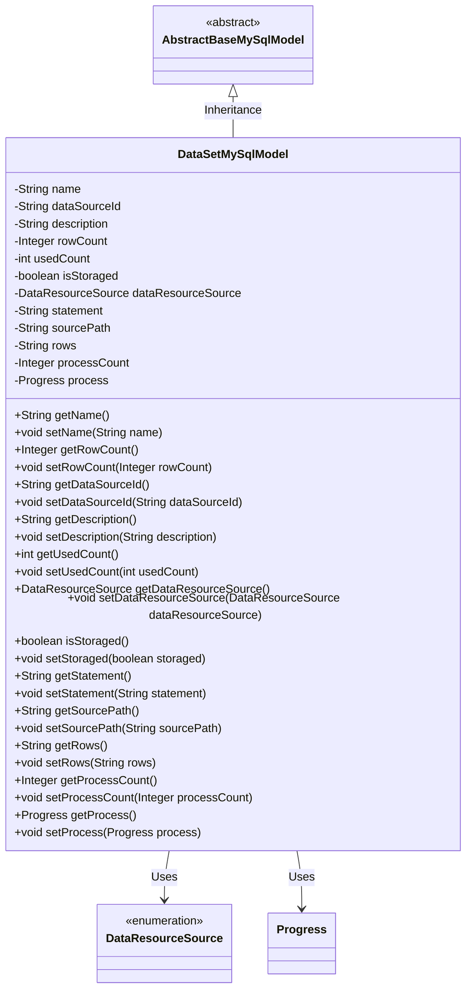

# Basic Information

|      |      |
|------|------|
| Name | DataSetMySqlModel |
| Language | .java |
| Code Path | WeFe/fusion/fusion-service/src/main/java/com/welab/wefe/data/fusion/service/database/entity/DataSetMySqlModel.java |
| Package Name | com.welab.wefe.data.fusion.service.database.entity |
| Dependencies | ['com.welab.wefe.data.fusion.service.enums.DataResourceSource', 'com.welab.wefe.data.fusion.service.enums.Progress', 'javax.persistence.Entity', 'javax.persistence.EnumType', 'javax.persistence.Enumerated'] |
| Brief Description | The `DataSetMySqlModel` class represents a dataset entity, containing attributes such as name, data source ID, description, row count, usage count, storage status, data source, SQL statement, source file path, selected columns, progress count, and progress status, along with their corresponding getter/setter methods. |

# Description

DataSetMySqlModel is an entity class that inherits from AbstractBaseMySqlModel and maps to the database table `data_set`. This class contains multiple fields: `name` represents the dataset name, `dataSourceId` identifies the data source, `description` provides descriptive information, `rowCount` records the number of data entries, `usedCount` tracks usage statistics, `isStoraged` marks whether it is stored, and `dataResourceSource` enumerates the data source origin. `statement` stores SQL statements, `sourcePath` records the source file path, `rows` holds selected columns, while `processCount` and `process` represent progress values and status respectively. Each field has corresponding getter and setter methods for accessing and modifying property values.

# Class Summary

| Name   | Type  | Description |
|-------|------|-------------|
| DataSetMySqlModel | class | The DataSetMySqlModel class represents a dataset entity, containing attributes such as name, data source ID, description, row count, usage count, storage status, data source, SQL statement, source file path, selected columns, progress count, and progress status. |

## Class DataSetMySqlModel

|      |      |
|------|------|
| Access Modifier | @Entity(name = "data_set");public |
| Type | class |
| Name | DataSetMySqlModel |
| Description | The DataSetMySqlModel class represents a dataset entity, containing attributes such as name, data source ID, description, row count, usage count, storage status, data source, SQL statement, source file path, selected columns, progress count, and progress status. |

### UML Class Diagram

This class diagram describes a MySQL dataset model (DataSetMySqlModel) that inherits from the abstract base class AbstractBaseMySqlModel and includes multiple fields such as name, data source ID, description, row count, etc. The class uses the enumeration type DataResourceSource to represent the data resource source and the Progress class to represent the progress status. All fields have corresponding getter and setter methods for accessing and modifying these private properties. This model is primarily used for storing and managing dataset-related information in the database.

### Internal Method Call Graph

```mermaid
graph TD
    A["Class DataSetMySqlModel"]
    B["Inheritance: AbstractBaseMySqlModel"]
    C["Annotation: @Entity(name='data_set')"]
    D["Property: String name"]
    E["Property: String dataSourceId"]
    F["Property: String description"]
    G["Property: Integer rowCount = 0"]
    H["Property: int usedCount = 0"]
    I["Property: boolean isStoraged = false"]
    J["Property: DataResourceSource dataResourceSource"]
    K["Property: String statement"]
    L["Property: String sourcePath"]
    M["Property: String rows"]
    N["Property: Integer processCount = 0"]
    O["Property: Progress process"]
    P["Method: getName/setName"]
    Q["Method: getRowCount/setRowCount"]
    R["Method: getDataSourceId/setDataSourceId"]
    S["Method: getDescription/setDescription"]
    T["Method: getUsedCount/setUsedCount"]
    U["Method: getDataResourceSource/setDataResourceSource"]
    V["Method: isStoraged/setStoraged"]
    W["Method: getStatement/setStatement"]
    X["Method: getSourcePath/setSourcePath"]
    Y["Method: getRows/setRows"]
    Z["Method: getProcessCount/setProcessCount"]
    AA["Method: getProcess/setProcess"]

    A --> B
    A --> C
    A --> D
    A --> E
    A --> F
    A --> G
    A --> H
    A --> I
    A --> J
    A --> K
    A --> L
    A --> M
    A --> N
    A --> O
    A --> P
    A --> Q
    A --> R
    A --> S
    A --> T
    A --> U
    A --> V
    A --> W
    A --> X
    A --> Y
    A --> Z
    A --> AA
```

This flowchart illustrates the complete structure of the DataSetMySqlModel class, including inheritance relationships, class annotations, 12 property fields with their data types, and corresponding getter/setter methods. All properties are encapsulated following the standard JavaBean specification, where dataResourceSource uses an enum type and is annotated with @Enumerated for serialization method, while the process property is of custom Progress type. The class inherits from AbstractBaseMySqlModel and is annotated as a JPA entity @Entity, mapped to the database table named 'data_set'.

### Field List

| Name  | Type  | Description |
|-------|-------|------|
| dataResourceSource | DataResourceSource | The enumeration field dataResourceSource uses a string type for storage. |
| processCount = 0 | Integer | The variable processCount is initialized to 0, of type Integer, used for counting. |
| isStoraged = false | boolean | The variable `isStoraged` is of boolean type, with an initial value of `false`, indicating an unstored state. |
| usedCount = 0 | int | Declare a private integer variable usedCount with an initial value of 0. |
| statement | String | Private string variable `statement`. |
| sourcePath | String | The private string variable sourcePath is used to store path information. |
| process | Progress | Private progress object `process` |
| rows | String | Private declaration of the string-type variable rows. |
| name | String | private String variable name |
| rowCount = 0 | Integer | Declare a private integer variable rowCount with an initial value of 0. |
| description | String | The private string type variable `description` is used to store descriptive information. |
| dataSourceId | String | Private string type variable dataSourceId. |

### Method List

| Name  | Type  | Description |
|-------|-------|------|
| setUsedCount | void | Set the public method for the number of times used, with the parameter being an integer usedCount. |
| setDescription | void | This is a Java method used to set the description property of an object. The method is named setDescription, which takes a string parameter description and assigns it to the description field of the object. |
| setName | void | This is a Java method used to set the name property of an object, assigning the passed string to the member variable name. |
| isStoraged | boolean | Check the boolean method for storage status and return the isStoraged value. |
| setStoraged | void | Set the Boolean method for storage state, assigning the parameter to the isStoraged variable. |
| getDataResourceSource | DataResourceSource | The method to obtain the data resource source object returns the member variable `dataResourceSource`. |
| setRowCount | void | Method to set the number of rows, with the parameter being an integer rowCount, which is assigned to the class member variable rowCount. |
| getDescription | String | This is a Java method that returns the value of the description attribute as a string. |
| setDataResourceSource | void | The method for setting the data resource source involves assigning the input parameters to the member variables of the class. |
| getRowCount | Integer | Methods to get the number of rows, returning an integer value rowCount. |
| getSourcePath | String | Public method to obtain the sourcePath value. |
| getName | String | This is a Java method that returns the value of the string-type variable `name`. |
| setProcessCount | void | The method to set the number of processes assigns the input parameter to the class variable processCount. |
| setRows | void | Set row data of string type. |
| setProcess | void | Methods for setting the progress object, which assigns the incoming progress object to the current object's progress property. |
| getDataSourceId | String | Methods to obtain the data source ID, returns the data source ID as a string type. |
| getProcess | Progress | Methods to obtain the current progress object. |
| getProcessCount | Integer | Get the current number of processes. |
| getStatement | String | Methods to obtain the statement string. |
| getRows | String | The method returns the value of the rows variable, which is of string type. |
| getUsedCount | int | The method returns the value of the used count variable. |
| setStatement | void | Methods for setting statement content, assigning input parameters to class member variables. |
| setDataSourceId | void | The method for setting the data source ID assigns the input parameter to the class member variable `dataSourceId`. |
| setSourcePath | void | Define the method `setSourcePath` to set the value of the member variable `sourcePath`. |

