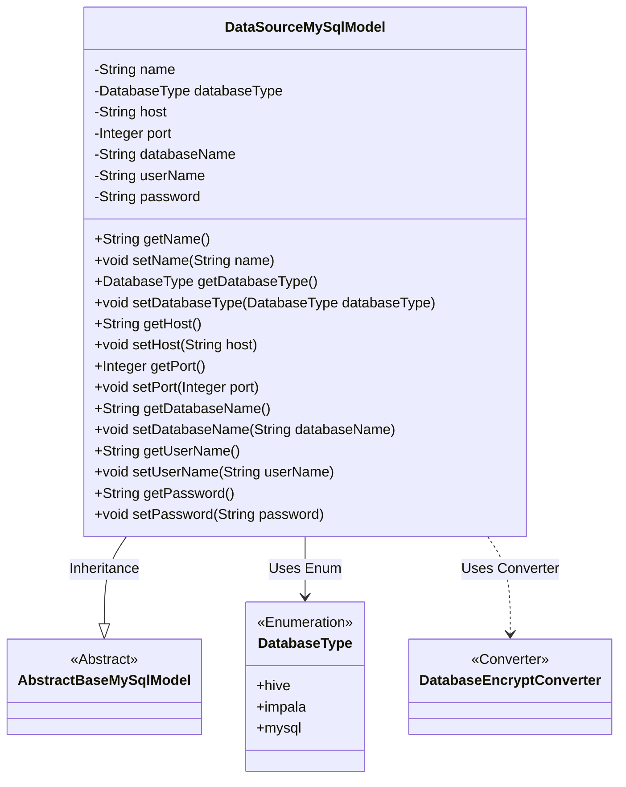

# Basic Information

|      |      |
|------|------|
| Name | DataSourceMySqlModel |
| Language | .java |
| Code Path | WeFe/fusion/fusion-service/src/main/java/com/welab/wefe/data/fusion/service/database/entity/DataSourceMySqlModel.java |
| Package Name | com.welab.wefe.data.fusion.service.database.entity |
| Dependencies | ['com.welab.wefe.common.jdbc.base.DatabaseType', 'com.welab.wefe.common.web.util.DatabaseEncryptConverter', 'javax.persistence.Convert', 'javax.persistence.Entity', 'javax.persistence.EnumType', 'javax.persistence.Enumerated'] |
| Brief Description | MySQL data source entity class, including attributes such as name, type, host, port, database name, username, and encrypted password, along with their corresponding getter/setter methods. |

# Description

This is a Java entity class named DataSourceMySqlModel, used to represent data source information. The class inherits from AbstractBaseMySqlModel and maps to the database table `data_source`. Key attributes include: data source name `name`, database type `databaseType` (enum values include hive, impala, mysql), host address `host`, port number `port`, database name `databaseName`, username `userName`, and password `password`. The password field is encrypted using the `DatabaseEncryptConverter`. The class provides standard getter and setter methods for each attribute.

# Class Summary

| Name   | Type  | Description |
|-------|------|-------------|
| DataSourceMySqlModel | class | MySQL data source entity class, including fields such as name, type, host, port, database name, username, and encrypted password, along with their corresponding getter/setter methods. |

## Class DataSourceMySqlModel

|      |      |
|------|------|
| Access Modifier | @Entity(name = "data_source");public |
| Type | class |
| Name | DataSourceMySqlModel |
| Description | MySQL data source entity class, including fields such as name, type, host, port, database name, username, and encrypted password, along with their corresponding getter/setter methods. |

### UML Class Diagram

This class diagram illustrates DataSourceMySqlModel as a subclass of AbstractBaseMySqlModel, containing database connection-related attributes (such as hostname, port, username, etc.) along with their getter/setter methods. The databaseType utilizes the DatabaseType enumeration, and the password field undergoes encryption conversion via DatabaseEncryptConverter. The overall structure reflects a typical design pattern of JPA entity classes, achieving database model definition through inheritance and composition.

### Internal Method Call Graph

```mermaid
graph TD
    A["Class DataSourceMySqlModel"]
    B["Inheritance: AbstractBaseMySqlModel"]
    C["Annotation: @Entity(name='data_source')"]
    D["Property: String name"]
    E["Property: DatabaseType databaseType<br>Annotation: @Enumerated(EnumType.STRING)"]
    F["Property: String host"]
    G["Property: Integer port"]
    H["Property: String databaseName"]
    I["Property: String userName"]
    J["Property: String password<br>Annotation: @Convert(converter=DatabaseEncryptConverter.class)"]
    K["Method: getName/setName"]
    L["Method: getDatabaseType/setDatabaseType"]
    M["Method: getHost/setHost"]
    N["Method: getPort/setPort"]
    O["Method: getDatabaseName/setDatabaseName"]
    P["Method: getUserName/setUserName"]
    Q["Method: getPassword/setPassword"]

    A --> B
    A --> C
    A --> D
    A --> E
    A --> F
    A --> G
    A --> H
    A --> I
    A --> J
    A --> K
    A --> L
    A --> M
    A --> N
    A --> O
    A --> P
    A --> Q
```

This code defines a JPA entity class named DataSourceMySqlModel, which inherits from AbstractBaseMySqlModel and represents data source configuration information. The class contains 7 core properties: data source name (name), database type (databaseType), host address (host), port number (port), database name (databaseName), username (userName), and encrypted password (password). Each property has corresponding getter and setter methods. The databaseType uses an enumeration type and specifies string storage via the @Enumerated annotation, while the password property specifies an encryption converter through the @Convert annotation. This entity is mapped to the "data_source" table in the database.

### Field List

| Name  | Type  | Description |
|-------|-------|------|
| port | Integer | The private integer variable `port` is used to store the port number. |
| userName | String | private String userName |
| password | String | The database password field is stored encrypted using an encryption converter. |
| databaseType | DatabaseType | Entity class fields use string enumeration types to annotate database types. |
| name | String | private String variable name |
| host | String | Private string variable host. |
| databaseName | String | Declare a private string variable databaseName. |

### Method List

| Name  | Type  | Description |
|-------|-------|------|
| getPassword | String | This is a Java method that returns the value of the string-type password field. |
| setHost | void | Methods for setting the host address: assign the input parameter `host` to the class member variable `host`. |
| getUserName | String | Public method to get the username, returns a string-type userName. |
| getHost | String | The method getHost returns the value of the string host. |
| setUserName | void | Java method for setting the username, which assigns the input parameter `userName` to the `userName` property of the current object. |
| getPort | Integer | Methods to obtain the port number, returns an integer type. |
| setPort | void | The method to set the port number assigns the parameter `port` to the class variable `this.port`. |
| setDatabaseName | void | Methods for setting the database name, assigning the input parameter to the class member variable databaseName. |
| setDatabaseType | void | The method to set the database type assigns the parameter databaseType to the class property of the same name. |
| getName | String | This is a Java method that returns the value of the string variable named "name". |
| setName | void | Methods for setting object names, assigning the parameter `name` to the `name` property of the object. |
| getDatabaseType | DatabaseType | Methods to obtain the current database type, with the return value being a DatabaseType object. |
| getDatabaseName | String | The method returns the database name string. |
| setPassword | void | The method to set the password assigns the input string to the class member variable `password`. |

