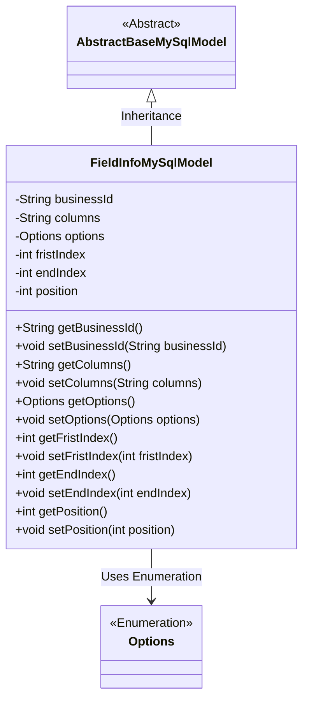

# Basic Information

|      |      |
|------|------|
| Name | FieldInfoMySqlModel |
| Language | .java |
| Code Path | WeFe/fusion/fusion-service/src/main/java/com/welab/wefe/data/fusion/service/database/entity/FieldInfoMySqlModel.java |
| Package Name | com.welab.wefe.data.fusion.service.database.entity |
| Dependencies | ['com.welab.wefe.data.fusion.service.enums.Options', 'javax.persistence.Entity', 'javax.persistence.EnumType', 'javax.persistence.Enumerated'] |
| Brief Description | The FieldInfoMySqlModel class maps to the database table field_info, containing fields such as businessId, columns, options enumeration, firstIndex, endIndex, and position, along with their corresponding getter/setter methods. |

# Description

The content defines a Java entity class named FieldInfoMySqlModel, which maps to the database table field_info. The class inherits from AbstractBaseMySqlModel and includes six attributes: businessId (String type), columns (String type), options (enum type, stored as String), fristIndex (integer type, likely a typo and should be firstIndex), endIndex (integer type), and position (integer type). Each attribute has corresponding getter and setter methods for accessing and modifying its value.

# Class Summary

| Name   | Type  | Description |
|-------|------|-------------|
| FieldInfoMySqlModel | class | FieldInfoMySqlModel is a MySQL entity class that includes business ID, column name, enumeration options, start/end indexes, and position fields. |

## Class FieldInfoMySqlModel

|      |      |
|------|------|
| Access Modifier | @Entity(name = "field_info");public |
| Type | class |
| Name | FieldInfoMySqlModel |
| Description | FieldInfoMySqlModel is a MySQL entity class that includes business ID, column name, enumeration options, start/end indexes, and position fields. |

### UML Class Diagram

This code demonstrates an entity class named FieldInfoMySqlModel, which inherits from the abstract base class AbstractBaseMySqlModel and contains multiple fields along with their corresponding getter and setter methods. The class is marked as a database entity using the JPA annotation @Entity, including fields such as business ID, column information, enumeration-type option configuration, and multiple index position fields. Notably, the options field stores enumeration values in string format via the @Enumerated annotation, and there may be a spelling error in the class (fristIndex should be firstIndex). This class is designed for persisting field-related configuration information, reflecting encapsulation and inheritance principles in object-oriented programming.

### Internal Method Call Graph

```mermaid
graph TD
    A["Class FieldInfoMySqlModel"]
    B["Inherits: AbstractBaseMySqlModel"]
    C["Annotation: @Entity(name='field_info')"]
    D["Property: String businessId"]
    E["Property: String columns"]
    F["Property: Options options @Enumerated(EnumType.STRING)"]
    G["Property: int fristIndex"]
    H["Property: int endIndex"]
    I["Property: int position"]
    J["Method: getBusinessId/setBusinessId"]
    K["Method: getColumns/setColumns"]
    L["Method: getOptions/setOptions"]
    M["Method: getFristIndex/setFristIndex"]
    N["Method: getEndIndex/setEndIndex"]
    O["Method: getPosition/setPosition"]

    A --> B
    A --> C
    A --> D
    A --> E
    A --> F
    A --> G
    A --> H
    A --> I
    A --> J
    A --> K
    A --> L
    A --> M
    A --> N
    A --> O
```

This code defines a JPA entity class named FieldInfoMySqlModel, which inherits from AbstractBaseMySqlModel and includes 6 properties with corresponding getter/setter methods. The options property uses the @Enumerated annotation to specify enum storage as strings, while the class is mapped to the database table "field_info" via the @Entity annotation. The flowchart clearly illustrates the class inheritance, property definitions, and method structure, demonstrating the fundamental components of a JPA entity class.

### Field List

| Name  | Type  | Description |
|-------|-------|------|
| position | int | The private integer variable `position` is used to store location information. |
| fristIndex | int | The private integer variable fristIndex. |
| endIndex | int | The private integer variable endIndex is used to mark the end position. |
| options | Options | The enumeration type field `options` stores enum values in string format. |
| columns | String | Private string variable columns |
| businessId | String | Define a private string type variable businessId. |

### Method List

| Name  | Type  | Description |
|-------|-------|------|
| getOptions | Options | Methods to obtain the options object. |
| getFristIndex | int | The method getFristIndex returns the value of the integer variable fristIndex. |
| getBusinessId | String | The method to obtain the business ID directly returns the value of the member variable businessId. |
| setFristIndex | void | Set the value of the class member variable `fristIndex`. |
| setOptions | void | Setting options method, assigns the passed `options` parameter to the `options` property of the current object. |
| setColumns | void | This method is used to set the column attributes of string type, assigning the input parameters to the member variable `columns` of the class. |
| setBusinessId | void | The method to set the business ID assigns the input parameter to the class member variable businessId. |
| getColumns | String | This is a Java method that returns a string variable named columns. |
| getEndIndex | int | The method returns the value of endIndex. |
| setEndIndex | void | Method to set the end index, assigning the parameter value to the class's endIndex member variable. |
| setPosition | void | Methods for setting object position, assigning input parameters to internal variable position. |
| getPosition | int | Methods to get the current position, returning an integer value `position`. |

