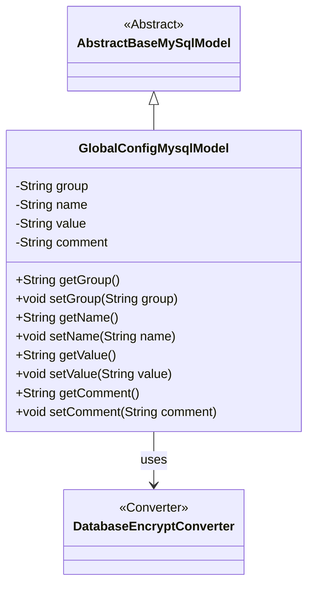
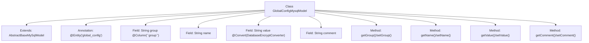

# Basic Information

|      |      |
|------|------|
| Name | GlobalConfigMysqlModel |
| Language | .java |
| Code Path | WeFe/fusion/fusion-service/src/main/java/com/welab/wefe/data/fusion/service/database/entity/GlobalConfigMysqlModel.java |
| Package Name | com.welab.wefe.data.fusion.service.database.entity |
| Dependencies | ['com.welab.wefe.common.web.util.DatabaseEncryptConverter', 'javax.persistence.Column', 'javax.persistence.Convert', 'javax.persistence.Entity'] |
| Brief Description | This is a Java entity class named GlobalConfigMysqlModel, used to map the database table global_config. It includes fields for group name, configuration item name, encrypted stored value, and description comments, along with getter and setter methods for each field. |

# Description

This is an entity class named GlobalConfigMysqlModel, which maps to the database table global_config. It inherits from AbstractBaseMySqlModel and contains four fields: group represents the group to which the configuration item belongs, name represents the name of the configuration item, value represents the value of the configuration item and is encrypted using DatabaseEncryptConverter, and comment is used to explain the configuration item. The class provides corresponding getter and setter methods for each field.

# Class Summary

| Name   | Type  | Description |
|-------|------|-------------|
| GlobalConfigMysqlModel | class | The `GlobalConfigMysqlModel` is an entity class for storing global configurations, containing fields such as group name, configuration item name, encrypted value, and description comments, along with providing getter/setter methods. |

## Class GlobalConfigMysqlModel

|      |      |
|------|------|
| Access Modifier | @Entity(name = "global_config");public |
| Type | class |
| Name | GlobalConfigMysqlModel |
| Description | The `GlobalConfigMysqlModel` is an entity class for storing global configurations, containing fields such as group name, configuration item name, encrypted value, and description comments, along with providing getter/setter methods. |

### UML Class Diagram

This code defines an entity class named GlobalConfigMysqlModel, which represents global configuration items in a database. It inherits from the abstract class AbstractBaseMySqlModel and contains four private attributes: group, name, value, and comment, along with their corresponding getter/setter methods. The value field utilizes DatabaseEncryptConverter for data conversion, indicating that this field will be encrypted during storage. The class diagram clearly illustrates the inheritance relationship and the dependency on field encryption conversion.

### Internal Method Call Graph

This code defines a JPA entity class named GlobalConfigMysqlModel, which extends AbstractBaseMySqlModel and maps to the database table `global_config`. The class contains four fields: group (with special column name annotation), name, value (using encryption converter), and comment, each with corresponding getter/setter methods. This model is used to store global configuration items, supporting features like grouping and encrypted storage, demonstrating the mapping relationship between JPA entities and database tables.

### Field List

| Name  | Type  | Description |
|-------|-------|------|
| comment | String | Private string type variable comment. |
| name | String | Private string variable name. |
| group | String | Database field mapping: the group column corresponds to the String-type group attribute. |
| value | String | Database field encryption conversion annotation, using the DatabaseEncryptConverter class to process the value field. |

### Method List

| Name  | Type  | Description |
|-------|-------|------|
| getGroup | String | Methods to obtain the string value of a group. |
| getName | String | This is a Java method that returns the value of the string variable named "name". |
| getValue | String | Public method to obtain the value. |
| setGroup | void | Set the group attribute of the object. |
| setName | void | This is a Java method used to set the name property of an object. The method takes a string parameter name and assigns it to the name field of the object. |
| setValue | void | Methods for setting string values, assigning the input value to the class member variable 'value'. |
| getComment | String | Methods to obtain the comment string. |
| setComment | void | This is a Java method used to set the comment property value of an object. The method takes a string parameter comment and assigns it to the comment member variable of the current object. |

