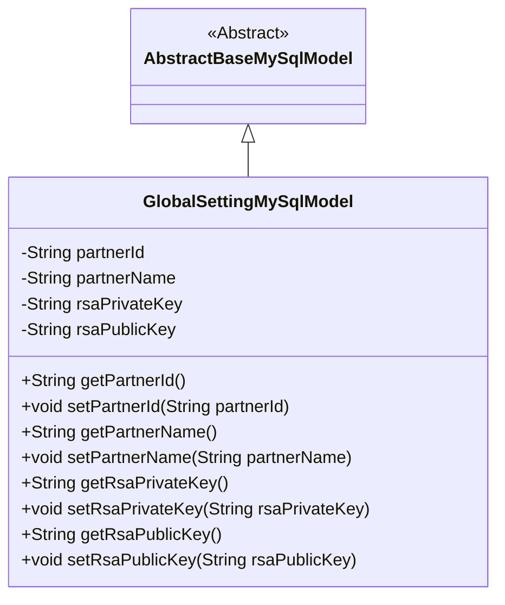

# Basic Information

|      |      |
|------|------|
| Name | GlobalSettingMySqlModel |
| Language | .java |
| Code Path | WeFe/fusion/fusion-service/src/main/java/com/welab/wefe/data/fusion/service/database/entity/GlobalSettingMySqlModel.java |
| Package Name | com.welab.wefe.data.fusion.service.database.entity |
| Dependencies | ['javax.persistence.Entity', 'java.util.UUID'] |
| Brief Description | The GlobalSettingMySqlModel class represents global settings, including partnerId, name, and RSA key pairs, inheriting from AbstractBaseMySqlModel. |

# Description

This is a JPA entity class named GlobalSettingMySqlModel, which extends AbstractBaseMySqlModel. The class contains four main fields: partnerId (default value is a random UUID string with hyphens removed), partnerName, rsaPrivateKey, and rsaPublicKey. Each field has corresponding getter and setter methods. The comments mention an annotated-out openSocketPort field with a default value of 8080, which is currently unused. This entity maps to the database table global_setting.

# Class Summary

| Name   | Type  | Description |
|-------|------|-------------|
| GlobalSettingMySqlModel | class | The GlobalSettingMySqlModel entity class includes fields such as partnerId, partnerName, rsaPrivateKey, and rsaPublicKey, along with their corresponding getter and setter methods. |

## Class GlobalSettingMySqlModel

|      |      |
|------|------|
| Access Modifier | @Entity(name = "global_setting");public |
| Type | class |
| Name | GlobalSettingMySqlModel |
| Description | The GlobalSettingMySqlModel entity class includes fields such as partnerId, partnerName, rsaPrivateKey, and rsaPublicKey, along with their corresponding getter and setter methods. |

### UML Class Diagram

This code defines an entity class named `GlobalSettingMySqlModel`, which inherits from the abstract base class `AbstractBaseMySqlModel`. The class contains four private string fields: `partnerId` (default value is a hyphen-removed UUID), `partnerName`, `rsaPrivateKey`, and `rsaPublicKey`, along with public getter and setter methods for each field. The class is marked as a JPA entity with the `@Entity` annotation, mapping to the database table "global_setting". This design is used to store global configuration information, particularly RSA key pair data related to partners.

### Internal Method Call Graph

```mermaid
graph TD
    A["Class GlobalSettingMySqlModel"]
    B["Inherits: AbstractBaseMySqlModel"]
    C["Annotation: @Entity('global_setting')"]
    D["Property: String partnerId = UUID generated"]
    E["Property: String partnerName"]
    F["Property: String rsaPrivateKey"]
    G["Property: String rsaPublicKey"]
    H["Method: getPartnerId()"]
    I["Method: setPartnerId(String)"]
    J["Method: getPartnerName()"]
    K["Method: setPartnerName(String)"]
    L["Method: getRsaPrivateKey()"]
    M["Method: setRsaPrivateKey(String)"]
    N["Method: getRsaPublicKey()"]
    O["Method: setRsaPublicKey(String)"]

    A --> B
    A --> C
    A --> D
    A --> E
    A --> F
    A --> G
    A --> H
    A --> I
    A --> J
    A --> K
    A --> L
    A --> M
    A --> N
    A --> O
```

This code defines a JPA entity class named GlobalSettingMySqlModel, which inherits from AbstractBaseMySqlModel and is used to store global configuration information. The class contains four main properties: automatically generated partnerId, partnerName, and RSA key pairs, each with corresponding getter and setter methods. Notably, the partnerId property is initialized via UUID generation with hyphens removed, while other properties require explicit setting. The class is mapped to the "global_setting" table in the database through the @Entity annotation, reflecting the mapping relationship between JPA entities and database tables.

### Field List

| Name  | Type  | Description |
|-------|-------|------|
| rsaPublicKey | String | RSA public key string variable. |
| rsaPrivateKey | String | RSA private key string variable. |
| partnerName | String | Declare a string type variable partnerName |
| partnerId = UUID.randomUUID().toString().replaceAll("-", "") | String | Generate a random UUID and remove the hyphens, storing it as a partnerId string. |

### Method List

| Name  | Type  | Description |
|-------|-------|------|
| setPartnerName | void | This is a Java method used to set the value of the member variable partnerName. The method takes a string parameter and assigns it to the partnerName property of the current object. |
| setPartnerId | void | The method to set the partner ID assigns the input string to the member variable partnerId. |
| getPartnerId | String | Common method to obtain partnerId. |
| getRsaPrivateKey | String | Methods to obtain an RSA private key, returning the private key value as a string. |
| getPartnerName | String | This is a Java method that returns the value of the member variable partnerName. The method is named getPartnerName, takes no parameters, and has a return type of String. |
| setRsaPrivateKey | void | Method to set the RSA private key, which assigns the passed string to the class's private variable `rsaPrivateKey`. |
| getRsaPublicKey | String | Methods to Obtain an RSA Public Key. |
| setRsaPublicKey | void | Method for setting RSA public key, with the parameter being of string type. |

