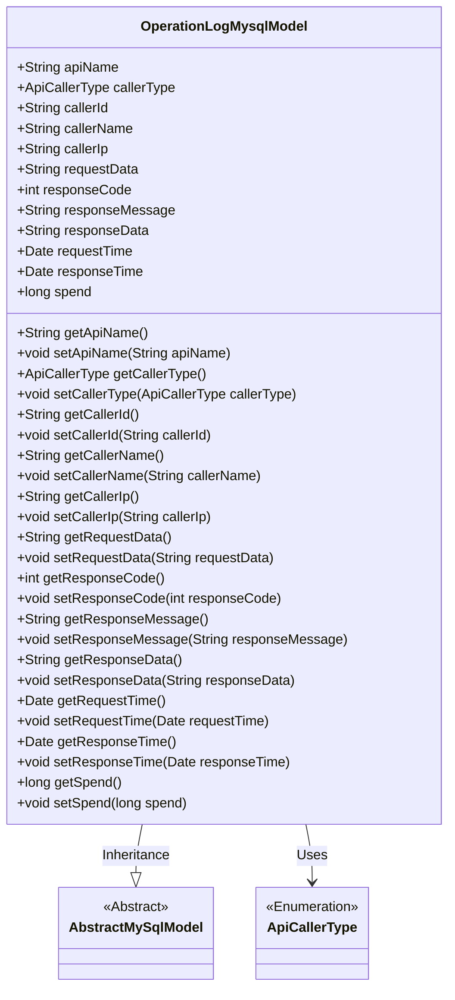

# Basic Information

|      |      |
|------|------|
| Name | OperationLogMysqlModel |
| Language | .java |
| Code Path | WeFe/fusion/fusion-service/src/main/java/com/welab/wefe/data/fusion/service/database/entity/OperationLogMysqlModel.java |
| Package Name | com.welab.wefe.data.fusion.service.database.entity |
| Dependencies | ['com.welab.wefe.common.web.delegate.api_log.ApiCallerType', 'javax.persistence.Entity', 'java.util.Date'] |
| Brief Description | Operation log entity class, recording API name, caller information, request/response data, and time consumption. |

# Description

The code defines an entity class named OperationLogMysqlModel, which is used to record API operation logs. The class includes fields such as request interface name, caller type, ID, name, IP address, request parameters, response status code, message, data, request time, response time, and duration. All fields are provided with corresponding getter and setter methods for convenient data access. This class inherits from AbstractMySqlModel, indicating its use for MySQL database storage.

# Class Summary

| Name   | Type  | Description |
|-------|------|-------------|
| OperationLogMysqlModel | class | Operation log entity class, containing fields such as interface name, caller information, request/response data, and time consumption. |

## Class OperationLogMysqlModel

|      |      |
|------|------|
| Access Modifier | @Entity(name = "operator_log");public |
| Type | class |
| Name | OperationLogMysqlModel |
| Description | Operation log entity class, containing fields such as interface name, caller information, request/response data, and time consumption. |

### UML Class Diagram

This code defines an entity class named OperationLogMysqlModel for recording API operation logs, which inherits from the AbstractMySqlModel base class. The class contains fields such as API name, caller information, request/response data, timestamps, etc., and provides access and modification to these fields through getter/setter methods. The callerType field uses the ApiCallerType enumeration. This model is primarily used for persisting API operation logs to a MySQL database, recording complete request-response lifecycle information, including key data such as caller identity, request parameters, response status, and execution time.

### Internal Method Call Graph

This flowchart illustrates the complete structure of the OperationLogMysqlModel class, including its inheritance from AbstractMySqlModel, @Entity annotation marking, 12 attribute fields of different data types (such as API name, caller information, request/response data timestamps), and the corresponding getter/setter method group. This entity class is primarily used for recording API operation logs, containing comprehensive request-response full-link information, making it suitable as a database persistence object.

### Field List

| Name  | Type  | Description |
|-------|-------|------|
| responseTime | Date | The class member variable responseTime, of type Date, represents the response time. |
| responseCode | int | The integer variable responseCode is used to store the response code. |
| responseMessage | String | Declared a public string variable responseMessage to store the response message. |
| callerId | String | Defined a public string variable callerId. |
| requestTime | Date | Declare a public Date type variable named requestTime. |
| responseData | String | Public string variable responseData, used to store response data. |
| callerName | String | Declare a public string variable callerName. |
| callerIp | String | The public string variable `callerIp` is used to store the caller's IP address. |
| requestData | String | Common string variables for request data. |
| apiName | String | Declare a public string variable apiName. |
| spend | long | The variable `spend` is of type long integer, representing the expenditure amount. |
| callerType = ApiCallerType.User | ApiCallerType | The API caller type is set to user. |

### Method List

| Name  | Type  | Description |
|-------|-------|------|
| getCallerId | String | The method returns the caller ID string. |
| getRequestTime | Date | Methods to obtain the request time, returning a Date-type requestTime value. |
| getResponseCode | int | Methods to obtain the HTTP response status code, returning the integer value of the variable `responseCode`. |
| setRequestData | void | Defines a public method `setRequestData` for setting the value of the class member variable `requestData`. The parameter is of string type. |
| getApiName | String | The method returns the value of the string-type variable apiName. |
| getSpend | long | Public method to get the spend value, returns long type data. |
| getResponseMessage | String | Methods to obtain the response message, returning a string-type responseMessage. |
| setResponseData | void | The method to set the response data assigns the passed string to the `responseData` member variable of the class. |
| setResponseCode | void | Methods for setting HTTP response status codes, which accept an integer parameter `responseCode` and assign it to the class member variable. |
| getCallerType | ApiCallerType | This is a Java method that returns the callerType property value of type ApiCallerType. |
| setRequestTime | void | The method to set the request time assigns the passed Date object to the `requestTime` property of the class. |
| setCallerName | void | Method to set the caller name, which assigns the input parameter to the class member variable callerName. |
| getCallerIp | String | Methods to obtain the caller's IP address, returning a string-type callerIp value. |
| getResponseData | String | Methods to obtain response data, returning a string-type variable `responseData`. |
| setApiName | void | Java Method: Set the apiName property value. |
| setResponseTime | void | The method to set the response time assigns the incoming Date object to the class's responseTime property. |
| setCallerType | void | Method to set the caller type, which assigns the incoming callerType to the callerType property of the current object. |
| setSpend | void | This is a Java method used to set the value of the spend variable. The method takes a long type parameter and assigns it to the class's member variable spend. |
| setCallerIp | void | Methods for setting the caller's IP address. |
| getCallerName | String | Methods to obtain the caller's name, returning a string-type callerName. |
| getRequestData | String | Methods to obtain request data, returning requestData of string type. |
| setCallerId | void | The method to set the caller ID assigns the parameter `callerId` to the `callerId` field of the current object. |
| setResponseMessage | void | This is a Java method used to set the value of the class's responseMessage property. The method takes a string parameter and assigns it to the class's member variable responseMessage. |
| getResponseTime | Date | Methods to obtain the response time, returning a Date type value responseTime. |

