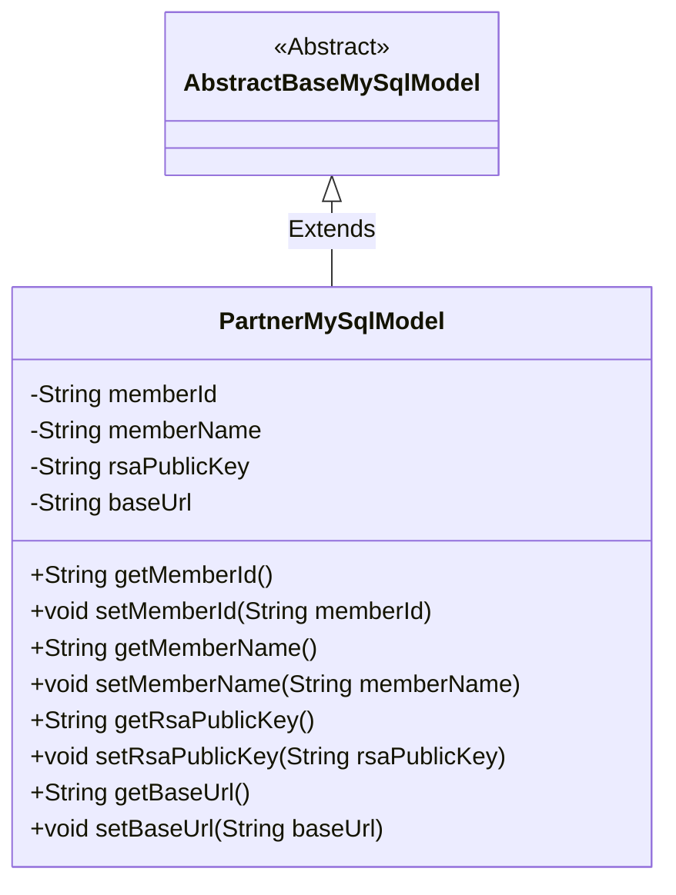

# Basic Information

|      |      |
|------|------|
| Name | PartnerMySqlModel |
| Language | .java |
| Code Path | WeFe/fusion/fusion-service/src/main/java/com/welab/wefe/data/fusion/service/database/entity/PartnerMySqlModel.java |
| Package Name | com.welab.wefe.data.fusion.service.database.entity |
| Dependencies | ['javax.persistence.Entity'] |
| Brief Description | The PartnerMySqlModel class defines the partner entity, containing fields for member ID, name, RSA public key, and base URL along with their corresponding getter/setter methods. |

# Description

This is a Java entity class named PartnerMySqlModel, mapped to the database table `partner`. It inherits from `AbstractBaseMySqlModel` and contains four main fields: `memberId` (member ID), `memberName` (member name), `rsaPublicKey` (RSA public key), and `baseUrl` (base URL). The class provides standard getter and setter methods for each field to access and modify these properties. The commented-out `openSocketPort` field indicates this feature is currently unused. This class is primarily used for storing partner-related data information.

# Class Summary

| Name   | Type  | Description |
|-------|------|-------------|
| PartnerMySqlModel | class | The PartnerMySqlModel entity class includes fields for member ID, name, RSA public key, and base URL, providing corresponding getter and setter methods. |

## Class PartnerMySqlModel

|      |      |
|------|------|
| Access Modifier | @Entity(name = "partner");public |
| Type | class |
| Name | PartnerMySqlModel |
| Description | The PartnerMySqlModel entity class includes fields for member ID, name, RSA public key, and base URL, providing corresponding getter and setter methods. |

### UML Class Diagram

This class diagram illustrates the inheritance relationship where PartnerMySqlModel extends AbstractBaseMySqlModel. PartnerMySqlModel is an entity class (annotated with @Entity) containing four private String-type fields: memberId, memberName, rsaPublicKey, and baseUrl, along with standard getter and setter methods for each field. The commented-out openSocketPort field is not included in the diagram. As a MySQL data model, this class primarily stores partner information such as basic details, RSA public keys, and base URLs.

### Internal Method Call Graph

```mermaid
graph TD
    A["Class PartnerMySqlModel"]
    B["Inherits: AbstractBaseMySqlModel"]
    C["Attribute: String memberId"]
    D["Attribute: String memberName"]
    E["Attribute: String rsaPublicKey"]
    F["Attribute: String baseUrl"]
    G["Method: getMemberId()"]
    H["Method: setMemberId(String)"]
    I["Method: getMemberName()"]
    J["Method: setMemberName(String)"]
    K["Method: getRsaPublicKey()"]
    L["Method: setRsaPublicKey(String)"]
    M["Method: getBaseUrl()"]
    N["Method: setBaseUrl(String)"]

    A --> B
    A --> C
    A --> D
    A --> E
    A --> F
    A --> G
    A --> H
    A --> I
    A --> J
    A --> K
    A --> L
    A --> M
    A --> N
```

This flowchart illustrates the structure of the PartnerMySqlModel class, including its inheritance relationship, attributes, and methods. The class inherits from AbstractBaseMySqlModel and contains four string-type attributes (memberId, memberName, rsaPublicKey, and baseUrl), along with their corresponding getter and setter methods. Each method is directly associated with the class, clearly reflecting its encapsulation characteristics.

### Field List

| Name  | Type  | Description |
|-------|-------|------|
| memberName | String | Member variable memberName, of type string. |
| memberId | String | Member ID string variable |
| rsaPublicKey | String | RSA public key string variable. |
| baseUrl | String | Basic URL variable of string type. |

### Method List

| Name  | Type  | Description |
|-------|-------|------|
| setMemberName | void | Methods for setting member names, assigning input parameters to the member variables of the class. |
| getMemberName | String | The method to obtain the member name directly returns the value of the member variable `memberName`. |
| getRsaPublicKey | String | This method returns an RSA public key string. |
| getMemberId | String | The method to obtain the member ID, which returns a string-type memberId. |
| setMemberId | void | The method to set the member ID assigns the passed string parameter to the class's member variable `memberId`. |
| setRsaPublicKey | void | This is a Java method used to set the RSA public key string. The method accepts a string parameter and assigns it to the class member variable `rsaPublicKey`. |
| getBaseUrl | String | Methods to obtain the base URL, directly returning the value of the baseUrl variable. |
| setBaseUrl | void | The method to set the base URL assigns the input parameter `baseUrl` to the class member variable `this.baseUrl`. |

