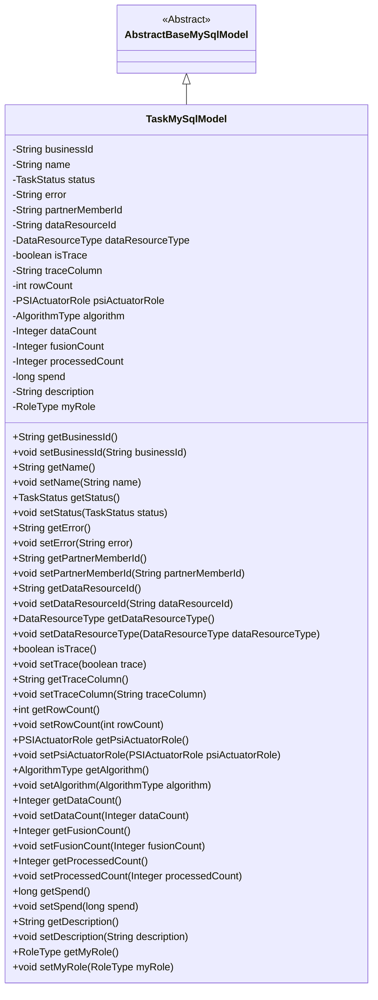

# Basic Information

|      |      |
|------|------|
| Name | TaskMySqlModel |
| Language | .java |
| Code Path | WeFe/fusion/fusion-service/src/main/java/com/welab/wefe/data/fusion/service/database/entity/TaskMySqlModel.java |
| Package Name | com.welab.wefe.data.fusion.service.database.entity |
| Dependencies | ['com.welab.wefe.data.fusion.service.enums', 'javax.persistence.Column', 'javax.persistence.Entity', 'javax.persistence.EnumType', 'javax.persistence.Enumerated'] |
| Brief Description | The TaskMySqlModel class defines the task entity, containing fields such as business ID, name, status, error message, member ID, resource type, trace tag, row count, algorithm type, role type, and various counters, which are used for database mapping. |

# Description

This is a Java class named TaskMySqlModel, which serves as a database entity mapped to the `task` table in MySQL. The class extends `AbstractBaseMySqlModel` and includes multiple fields to describe task information, such as business ID, name, status, error message, partner member ID, data resource ID, and type. It also contains enumerated type fields like task status, data resource type, PSI execution role, and algorithm type. Additionally, the class provides getter and setter methods for all fields to access and modify these attributes.

# Class Summary

| Name   | Type  | Description |
|-------|------|-------------|
| TaskMySqlModel | class | TaskMySqlModel is the task entity class, containing fields such as business ID, name, status, error message, member ID, resource ID, resource type, tracking tag, row count, role, algorithm type, data count, processing count, time consumed, and description. |

## Class TaskMySqlModel

|      |      |
|------|------|
| Access Modifier | @Entity(name = "task");public |
| Type | class |
| Name | TaskMySqlModel |
| Description | TaskMySqlModel is the task entity class, containing fields such as business ID, name, status, error message, member ID, resource ID, resource type, tracking tag, row count, role, algorithm type, data count, processing count, time consumed, and description. |

### UML Class Diagram

This code defines an entity class named `TaskMySqlModel`, which inherits from the abstract base class `AbstractBaseMySqlModel` and represents the structure of a task table in the database. The class includes multiple fields such as business ID, task name, status, error message, partner member ID, data resource information, etc., along with corresponding getter and setter methods. These fields are mapped to the database table through JPA annotations, with enum-type fields using `@Enumerated(EnumType.STRING)` to specify the storage format. This class is primarily used for persisting task-related data, supporting the storage and query of task information in various business scenarios.

### Internal Method Call Graph

```mermaid
graph TD
    A["Class TaskMySqlModel"]
    B["Inherits: AbstractBaseMySqlModel"]
    C["Property: String businessId"]
    D["Property: String name"]
    E["Property: TaskStatus status"]
    F["Property: String error"]
    G["Property: String partnerMemberId"]
    H["Property: String dataResourceId"]
    I["Property: DataResourceType dataResourceType"]
    J["Property: boolean isTrace"]
    K["Property: String traceColumn"]
    L["Property: int rowCount"]
    M["Property: PSIActuatorRole psiActuatorRole"]
    N["Property: AlgorithmType algorithm"]
    O["Property: Integer dataCount"]
    P["Property: Integer fusionCount"]
    Q["Property: Integer processedCount"]
    R["Property: long spend"]
    S["Property: String description"]
    T["Property: RoleType myRole"]
    U["Method: getBusinessId/setBusinessId"]
    V["Method: getName/setName"]
    W["Method: getStatus/setStatus"]
    X["Method: getError/setError"]
    Y["Method: getPartnerMemberId/setPartnerMemberId"]
    Z["Method: getDataResourceId/setDataResourceId"]
    AA["Method: getDataResourceType/setDataResourceType"]
    AB["Method: isTrace/setTrace"]
    AC["Method: getTraceColumn/setTraceColumn"]
    AD["Method: getRowCount/setRowCount"]
    AE["Method: getPsiActuatorRole/setPsiActuatorRole"]
    AF["Method: getAlgorithm/setAlgorithm"]
    AG["Method: getDataCount/setDataCount"]
    AH["Method: getFusionCount/setFusionCount"]
    AI["Method: getProcessedCount/setProcessedCount"]
    AJ["Method: getSpend/setSpend"]
    AK["Method: getDescription/setDescription"]
    AL["Method: getMyRole/setMyRole"]

    A --> B
    A --> C
    A --> D
    A --> E
    A --> F
    A --> G
    A --> H
    A --> I
    A --> J
    A --> K
    A --> L
    A --> M
    A --> N
    A --> O
    A --> P
    A --> Q
    A --> R
    A --> S
    A --> T
    A --> U
    A --> V
    A --> W
    A --> X
    A --> Y
    A --> Z
    A --> AA
    A --> AB
    A --> AC
    A --> AD
    A --> AE
    A --> AF
    A --> AG
    A --> AH
    A --> AI
    A --> AJ
    A --> AK
    A --> AL
```

This code defines a JPA entity class named `TaskMySqlModel`, which inherits from `AbstractBaseMySqlModel` and represents a task data model. The class includes multiple property fields such as business ID, task name, status, error messages, etc., along with corresponding getter and setter methods. The model also contains enum-type fields like task status and data resource type, as well as fields for tracking and statistics such as row count and processed count. The overall structure is clear, with properties covering the core data requirements for task management, making it suitable for use as a database persistence object.

### Field List

| Name  | Type  | Description |
|-------|-------|------|
| rowCount | int | The variable rowCount is used to store the number of rows. |
| partnerMemberId | String | partnerMemberId is a string-type member ID variable. |
| myRole | RoleType | Use the @Enumerated annotation to store the RoleType enum as a string in the database column my_role. |
| traceColumn | String | Declare a public string variable traceColumn. |
| dataCount | Integer | The integer variable dataCount is used to store the data quantity. |
| businessId | String | Business identification string |
| description | String | Common string type variable description. |
| error | String | String error variable. |
| isTrace | boolean | The boolean variable isTrace is used to indicate whether the trace function is enabled. |
| psiActuatorRole | PSIActuatorRole | Use the @Enumerated annotation to store the enumeration type PSIActuatorRole as a string in the database table's psi_actuator_role field. |
| algorithm | AlgorithmType | Use the @Enumerated annotation to store the enum type AlgorithmType as a string in the algorithm column of the database table. |
| dataResourceType | DataResourceType | Use the @Enumerated annotation to store the enum type DataResourceType as a string in the data_resource_type field of the database table. |
| status | TaskStatus | Use the @Enumerated annotation to store the TaskStatus enum type as a string in the database. |
| name | String | Declare a string variable named name. |
| processedCount | Integer | Processed count, integer type. |
| dataResourceId | String | String-type data resource identifier. |
| fusionCount | Integer | Variable fusionCount, integer type, public access. |
| spend | long | The variable `spend` is of type long integer, used to store expenditure amounts. |

### Method List

| Name  | Type  | Description |
|-------|-------|------|
| setDataResourceId | void | Method for setting the data resource ID: Assign the parameter value to the class member variable `dataResourceId`. |
| getPartnerMemberId | String | Methods to obtain the partner member ID, which returns the partnerMemberId as a string type. |
| setProcessedCount | void | Method to set the processed count, with the parameter being an integer processedCount. |
| setAlgorithm | void | The method to set the algorithm type assigns the input parameter to the class member variable `algorithm`. |
| setDataResourceType | void | The method for setting the data resource type assigns the passed DataResourceType parameter to the dataResourceType property of the current object. |
| setDescription | void | The method for setting the object's description information assigns the input string to the object's `description` property. |
| setError | void | Common method for setting error messages, assigning the input string to the class member variable error. |
| getFusionCount | Integer | Method to obtain the fusion count value, returns an integer type fusionCount. |
| setFusionCount | void | The method to set the fusion count value assigns the input parameter to the class member variable fusionCount. |
| getAlgorithm | AlgorithmType | Methods to obtain the current algorithm type. |
| getDataResourceType | DataResourceType | Methods for obtaining the type of data resource, with the return value being of type DataResourceType. |
| getDescription | String | Methods for obtaining descriptive information, returning the string-type description value. |
| getProcessedCount | Integer | Get the integer value of the processed quantity. |
| getTraceColumn | String | Common method for obtaining traceColumn values. |
| getName | String | Methods to obtain the name, returning the value of the string-type name variable. |
| getDataResourceId | String | Methods to obtain the data resource ID, returning the dataResourceId as a string type. |
| setBusinessId | void | The method to set the business ID assigns the input string to the class's `businessId` member variable. |
| getError | String | Common method for retrieving error messages, returns a string variable named error. |
| setName | void | The method to set the object name is to assign the parameter 'name' to the 'name' property of the object. |
| setPsiActuatorRole | void | Set the PSI executor role. |
| getRowCount | int | The method returns the value of rowCount. |
| setTrace | void | Methods for setting the trace state, assigning the boolean parameter `trace` to the `isTrace` variable. |
| setSpend | void | Method to set the spending amount, with the parameter being a long integer `spend`. |
| setMyRole | void | The method `setMyRole` is used to set the `myRole` property of the current object, with the parameter being of type `RoleType`. |
| setDataCount | void | This is a Java method used to set the value of the `dataCount` property of a class. The method takes an Integer parameter and assigns it to the member variable `dataCount` of the class. |
| setStatus | void | Set the task status by assigning the incoming status parameter to the `status` property of the current object. |
| getBusinessId | String | The method returns a businessId string. |
| getSpend | long | The method to obtain the consumption amount, returns a long integer value spend. |
| getPsiActuatorRole | PSIActuatorRole | Get the PSI executor role object. |
| setTraceColumn | void | Defined a public method `setTraceColumn` for setting the value of the class member variable `traceColumn`. |
| getMyRole | RoleType | Methods to get the current role type, returns the value of the myRole variable. |
| getStatus | TaskStatus | Methods to obtain the current task status, returning a status value of type TaskStatus. |
| setPartnerMemberId | void | The method to set the partner member ID assigns the parameter value to the class member variable `partnerMemberId`. |
| setRowCount | void | Method for setting the number of rows: assign the parameter rowCount to the class's member variable rowCount. |
| isTrace | boolean | This is a Java method that returns the state of the boolean isTrace. |
| getDataCount | Integer | Methods to obtain the data count value, returns an integer type. |

