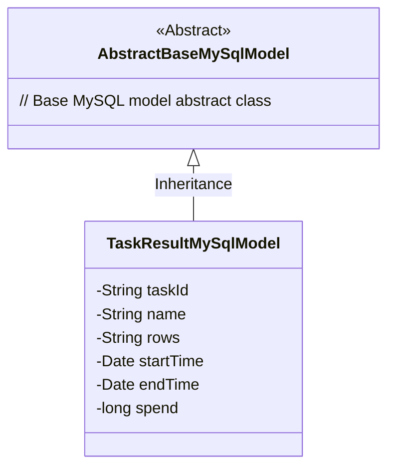
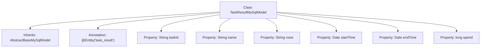

# Basic Information

|      |      |
|------|------|
| Name | TaskResultMySqlModel |
| Language | .java |
| Code Path | WeFe/fusion/fusion-service/src/main/java/com/welab/wefe/data/fusion/service/database/entity/TaskResultMySqlModel.java |
| Package Name | com.welab.wefe.data.fusion.service.database.entity |
| Dependencies | ['javax.persistence.Entity', 'java.util.Date'] |
| Brief Description | TaskResultMySqlModel is an entity class for storing task results, containing fields such as task ID, name, row count, start/end time, and time consumption. |

# Description

The content defines a JPA entity class named TaskResultMySqlModel, corresponding to the database table task_result. This class inherits from AbstractBaseMySqlModel and includes six fields: taskId represents the task ID, name records the task name, rows stores row count information, startTime and endTime record the task start and end times respectively, and spend stores the task duration. All fields are of basic data types or common object types.

# Class Summary

| Name   | Type  | Description |
|-------|------|-------------|
| TaskResultMySqlModel | class | TaskResultMySqlModel is a database entity class that includes fields for task ID, name, row count, start time, end time, and time consumed. |

## Class TaskResultMySqlModel

|      |      |
|------|------|
| Access Modifier | @Entity(name = "task_result");public |
| Type | class |
| Name | TaskResultMySqlModel |
| Description | TaskResultMySqlModel is a database entity class that includes fields for task ID, name, row count, start time, end time, and time consumed. |

### UML Class Diagram

This class diagram illustrates the inheritance relationship where TaskResultMySqlModel extends AbstractBaseMySqlModel. TaskResultMySqlModel is an entity class containing private fields such as taskId, name, and rows, which store information related to task execution results. As a concrete implementation class, it inherits the characteristics of the abstract base class, complies with JPA entity specifications, and is suitable for use as a database table mapping object. The diagram clearly demonstrates the object-oriented inheritance relationship with a well-defined hierarchical structure.

### Internal Method Call Graph

This flowchart illustrates the structure of the TaskResultMySqlModel class, which is an entity class inheriting from AbstractBaseMySqlModel and annotated with @Entity to map to the 'task_result' table. The class contains six property fields: three String types (taskId, name, rows), two Date types (startTime, endTime), and one long type (spend). All properties have no explicit access modifiers, defaulting to package-private visibility.

### Field List

| Name  | Type  | Description |
|-------|-------|------|
| startTime | Date | Declare a start time variable of date type. |
| rows | String | Declaration of the string variable rows. |
| endTime | Date | Declare a date-type variable named endTime. |
| taskId | String | Task ID string variable declaration. |
| name | String | Declare a string variable named name. |
| spend | long | long spend; declares a long integer variable named 'spend', used for storing large numerical values such as time or monetary data. |

### Method List

| Name  | Type  | Description |
|-------|-------|------|

