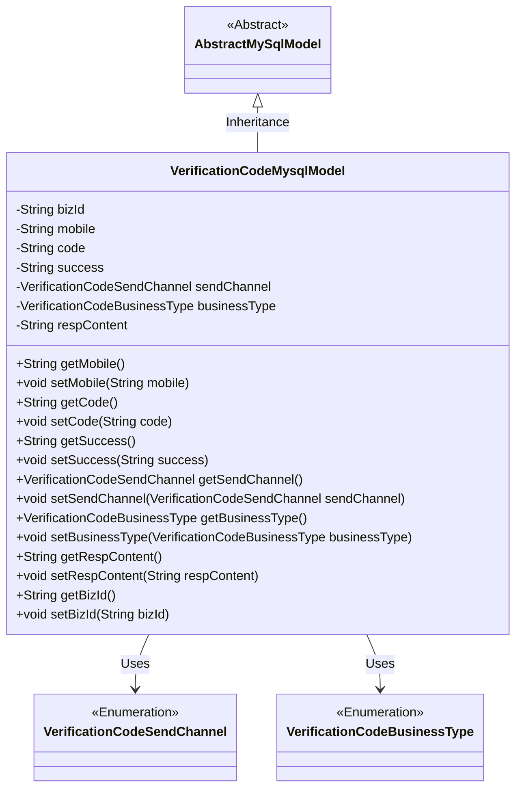
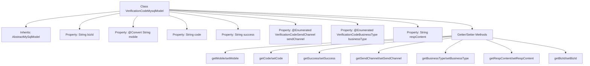

# Basic Information

|      |      |
|------|------|
| Name | VerificationCodeMysqlModel |
| Language | .java |
| Code Path | WeFe/fusion/fusion-service/src/main/java/com/welab/wefe/data/fusion/service/database/entity/VerificationCodeMysqlModel.java |
| Package Name | com.welab.wefe.data.fusion.service.database.entity |
| Dependencies | ['com.welab.wefe.common.web.util.DatabaseEncryptConverter', 'com.welab.wefe.common.wefe.enums.VerificationCodeBusinessType', 'com.welab.wefe.common.wefe.enums.VerificationCodeSendChannel', 'javax.persistence.Convert', 'javax.persistence.Entity', 'javax.persistence.EnumType', 'javax.persistence.Enumerated'] |
| Brief Description | Verification code MySQL entity class, including fields such as business ID, encrypted phone number, verification code, sending status, sending channel, business type, and response content, along with corresponding getter/setter methods. |

# Description

This is an entity class named VerificationCodeMysqlModel, used to store verification code-related information. It inherits from AbstractMySqlModel and includes the following fields: bizId for associating business information, mobile stored in encrypted form, code representing the verification code, success marking the sending status, sendChannel and businessType as enumeration types representing the sending channel and business type respectively, and respContent storing the response content. The class provides getter and setter methods for each field. This entity maps to the database table verification_code.

# Class Summary

| Name   | Type  | Description |
|-------|------|-------------|
| VerificationCodeMysqlModel | class | The VerificationCodeMysqlModel class includes fields such as business ID, encrypted phone number, verification code, sending status, sending channel, business type, and response content, which are used to store verification code-related information. |

## Class VerificationCodeMysqlModel

|      |      |
|------|------|
| Access Modifier | @Entity(name = "verification_code");public |
| Type | class |
| Name | VerificationCodeMysqlModel |
| Description | The VerificationCodeMysqlModel class includes fields such as business ID, encrypted phone number, verification code, sending status, sending channel, business type, and response content, which are used to store verification code-related information. |

### UML Class Diagram

This code defines an entity class named VerificationCodeMysqlModel for storing verification code-related information. The class inherits from AbstractMySqlModel and includes fields such as business ID, mobile number, verification code, sending status, sending channel, business type, and response content. The mobile number field uses a database encryption converter, while the sending channel and business type are enumeration types. The class provides getter and setter methods for all fields to facilitate data access and manipulation. This class is primarily used for storing and managing verification code-related data records in a MySQL database.

### Internal Method Call Graph

This flowchart illustrates the complete structure of the VerificationCodeMysqlModel class, featuring 7 core properties and their corresponding accessor methods. As a database entity class, it specifically highlights special annotations for encrypted fields (mobile) and enumerated type fields (sendChannel/businessType), while inheriting from the AbstractMySqlModel base class. All properties are equipped with standard Getter/Setter methods, forming a typical data model structure.

### Field List

| Name  | Type  | Description |
|-------|-------|------|
| bizId | String | Declare a private string variable bizId. |
| respContent | String | The private string variable respContent is used to store the response content. |
| mobile | String | The field mobile is encrypted and converted in the database using the DatabaseEncryptConverter class. |
| sendChannel | VerificationCodeSendChannel | The enumeration type field `sendChannel`, stored in string format, represents the channel for sending verification codes. |
| code | String | Defined a private string variable named code. |
| success | String | Define a private string variable success. |
| businessType | VerificationCodeBusinessType | Define the enum type field `businessType`, stored in string format. |

### Method List

| Name  | Type  | Description |
|-------|-------|------|
| getSendChannel | VerificationCodeSendChannel | Method to obtain the channel for sending verification codes. |
| setSendChannel | void | The method for setting the verification code sending channel, with the parameter being the sending channel object. |
| setCode | void | This is a Java method used to set the value of the code attribute for a class. The method takes a string parameter code and assigns it to the code member variable of the current object. |
| getBusinessType | VerificationCodeBusinessType | This method returns the businessType attribute value of the VerificationCodeBusinessType type. |
| setMobile | void | This is a Java method used to set the mobile property value of a class. The method takes a string parameter named mobile and assigns it to the class's member variable of the same name. |
| setRespContent | void | Methods for setting response content, assigning the parameter respContent to the class's respContent member variable. |
| getBizId | String | The method to obtain the business ID directly returns the value of the bizId field. |
| getMobile | String | Methods to obtain the phone number, returning a string variable named `mobile`. |
| getCode | String | Common methods for obtaining code values. |
| getSuccess | String | The method getSuccess returns the value of the string success. |
| setSuccess | void | This is a Java method used to set the value of a string-type success variable. The method is named setSuccess, which takes a String parameter and assigns it to the success member variable of the class. |
| setBusinessType | void | Method for setting the business type, which assigns the passed VerificationCodeBusinessType parameter to the businessType property of the current object. |
| getRespContent | String | The method returns the value of the string respContent. |
| setBizId | void | The method to set the business ID assigns the parameter bizId to the bizId property of the current object. |

