# Basic Information

|      |      |
|------|------|
| Name | entity |
| Language | .java |
| Code Path | WeFe/fusion/fusion-service/src/main/java/com/welab/wefe/data/fusion/service/database/entity |
| Package Name | docs.fusion.fusion-service.src.main.java.com.welab.wefe.data.fusion.service.database.entity |
| Brief Description | AbstractBaseMySqlModel is an abstract base class containing creator/updater fields. TaskMySqlModel describes task information. DataSetMySqlModel stores dataset information. TaskResultMySqlModel records task results. GlobalSettingMySqlModel stores global settings. DataSetColumnOutputModel represents dataset column output. GlobalConfigMysqlModel stores encryption configurations. BloomFilterMySqlModel describes a Bloom filter. PartnerMySqlModel stores partner data. OperationLogMysqlModel records operation logs. VerificationCodeMysqlModel stores verification codes. FieldInfoMySqlModel describes field information. AccountMysqlModel represents an account entity. DataSourceMySqlModel describes a data source. AbstractMySqlModel is a generic parent class containing ID and timestamp fields. |

# Description

## Overview  
The core responsibility of this module is to provide MySQL database entity mapping infrastructure for data fusion services, including universal abstract base classes and various business entity models. The interface specifications uniformly adopt JPA annotations for ORM mapping, with all entities inheriting from AbstractMySqlModel or its subclass AbstractBaseMySqlModel, providing standard getter/setter methods. Key data structures include business entities such as Task (TaskMySqlModel), Dataset (DataSetMySqlModel), Bloom Filter (BloomFilterMySqlModel), etc., all containing basic fields like ID and timestamps, as well as extended fields such as business status and encrypted data. External dependencies primarily include the JPA specification, UUID generator, and database encryption converter. For example, GlobalConfigMysqlModel uses DatabaseEncryptConverter to encrypt configuration item values.  

## Main Business Scenarios  
The module supports full lifecycle management of data fusion, similar to an ETL process console. Typical interaction patterns include: task creation (TaskMySqlModel records PSI algorithm type/execution role), dataset processing (DataSetMySqlModel tracks data source/progress), and result storage (TaskResultMySqlModel saves time consumption statistics). Complete functionality covers partner management (PartnerMySqlModel), global configuration (GlobalSettingMySqlModel), and security auditing (OperationLogMysqlModel). API integration examples include encrypted field access (e.g., phone numbers in AccountMysqlModel) and enumeration type handling (e.g., database types in DataSourceMySqlModel). A typical application pattern is multi-institution data collaboration, such as implementing private set intersection via BloomFilterMySqlModel.

### Package Internal Structure View

```mermaid
graph TD
    entity --> AbstractBaseMySqlModel.java
    entity --> TaskMySqlModel.java
    entity --> DataSetMySqlModel.java
    entity --> TaskResultMySqlModel.java
    entity --> GlobalSettingMySqlModel.java
    entity --> DataSetColumnOutputModel.java
    entity --> GlobalConfigMysqlModel.java
    entity --> BloomFilterMySqlModel.java
    entity --> PartnerMySqlModel.java
    entity --> OperationLogMysqlModel.java
    entity --> VerificationCodeMysqlModel.java
    entity --> FieldInfoMySqlModel.java
    entity --> AccountMysqlModel.java
    entity --> DataSourceMySqlModel.java
    entity --> AbstractMySqlModel.java
```

This flowchart illustrates the hierarchical structure of database entity classes in the WeFe data fusion service. All entity class files are located under the entity directory, including 15 concrete implementation classes such as task models, dataset models, and global configuration models. These classes inherit from the abstract base classes AbstractBaseMySqlModel or AbstractMySqlModel, forming a clear data persistence layer structure.

# File List

| Name   | Type  | Description |
|-------|------|-------------|
| [AbstractBaseMySqlModel.java](AbstractBaseMySqlModel.md) | file | The abstract class `AbstractBaseMySqlModel` extends `AbstractMySqlModel` and includes creator and updater fields along with their getter/setter methods. |
| [TaskMySqlModel.java](TaskMySqlModel.md) | file | The TaskMySqlModel class defines the task entity, containing fields such as business ID, name, status, error message, member ID, resource type, tracking tag, row count, algorithm type, role type, and various counters, which are used for database mapping. |
| [DataSetMySqlModel.java](DataSetMySqlModel.md) | file | The `DataSetMySqlModel` class represents a dataset entity, containing attributes such as name, data source ID, description, row count, usage count, storage status, data source, SQL statement, source file path, selected columns, progress count, and progress status, along with their corresponding getter/setter methods. |
| [TaskResultMySqlModel.java](TaskResultMySqlModel.md) | file | TaskResultMySqlModel is an entity class for storing task results, containing fields such as task ID, name, row count, start/end time, and time consumed. |
| [GlobalSettingMySqlModel.java](GlobalSettingMySqlModel.md) | file | The `GlobalSettingMySqlModel` class represents global settings, including partnerId, name, and RSA key pairs, inheriting from `AbstractBaseMySqlModel`. |
| [DataSetColumnOutputModel.java](DataSetColumnOutputModel.md) | file | Dataset column output model class, containing attributes such as dataset ID, sequence number, field name, data type, comments, number of empty rows, and value distribution, along with corresponding getter/setter methods. |
| [GlobalConfigMysqlModel.java](GlobalConfigMysqlModel.md) | file | This is a Java entity class named GlobalConfigMysqlModel, used to map the database table global_config. It includes fields for group name, configuration item name, encrypted stored value, and description comments, and provides getter and setter methods for each field. |
| [BloomFilterMySqlModel.java](BloomFilterMySqlModel.md) | file | The BloomFilterMySqlModel class defines the MySQL model for the Bloom filter, including fields such as name, data source ID, description, public-private key parameters, file path, SQL statements, progress status, and their corresponding getter and setter methods. |
| [PartnerMySqlModel.java](PartnerMySqlModel.md) | file | The PartnerMySqlModel class defines the partner entity, containing fields for member ID, name, RSA public key, and base URL along with their corresponding getter/setter methods. |
| [OperationLogMysqlModel.java](OperationLogMysqlModel.md) | file | Operation log entity class, recording API name, caller information, request/response data, and time consumption. |
| [VerificationCodeMysqlModel.java](VerificationCodeMysqlModel.md) | file | Verification Code MySQL Entity Class, including fields such as business ID, encrypted phone number, verification code, sending status, sending channel, business type, response content, and corresponding getter/setter methods. |
| [FieldInfoMySqlModel.java](FieldInfoMySqlModel.md) | file | The FieldInfoMySqlModel class maps to the database table field_info, containing fields such as businessId, columns, options enumeration, firstIndex, endIndex, and position, along with their corresponding getter/setter methods. |
| [AccountMysqlModel.java](AccountMysqlModel.md) | file | The AccountMysqlModel class defines the account entity, containing basic information such as phone number, password, nickname, and email, along with attributes like administrator role, review status, and availability. It supports storing historical passwords in JSON format. |
| [DataSourceMySqlModel.java](DataSourceMySqlModel.md) | file | MySQL data source entity class, including attributes such as name, type, host, port, database name, username, and encrypted password, along with their getter/setter methods. |
| [AbstractMySqlModel.java](AbstractMySqlModel.md) | file | Abstract MySQL model base class, including ID (UUID generation), creation time and update time fields along with their corresponding getter/setter methods. |

