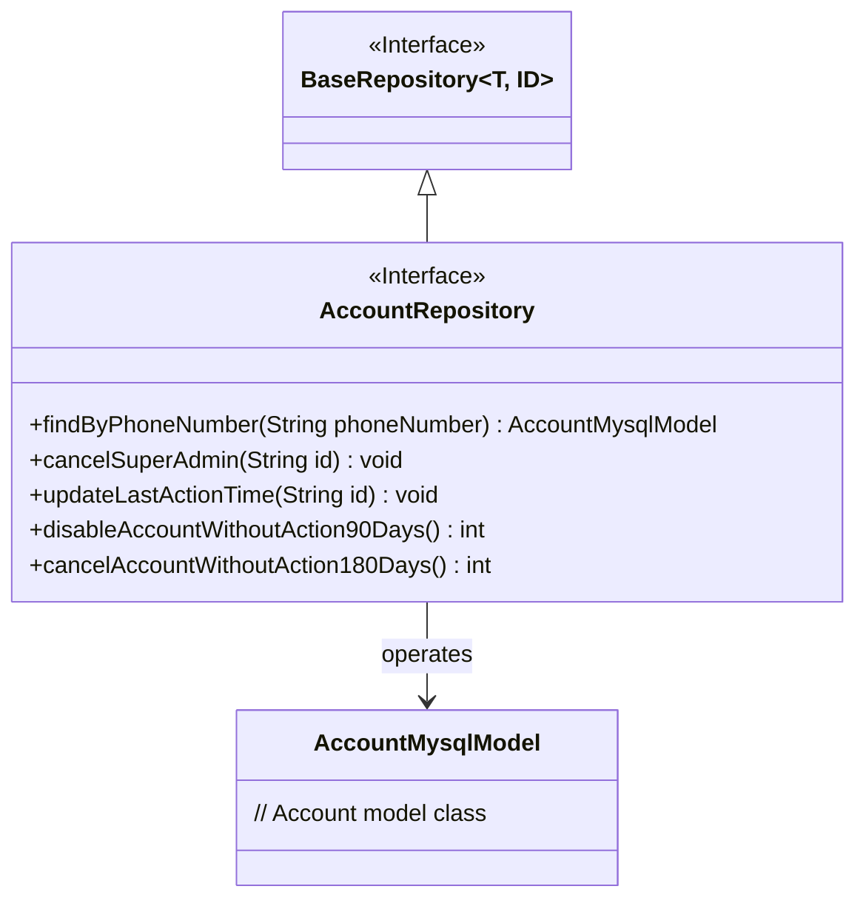
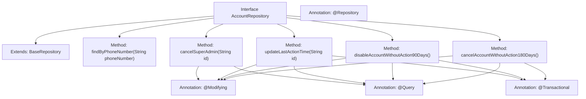

# Basic Information

|      |      |
|------|------|
| Name | AccountRepository |
| Language | .java |
| Code Path | WeFe/fusion/fusion-service/src/main/java/com/welab/wefe/data/fusion/service/database/repository/AccountRepository.java |
| Package Name | com.welab.wefe.data.fusion.service.database.repository |
| Dependencies | ['com.welab.wefe.data.fusion.service.database.entity.AccountMysqlModel', 'com.welab.wefe.data.fusion.service.database.repository.base.BaseRepository', 'org.springframework.data.jpa.repository.Modifying', 'org.springframework.data.jpa.repository.Query', 'org.springframework.stereotype.Repository', 'org.springframework.transaction.annotation.Transactional'] |
| Brief Description | The AccountRepository interface extends BaseRepository and includes methods for querying accounts by mobile number, revoking super administrator privileges, updating last activity time, disabling accounts inactive for 90 days, and deleting accounts inactive for 180 days. |

# Description

This is a Spring Data JPA repository interface named AccountRepository, which extends BaseRepository and is used to manage data of type AccountMysqlModel. The interface provides multiple database operation methods: querying accounts by phone number, revoking super administrator privileges, updating the last operation time, disabling accounts inactive for 90 days, and deleting accounts inactive for 180 days. All modification operations are annotated with @Modifying and have automatic cache clearance enabled, with some methods additionally annotated with @Transactional for transaction management. The query statements use native SQL and are defined via the @Query annotation.

# Class Summary

| Name   | Type  | Description |
|-------|------|-------------|
| AccountRepository | interface | The AccountRepository interface extends BaseRepository, providing methods to query accounts by mobile number, revoke super administrator privileges, update the last operation time, disable accounts inactive for 90 days, and delete accounts inactive for 180 days. |

## Class AccountRepository

|      |      |
|------|------|
| Access Modifier | @Repository;public |
| Type | interface |
| Name | AccountRepository |
| Description | The AccountRepository interface extends BaseRepository, providing methods to query accounts by mobile number, revoke super administrator privileges, update the last operation time, disable accounts inactive for 90 days, and delete accounts inactive for 180 days. |

### UML Class Diagram

This code demonstrates a Spring Data JPA `AccountRepository` interface, which extends the generic `BaseRepository` interface and is specifically designed to operate on the `AccountMysqlModel` entity class. The interface defines five methods: querying an account by phone number, revoking super admin privileges, updating the last action time, disabling accounts inactive for 90 days, and deleting accounts inactive for 180 days. All modification operations are annotated with `@Modifying` and `@Transactional` to ensure data consistency and transactional integrity.

### Internal Method Call Graph

This flowchart illustrates the structure and functionality of the AccountRepository interface. The interface extends BaseRepository and includes five key methods: finding an account by phone number, revoking super admin privileges, updating the last action time, disabling accounts inactive for 90 days, and canceling accounts inactive for 180 days. Critical methods utilize @Modifying, @Query, and @Transactional annotations to perform database modifications, reflecting Spring Data JPA's declarative transaction management features.

### Field List

| Name  | Type  | Description |
|-------|-------|------|

### Method List

| Name  | Type  | Description |
|-------|-------|------|
| updateLastActionTime | void | Update the last_action_time of the specified ID record to the current time using native SQL, automatically clearing the persistence context. |
| disableAccountWithoutAction90Days | int | Using transaction annotations and auto-cleanup, update the status of accounts inactive for 90 days to "disabled" via native SQL. |
| cancelSuperAdmin | void | Update account permissions: Revoke super administrator and administrator roles based on ID. |
| cancelAccountWithoutAction180Days | int | JPA method with transactional annotation automatically clears cache and executes native SQL to update accounts inactive for 180 days to canceled status. |
| findByPhoneNumber | AccountMysqlModel | Querying account information based on mobile phone number in MySQL model methods. |

