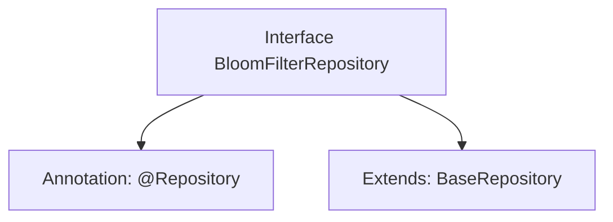

# Basic Information

|      |      |
|------|------|
| Name | BloomFilterRepository |
| Language | .java |
| Code Path | WeFe/fusion/fusion-service/src/main/java/com/welab/wefe/data/fusion/service/database/repository/BloomFilterRepository.java |
| Package Name | com.welab.wefe.data.fusion.service.database.repository |
| Dependencies | ['com.welab.wefe.data.fusion.service.database.entity.BloomFilterMySqlModel', 'com.welab.wefe.data.fusion.service.database.repository.base.BaseRepository', 'org.springframework.stereotype.Repository'] |
| Brief Description | This is a Spring Data JPA repository interface that extends the base repository, used for operating Bloom filter MySQL model data. |

# Description

The content defines a Spring Data repository interface named `BloomFilterRepository`, marked with the `@Repository` annotation. This interface extends the generic `BaseRepository` interface, specifying the entity type as `BloomFilterMySqlModel` and the primary key type as `String`. This indicates it is a data access layer component for operating on `BloomFilterMySqlModel` entities, following the repository pattern design of Spring Data.

# Class Summary

| Name   | Type  | Description |
|-------|------|-------------|
| BloomFilterRepository | interface | The code defines a Spring repository interface named BloomFilterRepository, which extends BaseRepository and is used to operate on data of type BloomFilterMySqlModel with a primary key type of String. |


## Class BloomFilterRepository

|      |      |
|------|------|
| Access Modifier | @Repository;public |
| Type | interface |
| Name | BloomFilterRepository |
| Description | The code defines a Spring repository interface named BloomFilterRepository, which extends BaseRepository and is used to operate on data of type BloomFilterMySqlModel with a primary key type of String. |


### UML Class Diagram

```mermaid
classDiagram
    class BloomFilterRepository {
        <<Interface>>
    }
    class BaseRepository~T, ID~ {
        <<Interface>>
    }
    BloomFilterRepository --|> BaseRepository : extends
    // BaseRepository is a generic interface, BloomFilterRepository inherits it with specified generic parameters
    // BloomFilterMySqlModel as entity type, String as ID type
```

This class diagram illustrates the inheritance relationship between repository interfaces in Spring Data JPA. BloomFilterRepository is an interface annotated with @Repository, which extends the generic interface BaseRepository with specified generic parameters: BloomFilterMySqlModel as the entity type and String as the ID type. This design follows Spring Data's repository pattern, providing basic CRUD operation capabilities for specific entity types.


### Internal Method Call Graph



This code defines a Spring Data repository interface named BloomFilterRepository, marked as a persistence layer component with the @Repository annotation. The interface extends the generic BaseRepository interface, specifying the entity type as BloomFilterMySqlModel and the primary key type as String. The flowchart clearly illustrates the annotation and inheritance relationships of the interface, demonstrating the typical pattern in Spring Data JPA for rapidly implementing CRUD operations by inheriting from a base repository interface.

### Field List

| Name  | Type  | Description |
|-------|-------|------|

### Method List

| Name  | Type  | Description |
|-------|-------|------|


