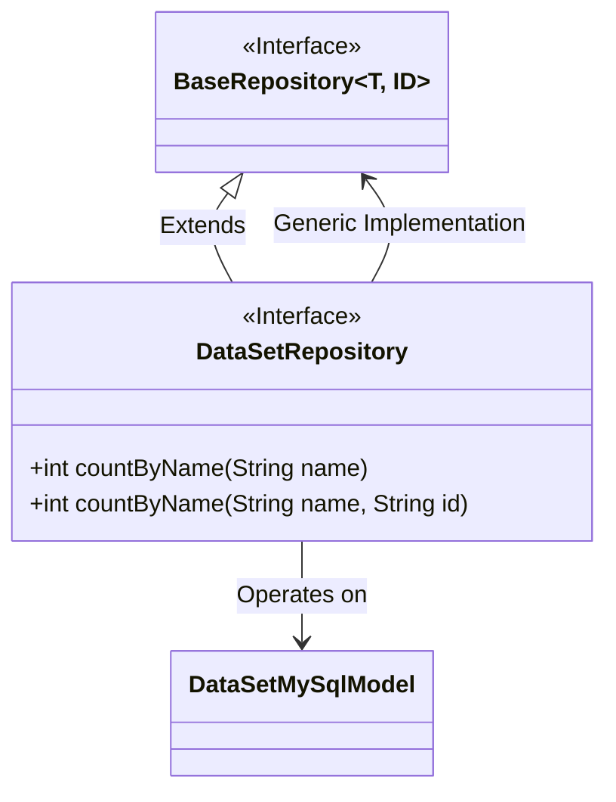
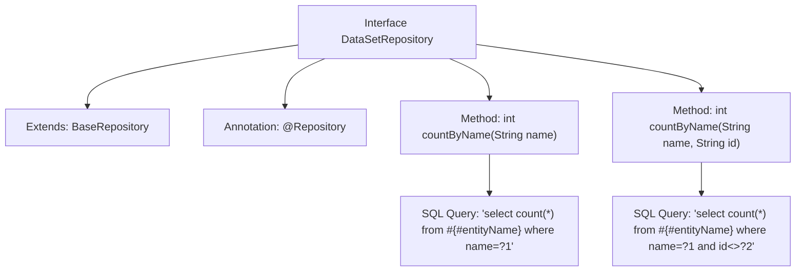

# Basic Information

|      |      |
|------|------|
| Name | DataSetRepository |
| Language | .java |
| Code Path | WeFe/fusion/fusion-service/src/main/java/com/welab/wefe/data/fusion/service/database/repository/DataSetRepository.java |
| Package Name | com.welab.wefe.data.fusion.service.database.repository |
| Dependencies | ['com.welab.wefe.data.fusion.service.database.entity.DataSetMySqlModel', 'com.welab.wefe.data.fusion.service.database.repository.base.BaseRepository', 'org.springframework.data.jpa.repository.Query', 'org.springframework.stereotype.Repository'] |
| Brief Description | The DataSetRepository interface extends BaseRepository, providing two native SQL query methods: counting records by name, and counting records by name while excluding a specified ID. |

# Description

This is a Spring Data JPA repository interface named `DataSetRepository`, which extends `BaseRepository` with generic parameters specifying the entity type as `DataSetMySqlModel` and the primary key type as `String`. The interface defines two statistical methods: `countByName(String name)` uses a native SQL query to count the total number of records with the specified name; `countByName(String name, String id)` counts the number of records where the name matches and the ID does not equal the specified value. Both methods use the `@Query` annotation to directly write native SQL statements, where `#{#entityName}` will be replaced by the table name corresponding to the entity. The method annotations describe the purpose of the parameters and return values.

# Class Summary

| Name   | Type  | Description |
|-------|------|-------------|
| DataSetRepository | interface | The DataSetRepository interface extends BaseRepository and provides two native SQL query methods: counting records by name, and counting records by name while excluding a specified ID. |

## Class DataSetRepository

|      |      |
|------|------|
| Access Modifier | @Repository;public |
| Type | interface |
| Name | DataSetRepository |
| Description | The DataSetRepository interface extends BaseRepository and provides two native SQL query methods: counting records by name, and counting records by name while excluding a specified ID. |

### UML Class Diagram

This code demonstrates a Spring Data JPA Repository interface design. The DataSetRepository interface extends the generic BaseRepository interface, specifying the entity type as DataSetMySqlModel and ID type as String. The interface defines two overloaded countByName methods for counting records with a specified name (with or without ID exclusion), both annotated with @Query to specify native SQL queries. The class diagram clearly illustrates the interface inheritance relationship and generic parameter binding, reflecting a typical implementation of the Repository pattern in Spring Data JPA.

### Internal Method Call Graph

This flowchart illustrates the structure and functionality of the DataSetRepository interface. The interface extends BaseRepository and is annotated with @Repository, indicating it's a data access component. It defines two overloaded countByName methods for counting records that match specific name conditions or name-plus-ID conditions. Each method specifies native SQL queries via @Query annotations, where #{#entityName} will be replaced by the actual entity table name. This design is commonly used in JPA scenarios requiring custom complex queries.

### Field List

| Name  | Type  | Description |
|-------|-------|------|

### Method List

| Name  | Type  | Description |
|-------|-------|------|
| countByName | int | Query the total number of records with a specified name in the database using native SQL statements, returning an integer result. |
| countByName | int | Query the count of records with the same name but different IDs, using name and ID as parameters, and return the count result. |

