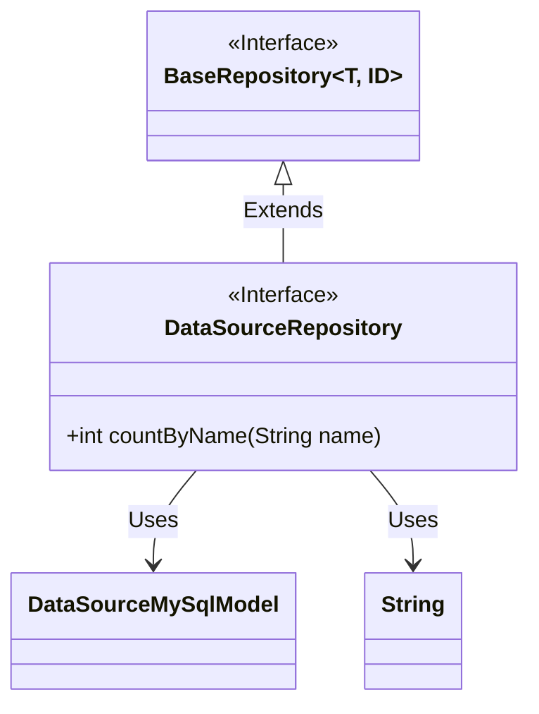
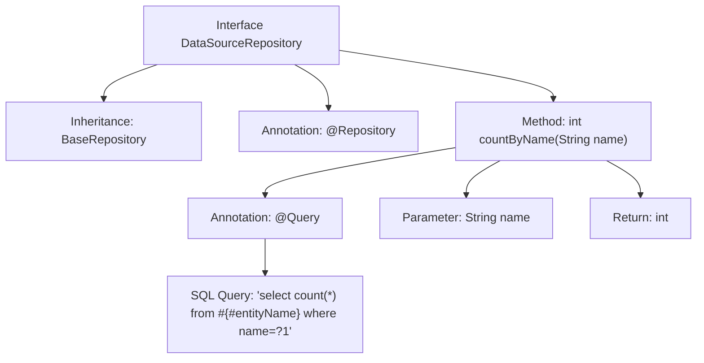

# Basic Information

|      |      |
|------|------|
| Name | DataSourceRepository |
| Language | .java |
| Code Path | WeFe/fusion/fusion-service/src/main/java/com/welab/wefe/data/fusion/service/database/repository/DataSourceRepository.java |
| Package Name | com.welab.wefe.data.fusion.service.database.repository |
| Dependencies | ['com.welab.wefe.data.fusion.service.database.entity.DataSourceMySqlModel', 'com.welab.wefe.data.fusion.service.database.repository.base.BaseRepository', 'org.springframework.data.jpa.repository.Query', 'org.springframework.stereotype.Repository'] |
| Brief Description | The DataSourceRepository interface extends BaseRepository and provides the countByName method for counting by name, utilizing native SQL queries. |

# Description

This is a Spring Data JPA repository interface named `DataSourceRepository`, which extends `BaseRepository` with generic parameters specifying the entity type as `DataSourceMySqlModel` and the primary key type as `String`. The interface defines a statistical method `countByName`, annotated with `@Query` to specify a native SQL query statement for counting the total number of records in the table where the `name` field matches the input parameter. The method accepts a `String` parameter `name` and returns the statistical result as an integer value.

# Class Summary

| Name   | Type  | Description |
|-------|------|-------------|
| DataSourceRepository | interface | The DataSourceRepository interface extends BaseRepository and provides the countByName method for counting by name, utilizing native SQL queries. |

## Class DataSourceRepository

|      |      |
|------|------|
| Access Modifier | @Repository;public |
| Type | interface |
| Name | DataSourceRepository |
| Description | The DataSourceRepository interface extends BaseRepository and provides the countByName method for counting by name, utilizing native SQL queries. |

### UML Class Diagram

This code demonstrates a Spring Data JPA repository interface design. The DataSourceRepository interface extends the generic BaseRepository interface, specifying the entity type as DataSourceMySqlModel and ID type as String. The interface defines a native SQL query method countByName() for counting data sources with a specified name. The class diagram clearly illustrates the interface inheritance relationship and the use of type parameters, reflecting the standard implementation of the JPA repository pattern. As a data access layer component, DataSourceRepository provides basic CRUD operations and custom query capabilities for the DataSourceMySqlModel entity.

### Internal Method Call Graph

This code defines a Spring Data JPA Repository interface `DataSourceRepository`, which extends `BaseRepository` and is annotated with `@Repository`. Its core functionality is to count data records with a specified name via the `countByName` method, which uses the `@Query` annotation to define a native SQL query. The flowchart illustrates the inheritance relationship, method definition with annotations, and clearly presents the complete call chain from parameter input to result return.

### Field List

| Name  | Type  | Description |
|-------|-------|------|

### Method List

| Name  | Type  | Description |
|-------|-------|------|
| countByName | int | Query the total number of records with a specified name in the database using native SQL statements, and return the count of matching entries. |

