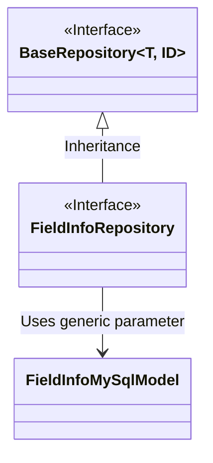
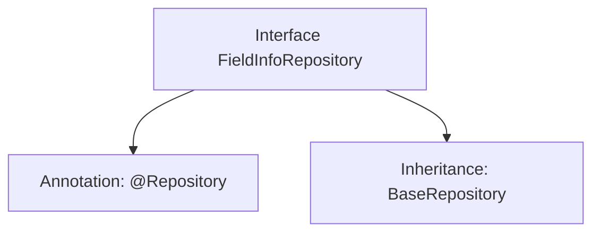

# Basic Information

|      |      |
|------|------|
| Name | FieldInfoRepository |
| Language | .java |
| Code Path | WeFe/fusion/fusion-service/src/main/java/com/welab/wefe/data/fusion/service/database/repository/FieldInfoRepository.java |
| Package Name | com.welab.wefe.data.fusion.service.database.repository |
| Dependencies | ['com.welab.wefe.data.fusion.service.database.entity.FieldInfoMySqlModel', 'com.welab.wefe.data.fusion.service.database.repository.base.BaseRepository', 'org.springframework.stereotype.Repository'] |
| Brief Description | This is a Spring repository interface that extends the base repository class, designed for operating on FieldInfoMySqlModel type data with a primary key of String type. |

# Description

The content describes a Spring Data repository interface named FieldInfoRepository. This interface is annotated with @Repository, indicating it is a Spring-managed persistence layer component. The interface extends the generic BaseRepository interface, specifying the entity type as FieldInfoMySqlModel and the primary key type as String. This design indicates that the repository is used to operate on FieldInfo entity data in a MySQL database, inheriting common CRUD operations from the base repository. The entire definition is concise and clear, adhering to the Spring Data JPA specifications.

# Class Summary

| Name   | Type  | Description |
|-------|------|-------------|
| FieldInfoRepository | interface | This is a Spring Data JPA repository interface that extends the base repository class, used for operating on the FieldInfoMySqlModel entity with a primary key type of String. |

## Class FieldInfoRepository

|      |      |
|------|------|
| Access Modifier | @Repository;public |
| Type | interface |
| Name | FieldInfoRepository |
| Description | This is a Spring Data JPA repository interface that extends the base repository class, used for operating on the FieldInfoMySqlModel entity with a primary key type of String. |

### UML Class Diagram

This class diagram illustrates the relationship where the FieldInfoRepository interface inherits from the generic BaseRepository interface. FieldInfoRepository is a Spring Data repository interface (annotated with @Repository) that inherits basic CRUD operations from BaseRepository, with the generic parameter T specified as FieldInfoMySqlModel (a database entity model) and ID as String type. This design follows Spring Data JPA's repository pattern, acquiring standard data access capabilities through inheritance of the base interface while maintaining interface simplicity.

### Internal Method Call Graph

This code defines a Spring Data repository interface named FieldInfoRepository, annotated with @Repository to identify it as a persistence layer component. The interface inherits from the BaseRepository generic interface, specifying the entity type as FieldInfoMySqlModel and the primary key type as String. The flowchart clearly illustrates the annotation and inheritance relationships of the interface, demonstrating the typical pattern in Spring Data JPA for rapidly implementing CRUD operations by inheriting from a base repository interface.

### Field List

| Name  | Type  | Description |
|-------|-------|------|

### Method List

| Name  | Type  | Description |
|-------|-------|------|

