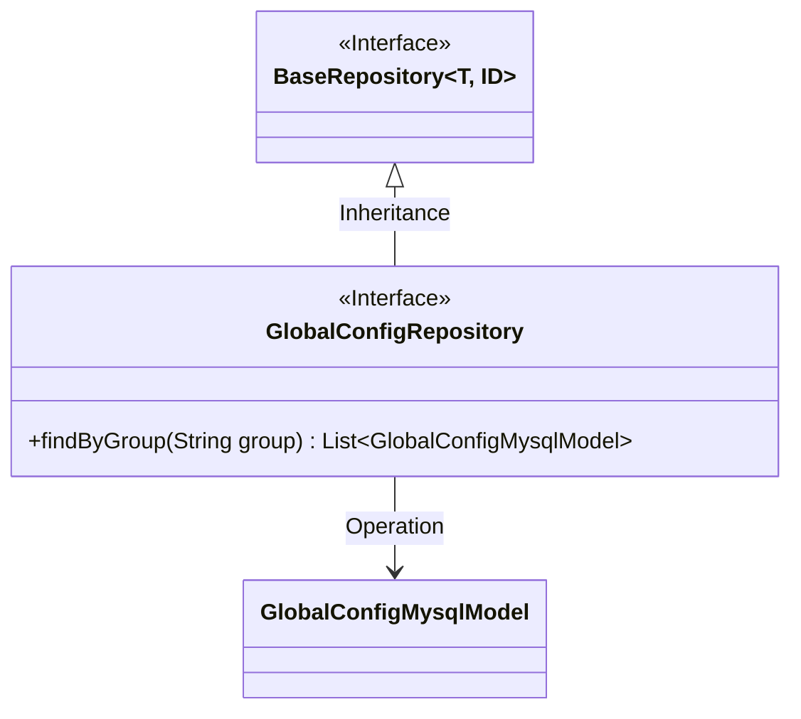
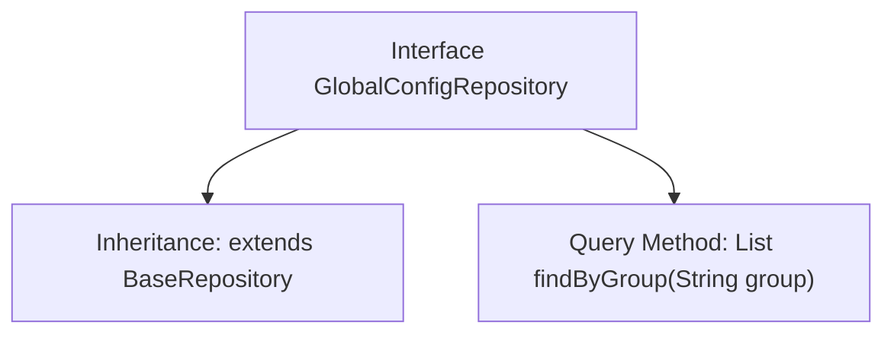

# Basic Information

|      |      |
|------|------|
| Name | GlobalConfigRepository |
| Language | .java |
| Code Path | WeFe/fusion/fusion-service/src/main/java/com/welab/wefe/data/fusion/service/database/repository/GlobalConfigRepository.java |
| Package Name | com.welab.wefe.data.fusion.service.database.repository |
| Dependencies | ['com.welab.wefe.data.fusion.service.database.entity.GlobalConfigMysqlModel', 'com.welab.wefe.data.fusion.service.database.repository.base.BaseRepository', 'org.springframework.stereotype.Repository', 'java.util.List'] |
| Brief Description | This is a Spring Repository interface that extends BaseRepository, designed for operating on GlobalConfigMysqlModel data and providing query functionality by the group field. |

# Description

The content defines a Spring Data repository interface named GlobalConfigRepository, which extends the BaseRepository base class and is used to manipulate data of type GlobalConfigMysqlModel with a primary key type of String. The interface includes a method findByGroup for querying by the group field, returning a list of matching entities. This interface is marked as a Spring-managed persistence layer component via the @Repository annotation.

# Class Summary

| Name   | Type  | Description |
|-------|------|-------------|
| GlobalConfigRepository | interface | This is a Spring Repository interface that extends BaseRepository, designed for operating on GlobalConfigMysqlModel data and providing query functionality by the group field. |

## Class GlobalConfigRepository

|      |      |
|------|------|
| Access Modifier | @Repository;public |
| Type | interface |
| Name | GlobalConfigRepository |
| Description | This is a Spring Repository interface that extends BaseRepository, designed for operating on GlobalConfigMysqlModel data and providing query functionality by the group field. |

### UML Class Diagram

Class Diagram Description: This diagram illustrates that the GlobalConfigRepository interface inherits from the generic BaseRepository interface and operates on the GlobalConfigMysqlModel entity class. BaseRepository defines generic repository operations, while GlobalConfigRepository extends specific functionality for querying by group, reflecting the repository pattern design of Spring Data JPA.

### Internal Method Call Graph

This flowchart illustrates the structure and functionality of the GlobalConfigRepository interface. The interface extends BaseRepository with generic types specified as GlobalConfigMysqlModel and String. It defines a query method findByGroup, which retrieves and returns a list of GlobalConfigMysqlModel objects based on the group parameter. This interface utilizes Spring Data JPA's Repository marker, indicating it is a data access layer component capable of automatically implementing basic CRUD operations and custom query methods.

### Field List

| Name  | Type  | Description |
|-------|-------|------|

### Method List

| Name  | Type  | Description |
|-------|-------|------|
| findByGroup | List<GlobalConfigMysqlModel> | The method `findByGroup` queries a list of `GlobalConfigMysqlModel` by group name. |

