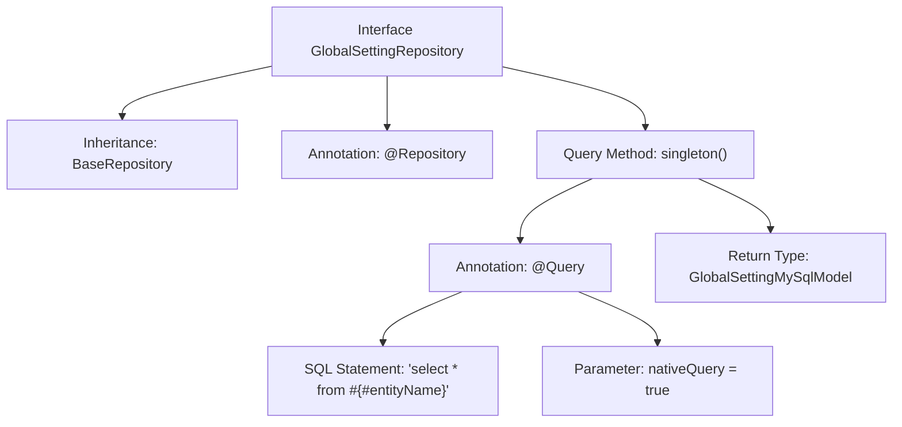

# Basic Information

|      |      |
|------|------|
| Name | GlobalSettingRepository |
| Language | .java |
| Code Path | WeFe/fusion/fusion-service/src/main/java/com/welab/wefe/data/fusion/service/database/repository/GlobalSettingRepository.java |
| Package Name | com.welab.wefe.data.fusion.service.database.repository |
| Dependencies | ['com.welab.wefe.data.fusion.service.database.entity.GlobalSettingMySqlModel', 'com.welab.wefe.data.fusion.service.database.repository.base.BaseRepository', 'org.springframework.data.jpa.repository.Query', 'org.springframework.stereotype.Repository'] |
| Brief Description | The GlobalSettingRepository interface extends BaseRepository and provides a singleton query method, using native SQL to retrieve all fields. |

# Description

This is a Spring Data JPA repository interface named GlobalSettingRepository, which extends the BaseRepository base class. The interface operates on the GlobalSettingMySqlModel entity class with a primary key type of String. It defines a query method called singleton, using the @Query annotation to specify a native SQL query statement that retrieves all table records corresponding to the entity represented by #{#entityName}. The method returns a single GlobalSettingMySqlModel object, intended for performing single-record query operations.

# Class Summary

| Name   | Type  | Description |
|-------|------|-------------|
| GlobalSettingRepository | interface | This is a Spring Data JPA Repository interface that defines the singleton() method for single-table queries on GlobalSettingMySqlModel, using native SQL to retrieve all records. |


## Class GlobalSettingRepository

|      |      |
|------|------|
| Access Modifier | @Repository;public |
| Type | interface |
| Name | GlobalSettingRepository |
| Description | This is a Spring Data JPA Repository interface that defines the singleton() method for single-table queries on GlobalSettingMySqlModel, using native SQL to retrieve all records. |


### UML Class Diagram

```mermaid
classDiagram
    class BaseRepository~T, ID~ {
        <<Interface>>
    }

    class GlobalSettingRepository {
        <<Interface>>
        +GlobalSettingMySqlModel singleton()
    }
    
    class GlobalSettingMySqlModel {
    }

    BaseRepository <|-- GlobalSettingRepository  // Inheritance
    GlobalSettingRepository --> GlobalSettingMySqlModel : Query returns
```

This class diagram illustrates the repository interface structure in Spring Data JPA. The GlobalSettingRepository interface inherits from the generic BaseRepository interface, specifying the entity type GlobalSettingMySqlModel and primary key type String. The interface defines a native SQL query method singleton() annotated with @Query, which retrieves a single global setting record from the database. The diagram clearly presents the interface inheritance relationship and entity type dependency, conforming to the typical design of the JPA repository pattern.


### Internal Method Call Graph



This flowchart illustrates the structure of the GlobalSettingRepository interface in Spring Data JPA. The interface is declared as a data access component via the @Repository annotation and inherits BaseRepository to obtain basic CRUD functionality. The core is the native SQL query method singleton() defined with the @Query annotation, which executes the "select * from #{#entityName}" query and returns a GlobalSettingMySqlModel entity. The flowchart clearly presents the hierarchical invocation relationships among annotations, inheritance, and query methods, reflecting the characteristics of JPA's declarative programming approach.

### Field List

| Name  | Type  | Description |
|-------|-------|------|

### Method List

| Name  | Type  | Description |
|-------|-------|------|
| singleton | GlobalSettingMySqlModel | Query all entity data and return a singleton GlobalSettingMySqlModel object. |


