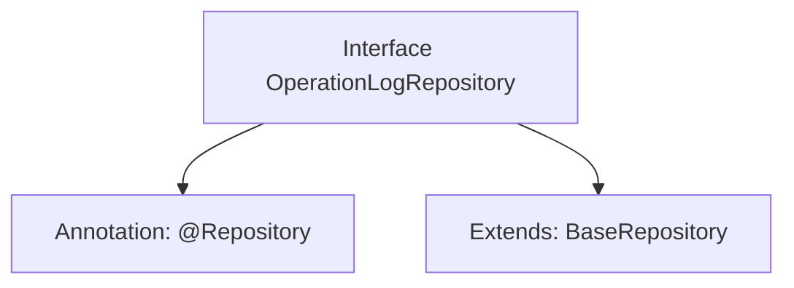

# Basic Information

|      |      |
|------|------|
| Name | OperationLogRepository |
| Language | .java |
| Code Path | WeFe/fusion/fusion-service/src/main/java/com/welab/wefe/data/fusion/service/database/repository/OperationLogRepository.java |
| Package Name | com.welab.wefe.data.fusion.service.database.repository |
| Dependencies | ['com.welab.wefe.data.fusion.service.database.entity.OperationLogMysqlModel', 'com.welab.wefe.data.fusion.service.database.repository.base.BaseRepository', 'org.springframework.stereotype.Repository'] |
| Brief Description | Operation log repository interface, inherits from the base repository class, manages the operation log MySQL model, with the primary key type as string. |

# Description

The code snippet defines a Spring Data repository interface named `OperationLogRepository`, identified by the `@Repository` annotation. This interface extends the generic base class `BaseRepository`, specifying the entity type as `OperationLogMysqlModel` and the primary key type as `String`. It is primarily used for persistent access to operation log data in MySQL, inheriting basic CRUD operation capabilities.

# Class Summary

| Name   | Type  | Description |
|-------|------|-------------|
| OperationLogRepository | interface | This is a database repository interface for operation logs, inherited from the base repository class, used for storing MySQL model data of operation logs. |


## Class OperationLogRepository

|      |      |
|------|------|
| Access Modifier | @Repository;public |
| Type | interface |
| Name | OperationLogRepository |
| Description | This is a database repository interface for operation logs, inherited from the base repository class, used for storing MySQL model data of operation logs. |


### UML Class Diagram

```mermaid
classDiagram
    class OperationLogRepository {
        <<Interface>>
    }
    class BaseRepository~T, ID~ {
        <<Interface>>
    }
    
    OperationLogRepository --|> BaseRepository : Extends
    // OperationLogRepository inherits from the generic interface BaseRepository, with generic parameters specified as OperationLogMysqlModel and String
```

This class diagram illustrates the inheritance relationship where the OperationLogRepository interface extends the generic BaseRepository interface. OperationLogRepository is a Spring data access layer interface marked with @Repository, which acquires basic CRUD operation capabilities by extending the BaseRepository interface. The generic parameter T is specified as OperationLogMysqlModel to represent the entity type for operations, while ID is specified as String to denote the primary key type. This design adheres to Spring Data JPA's repository pattern, providing a standardized data access interface for operation logs.


### Internal Method Call Graph



This flowchart illustrates the structural relationships of the OperationLogRepository interface. The interface is marked as a Spring @Repository component and extends the BaseRepository generic interface, specifying OperationLogMysqlModel as the entity type and String as the primary key type. This design indicates it is a data access layer component for database operations, following Spring Data's Repository pattern, which automatically inherits basic CRUD operations through the base interface.

### Field List

| Name  | Type  | Description |
|-------|-------|------|

### Method List

| Name  | Type  | Description |
|-------|-------|------|


