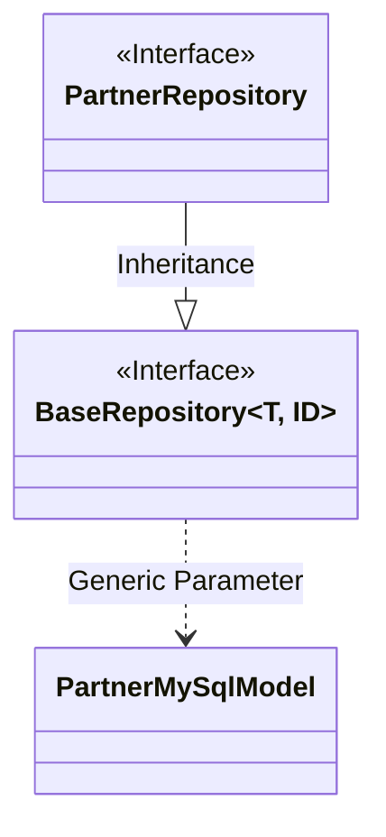
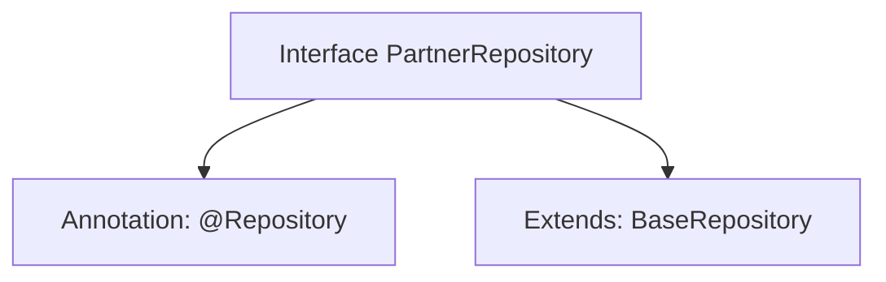

# Basic Information

|      |      |
|------|------|
| Name | PartnerRepository |
| Language | .java |
| Code Path | WeFe/fusion/fusion-service/src/main/java/com/welab/wefe/data/fusion/service/database/repository/PartnerRepository.java |
| Package Name | com.welab.wefe.data.fusion.service.database.repository |
| Dependencies | ['com.welab.wefe.data.fusion.service.database.entity.PartnerMySqlModel', 'com.welab.wefe.data.fusion.service.database.repository.base.BaseRepository', 'org.springframework.stereotype.Repository'] |
| Brief Description | The PartnerRepository interface extends BaseRepository and is used to manipulate PartnerMySqlModel data, with the primary key type being String. |

# Description

This is a Spring Data repository interface named PartnerRepository, annotated with `@Repository`. It extends the generic `BaseRepository` interface, specifying `PartnerMySqlModel` as the entity type and `String` as the primary key type. This interface is primarily used for operating on the database table corresponding to the `PartnerMySqlModel` entity, providing basic CRUD operation capabilities. By inheriting from `BaseRepository`, it acquires fundamental database access functionalities without requiring manual implementation of common data access methods.

# Class Summary

| Name   | Type  | Description |
|-------|------|-------------|
| PartnerRepository | interface | Partner repository interface, inherits from the base repository, operates on PartnerMySqlModel type data with a primary key of String type. |

## Class PartnerRepository

|      |      |
|------|------|
| Access Modifier | @Repository;public |
| Type | interface |
| Name | PartnerRepository |
| Description | Partner repository interface, inherits from the base repository, operates on PartnerMySqlModel type data with a primary key of String type. |

### UML Class Diagram

This class diagram illustrates the relationship where the PartnerRepository interface inherits from the generic BaseRepository interface. BaseRepository is an interface with two generic parameters (T and ID), where T is concretized as the PartnerMySqlModel entity class and the ID type is String. As a data access layer interface, PartnerRepository inherits basic CRUD operations from BaseRepository while specifying the entity type as PartnerMySqlModel and the primary key type as String. This design follows the repository pattern of Spring Data JPA, enabling standardized access to Partner data in MySQL databases.

### Internal Method Call Graph

This flowchart illustrates the structure of the PartnerRepository interface, which is a Spring component annotated with @Repository. It extends the generic base class BaseRepository, specifying PartnerMySqlModel as the entity type and String as the ID type. This design pattern is commonly used in Spring Data JPA to quickly gain CRUD operation capabilities by inheriting predefined repository interfaces while maintaining type safety.

### Field List

| Name  | Type  | Description |
|-------|-------|------|

### Method List

| Name  | Type  | Description |
|-------|-------|------|

