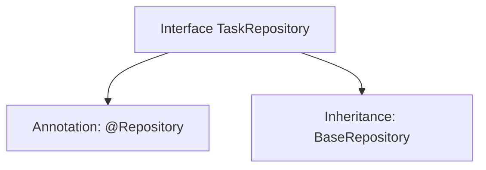

# Basic Information

|      |      |
|------|------|
| Name | TaskRepository |
| Language | .java |
| Code Path | WeFe/fusion/fusion-service/src/main/java/com/welab/wefe/data/fusion/service/database/repository/TaskRepository.java |
| Package Name | com.welab.wefe.data.fusion.service.database.repository |
| Dependencies | ['com.welab.wefe.data.fusion.service.database.entity.TaskMySqlModel', 'com.welab.wefe.data.fusion.service.database.repository.base.BaseRepository', 'org.springframework.stereotype.Repository'] |
| Brief Description | This is a Spring TaskRepository interface, which extends BaseRepository, used for operating data of type TaskMySqlModel with a primary key type of String. |

# Description

This is a Spring Data repository interface named TaskRepository, marked with the @Repository annotation. It inherits from the generic BaseRepository interface, specifying the entity type as TaskMySqlModel and the primary key type as String. This interface is primarily used for database operations but does not define additional methods, relying solely on the CRUD functionality provided by the base class.

# Class Summary

| Name   | Type  | Description |
|-------|------|-------------|
| TaskRepository | interface | This is a Spring TaskRepository interface, which extends BaseRepository, used for manipulating data of type TaskMySqlModel with a primary key of type String. |


## Class TaskRepository

|      |      |
|------|------|
| Access Modifier | @Repository;public |
| Type | interface |
| Name | TaskRepository |
| Description | This is a Spring TaskRepository interface, which extends BaseRepository, used for manipulating data of type TaskMySqlModel with a primary key of type String. |


### UML Class Diagram

```mermaid
classDiagram
    class TaskRepository {
        <<Interface>>
    }
    class BaseRepository~T, ID~ {
        <<Interface>>
    }
    TaskRepository --|> BaseRepository : Inheritance
    // BaseRepository is a generic interface, TaskRepository inherits and specifies generic parameters
```

This class diagram illustrates the relationship where the TaskRepository interface inherits from the BaseRepository generic interface. BaseRepository is an interface with two generic parameters (T and ID), and TaskRepository implements specific data access functionality by inheriting and specifying concrete type parameters (TaskMySqlModel and String). As an interface marked with @Repository, it is typically used for database operations, inheriting basic CRUD operation capabilities from the base repository interface here.


### Internal Method Call Graph



This code defines a Spring Data JPA repository interface TaskRepository, marked as a persistence layer component via the @Repository annotation. The interface extends the BaseRepository interface, specifying the entity type as TaskMySqlModel and the primary key type as String. The flowchart illustrates the annotation and inheritance relationships of the interface, reflecting the typical design pattern in Spring Data JPA for simplifying database operations.

### Field List

| Name  | Type  | Description |
|-------|-------|------|

### Method List

| Name  | Type  | Description |
|-------|-------|------|


