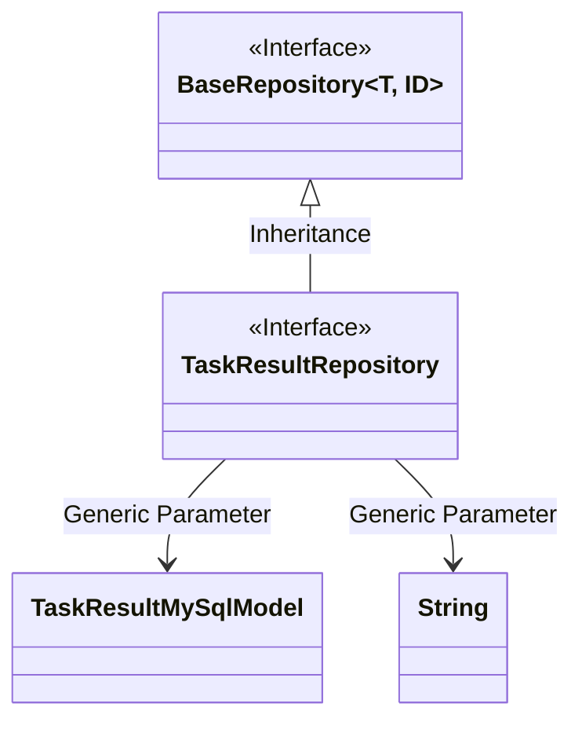
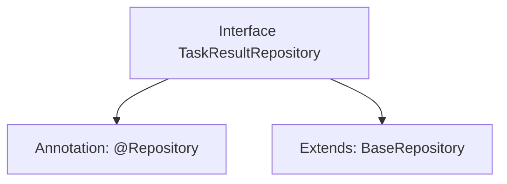

# Basic Information

|      |      |
|------|------|
| Name | TaskResultRepository |
| Language | .java |
| Code Path | WeFe/fusion/fusion-service/src/main/java/com/welab/wefe/data/fusion/service/database/repository/TaskResultRepository.java |
| Package Name | com.welab.wefe.data.fusion.service.database.repository |
| Dependencies | ['com.welab.wefe.data.fusion.service.database.entity.TaskResultMySqlModel', 'com.welab.wefe.data.fusion.service.database.repository.base.BaseRepository', 'org.springframework.stereotype.Repository'] |
| Brief Description | Task result repository interface, inherits from the base repository, operates on the task result MySQL model, with the primary key type as string. |

# Description

The content describes a Spring Data JPA repository interface named TaskResultRepository. This interface is annotated with @Repository to identify it as a data access component and inherits from the generic base class BaseRepository, specifying the entity type as TaskResultMySqlModel and the primary key type as String. This interface is primarily used for database operations on the TaskResultMySqlModel entity, inheriting common CRUD operation methods provided by the base class.

# Class Summary

| Name   | Type  | Description |
|-------|------|-------------|
| TaskResultRepository | interface | This is a Spring TaskResultRepository interface that extends BaseRepository, used for manipulating TaskResultMySqlModel type data with a primary key of String type. |

## Class TaskResultRepository

|      |      |
|------|------|
| Access Modifier | @Repository;public |
| Type | interface |
| Name | TaskResultRepository |
| Description | This is a Spring TaskResultRepository interface that extends BaseRepository, used for manipulating TaskResultMySqlModel type data with a primary key of String type. |

### UML Class Diagram

This class diagram illustrates the inheritance relationship of repository interfaces in Spring Data JPA. TaskResultRepository is an interface annotated with @Repository, inheriting from the generic interface BaseRepository<TaskResultMySqlModel, String>, indicating that this repository operates on entities of type TaskResultMySqlModel with a primary key of type String. BaseRepository serves as a foundational repository interface providing generic CRUD operations, while TaskResultRepository acts as a domain-specific repository interface capable of extending custom query methods.

### Internal Method Call Graph

This code demonstrates the definition of a Spring Data JPA repository interface. The TaskResultRepository interface is annotated with @Repository, indicating it is a data access component, and extends the BaseRepository interface, specifying the entity type TaskResultMySqlModel and primary key type String. This design provides basic CRUD operations for database tables, representing a typical implementation of the Spring Data JPA repository pattern.

### Field List

| Name  | Type  | Description |
|-------|-------|------|

### Method List

| Name  | Type  | Description |
|-------|-------|------|

