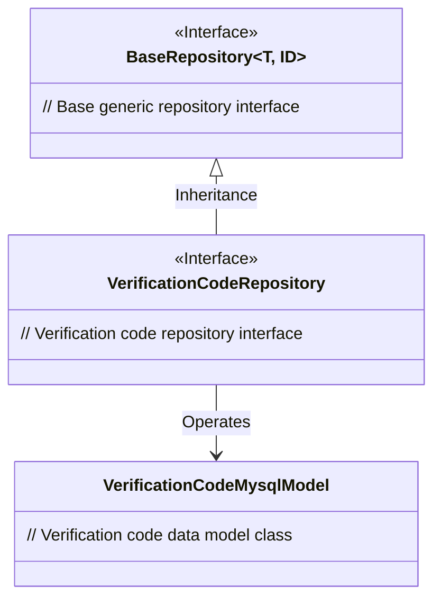
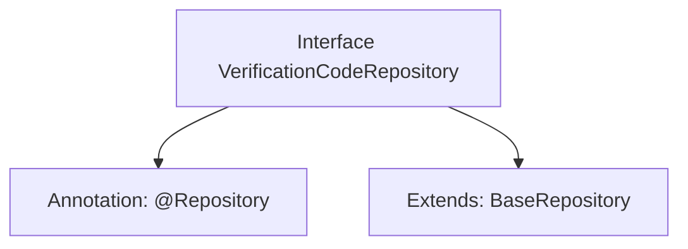

# Basic Information

|      |      |
|------|------|
| Name | VerificationCodeRepository |
| Language | .java |
| Code Path | WeFe/fusion/fusion-service/src/main/java/com/welab/wefe/data/fusion/service/database/repository/VerificationCodeRepository.java |
| Package Name | com.welab.wefe.data.fusion.service.database.repository |
| Dependencies | ['com.welab.wefe.data.fusion.service.database.entity.VerificationCodeMysqlModel', 'com.welab.wefe.data.fusion.service.database.repository.base.BaseRepository', 'org.springframework.stereotype.Repository'] |
| Brief Description | This is a verification code repository interface that inherits from the base repository, used for operating MySQL model data related to verification codes. |

# Description

The content defines a Spring Data repository interface named `VerificationCodeRepository`, marked as a persistence layer component with the `@Repository` annotation. This interface extends the generic base class `BaseRepository`, specifying the entity type as `VerificationCodeMysqlModel` and the primary key type as `String`. This indicates that the repository is used for handling persistence operations of verification code data but does not define additional methods, relying solely on the standard CRUD functionality provided by the base class.

# Class Summary

| Name   | Type  | Description |
|-------|------|-------------|
| VerificationCodeRepository | interface | This is a captcha repository interface that inherits the base repository and is used to manipulate MySQL model data for captchas. |

## Class VerificationCodeRepository

|      |      |
|------|------|
| Access Modifier | @Repository;public |
| Type | interface |
| Name | VerificationCodeRepository |
| Description | This is a captcha repository interface that inherits the base repository and is used to manipulate MySQL model data for captchas. |

### UML Class Diagram

This class diagram illustrates the hierarchical relationship of verification code storage. The VerificationCodeRepository interface inherits from the generic BaseRepository interface, specifying the generic parameters as VerificationCodeMysqlModel and String type, indicating that this repository is used to operate verification code data models with a string-type primary key. As the top-level abstract interface, BaseRepository provides foundational repository capabilities, which VerificationCodeRepository acquires through inheritance and specializes for the verification code domain. The entire design aligns with the JPA repository pattern, achieving decoupling in the data access layer.

### Internal Method Call Graph

This code defines a Spring Data JPA repository interface VerificationCodeRepository, marked as a persistence layer component via the @Repository annotation. The interface extends the generic BaseRepository interface, specifying the entity type as VerificationCodeMysqlModel and the primary key type as String. This design provides foundational support for CRUD operations on verification code data, adhering to Spring Data's repository pattern specifications.

### Field List

| Name  | Type  | Description |
|-------|-------|------|

### Method List

| Name  | Type  | Description |
|-------|-------|------|

