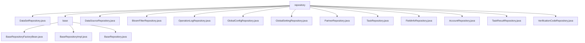

# Basic Information

|      |      |
|------|------|
| Name | repository |
| Language | .java |
| Code Path | WeFe/fusion/fusion-service/src/main/java/com/welab/wefe/data/fusion/service/database/repository |
| Package Name | docs.fusion.fusion-service.src.main.java.com.welab.wefe.data.fusion.service.database.repository |
| Brief Description | Multiple Spring Data JPA repository interfaces inherit from BaseRepository, providing CRUD and custom SQL query capabilities, supporting various entity types such as DataSet, Account, etc. |

# Description

## Overview  
This module is a generic repository framework based on Spring Data JPA, with its core responsibility being to provide standardized data access capabilities and extend native SQL queries. The interface specifications uniformly inherit from the BaseRepository base class, supporting conditional statistics, field updates, and transactional operations—such as executing native SQL via the @Query annotation (e.g., the countByName statistical method). Key data structures include the *MySqlModel series of entities (e.g., DataSetMySqlModel, AccountMysqlModel) and String-type primary keys. External dependencies are concentrated on Spring Data JPA and Hibernate. For example, AccountRepository implements transactional account status updates using @Modifying.  

## Primary Business Scenarios  
The module is suitable for multi-entity CRUD and complex query scenarios, functioning like an enhanced JPA template. A typical workflow involves: inheriting BaseRepository to gain foundational capabilities → extending custom SQL via @Query → combining transactional operations (e.g., AccountRepository disabling inactive accounts). Interaction patterns include: 1) Field-based queries (e.g., GlobalConfigRepository.findByGroup); 2) Native SQL statistics (e.g., DataSetRepository.countByName); 3) Single-record operations (e.g., GlobalSettingRepository.singleton). Integration examples span multiple domains such as logging and partner management, with PartnerRepository directly reusing the base class's CRUD.

### Package Internal Structure View

This flowchart illustrates the hierarchical structure of database repositories in the data fusion service. The top level is the repository directory, which contains multiple concrete repository implementation classes (such as DataSetRepository.java) and a base subdirectory. The base directory includes foundational repository factory classes (BaseRepositoryFactoryBean.java) and base repository implementation classes (BaseRepositoryImpl.java, BaseRepository.java). The overall structure is clear, reflecting the organizational hierarchy of the code.

# File List

| Name   | Type  | Description |
|-------|------|-------------|
| [DataSetRepository.java](DataSetRepository.md) | file | The DataSetRepository interface extends BaseRepository, providing two native SQL query methods: counting records by name, and counting records by name and ID (excluding a specified ID). |
| [DataSourceRepository.java](DataSourceRepository.md) | file | The DataSourceRepository interface extends BaseRepository and provides the countByName method for counting by name, utilizing native SQL queries. |
| [BloomFilterRepository.java](BloomFilterRepository.md) | file | This is a Spring Data JPA repository interface that extends the base repository for operating MySQL model data of Bloom filters. |
| [OperationLogRepository.java](OperationLogRepository.md) | file | Operation log repository interface, inherits from the base repository class, manages the operation log MySQL model, with the primary key type as string. |
| [GlobalConfigRepository.java](GlobalConfigRepository.md) | file | This is a Spring Repository interface that extends BaseRepository, designed for operating on GlobalConfigMysqlModel data and provides query functionality by the group field. |
| [GlobalSettingRepository.java](GlobalSettingRepository.md) | file | The GlobalSettingRepository interface extends BaseRepository, providing a single query method singleton that uses native SQL to retrieve all fields. |
| [PartnerRepository.java](PartnerRepository.md) | file | The PartnerRepository interface extends BaseRepository and is used to manipulate PartnerMySqlModel data, with the primary key type being String. |
| [TaskRepository.java](TaskRepository.md) | file | This is a Spring TaskRepository interface, extending from BaseRepository, designed to operate on TaskMySqlModel type data with a primary key type of String. |
| [FieldInfoRepository.java](FieldInfoRepository.md) | file | This is a Spring repository interface that extends the base repository class, designed for manipulating FieldInfoMySqlModel type data with a primary key of String type. |
| [AccountRepository.java](AccountRepository.md) | file | The AccountRepository interface extends BaseRepository, containing methods for querying accounts by mobile number, revoking super administrator privileges, updating last activity time, disabling accounts inactive for 90 days, and deleting accounts inactive for 180 days. |
| [TaskResultRepository.java](TaskResultRepository.md) | file | Task Result Repository Interface, inherits from the base repository, operates on the task result MySQL model, with the primary key type as string. |
| [VerificationCodeRepository.java](VerificationCodeRepository.md) | file | This is a verification code repository interface that inherits from the base repository, used for operating MySQL model data related to verification codes. |
| [base](base/_module.md) | package | BaseRepositoryFactoryBean extends JpaRepositoryFactoryBean to create custom JPA repository instances. BaseRepositoryImpl inherits from SimpleJpaRepository, providing various data operation methods. The BaseRepository interface extends JpaRepository, defining common data operation functionalities. |

