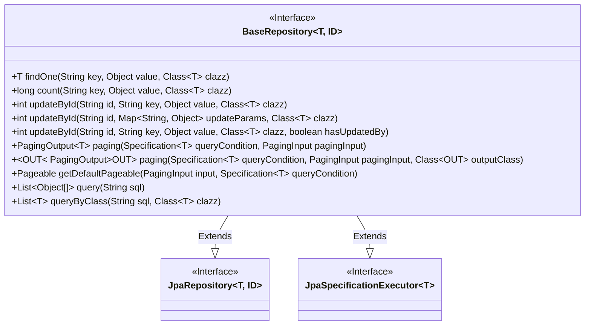

# Basic Information

|      |      |
|------|------|
| Name | BaseRepository |
| Language | .java |
| Code Path | WeFe/fusion/fusion-service/src/main/java/com/welab/wefe/data/fusion/service/database/repository/base/BaseRepository.java |
| Package Name | com.welab.wefe.data.fusion.service.database.repository.base |
| Dependencies | ['com.welab.wefe.common.data.mysql.MySpecification', 'com.welab.wefe.data.fusion.service.dto.base.PagingInput', 'com.welab.wefe.data.fusion.service.dto.base.PagingOutput', 'org.springframework.data.domain.PageRequest', 'org.springframework.data.domain.Pageable', 'org.springframework.data.domain.Sort', 'org.springframework.data.jpa.domain.Specification', 'org.springframework.data.jpa.repository.JpaRepository', 'org.springframework.data.jpa.repository.JpaSpecificationExecutor', 'org.springframework.data.repository.NoRepositoryBean', 'org.springframework.lang.Nullable', 'org.springframework.transaction.annotation.Transactional', 'java.io.Serializable', 'java.util.List', 'java.util.Map'] |
| Brief Description | The BaseRepository interface extends JpaRepository and JpaSpecificationExecutor, providing custom query, update, pagination, and native SQL operation capabilities. It supports field-based queries, statistics, transactional updates, and pagination conversion. |

# Description

The interface defines a generic base repository interface, extending JpaRepository and JpaSpecificationExecutor, providing various data operation methods. It includes functionalities such as querying a single record by field, counting records, updating single or multiple fields by ID (with transaction rollback support), paginated queries (with POJO-to-DTO conversion support), obtaining default pagination parameters (with customizable sorting support), and native SQL queries (returning arrays or entity classes). All update operations are annotated with transactional annotations to ensure data consistency.

# Class Summary

| Name   | Type  | Description |
|-------|------|-------------|
| BaseRepository | interface | The BaseRepository interface extends JpaRepository and JpaSpecificationExecutor, providing functionalities such as field-based querying, counting, updating, paginated queries, and native SQL queries. |

## Class BaseRepository

|      |      |
|------|------|
| Access Modifier | @NoRepositoryBean;public |
| Type | interface |
| Name | BaseRepository |
| Description | The BaseRepository interface extends JpaRepository and JpaSpecificationExecutor, providing functionalities such as field-based querying, counting, updating, paginated queries, and native SQL queries. |

### UML Class Diagram

This class diagram illustrates a generic interface BaseRepository that extends both JpaRepository and JpaSpecificationExecutor interfaces, providing comprehensive database operations. The interface includes functionalities such as querying single entities, counting records, updating data, paginated queries, and native SQL queries. Paginated queries support generic return type conversion, while update operations support transaction rollback. Through inheritance, this interface integrates core features of Spring Data JPA and extends commonly used business operations.

### Internal Method Call Graph

```mermaid
graph TD
    A["Interface BaseRepository<T, ID>"]
    B["Extends: JpaRepository<T, ID>"]
    C["Extends: JpaSpecificationExecutor<T>"]
    D["Method: T findOne(key,value,clazz)"]
    E["Method: long count(key,value,clazz)"]
    F["Method: int updateById(id,key,value,clazz)"]
    G["Method: int updateById(id,updateParams,clazz)"]
    H["Method: int updateById(id,key,value,clazz,hasUpdatedBy)"]
    I["Method: PagingOutput<T> paging(queryCondition,pagingInput)"]
    J["Method: PagingOutput<OUT> paging(queryCondition,pagingInput,outputClass)"]
    K["Method: Pageable getDefaultPageable(input,queryCondition)"]
    L["Method: List<Object[]> query(sql)"]
    M["Method: List<T> queryByClass(sql,clazz)"]

    A --> B
    A --> C
    A --> D
    A --> E
    A --> F
    A --> G
    A --> H
    A --> I
    A --> J
    A --> K
    A --> L
    A --> M
```

This flowchart illustrates the structure of the BaseRepository interface and its method relationships. As a JPA extension interface, it inherits core functionalities from both JpaRepository and JpaSpecificationExecutor, while adding 12 custom methods including conditional queries (findOne/count), update operations (updateById), pagination queries (paging), and native SQL queries (query). Notably, the getDefaultPageable default method implements pagination sorting logic, and multiple overloaded updateById methods provide update operations at varying granularities. All transactional methods are annotated with @Transactional to ensure data consistency.

### Field List

| Name  | Type  | Description |
|-------|-------|------|

### Method List

| Name  | Type  | Description |
|-------|-------|------|
| getDefaultPageable | Pageable | The method generates a pagination request based on the input parameters, prioritizing the sorting criteria from the query conditions. If none are provided, it defaults to sorting by createdTime in descending order. |
| count | long | The method is used to count the number of objects where the specified key and value match, returning a long integer result. |
| updateById | int | A method annotated with transaction annotation updates specified fields by ID and rolls back on exception. |
| query | List<Object[]> | This method executes an SQL query and returns an array list of objects, with each array representing a row of query results. |
| paging | PagingOutput<OUT> | Pagination query method, which accepts query conditions, pagination parameters, and output class, and returns paginated results. |
| findOne | T | Retrieve a single object of the specified type based on key-value pairs. |
| paging | PagingOutput<T> | Pagination query method, which accepts query conditions and pagination parameters, and returns paginated results. |
| updateById | int | Update method with transaction, rolls back on exception. Parameters: ID, key, value, class type, whether to update operator flag. |
| updateById | int | Update method with transaction, rollback on exception, updates the object based on ID and parameters. |
| queryByClass | List<T> | Query the database and return a list of objects of the specified type. The parameters are the SQL statement and the target class. |

