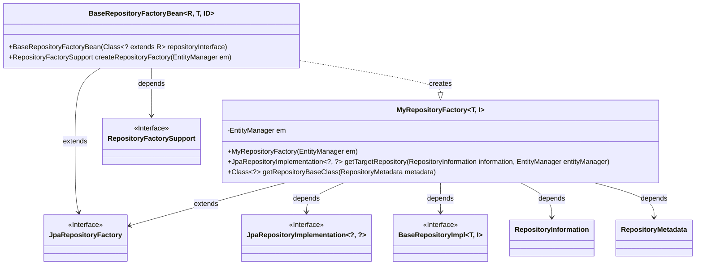

# Basic Information

|      |      |
|------|------|
| Name | BaseRepositoryFactoryBean |
| Language | .java |
| Code Path | WeFe/fusion/fusion-service/src/main/java/com/welab/wefe/data/fusion/service/database/repository/base/BaseRepositoryFactoryBean.java |
| Package Name | com.welab.wefe.data.fusion.service.database.repository.base |
| Dependencies | ['org.springframework.data.jpa.repository.JpaRepository', 'org.springframework.data.jpa.repository.support.JpaRepositoryFactory', 'org.springframework.data.jpa.repository.support.JpaRepositoryFactoryBean', 'org.springframework.data.jpa.repository.support.JpaRepositoryImplementation', 'org.springframework.data.repository.core.RepositoryInformation', 'org.springframework.data.repository.core.RepositoryMetadata', 'org.springframework.data.repository.core.support.RepositoryFactorySupport', 'javax.persistence.EntityManager', 'java.io.Serializable'] |
| Brief Description | BaseRepositoryFactoryBean extends JpaRepositoryFactoryBean, customizing the factory to create BaseRepositoryImpl instances for specific JPA repository implementations. |

# Description

BaseRepositoryFactoryBean is a generic class extending JpaRepositoryFactoryBean, designed to create custom JPA repository instances. It accepts the repository interface type through its constructor and overrides the createRepositoryFactory method to return a custom MyRepositoryFactory. The inner class MyRepositoryFactory inherits from JpaRepositoryFactory and is responsible for instantiating concrete BaseRepositoryImpl implementation classes while designating them as base repository classes. The entire process revolves around Spring Data JPA's repository factory mechanism, enabling customized handling of entity management and base repository classes.

# Class Summary

| Name   | Type  | Description |
|-------|------|-------------|
| BaseRepositoryFactoryBean | class | Customize the JPA repository factory bean, extend JpaRepositoryFactoryBean, override the factory creation logic, and return a custom BaseRepositoryImpl implementation class. |

## Class BaseRepositoryFactoryBean

|      |      |
|------|------|
| Access Modifier | public |
| Type | class |
| Name | BaseRepositoryFactoryBean |
| Description | Customize the JPA repository factory bean, extend JpaRepositoryFactoryBean, override the factory creation logic, and return a custom BaseRepositoryImpl implementation class. |

### UML Class Diagram

This code demonstrates a Spring Data JPA-based repository factory bean implementation. BaseRepositoryFactoryBean is a generic class that extends JpaRepositoryFactoryBean and is used to create custom JPA repository instances. It internally contains a static factory class MyRepositoryFactory, which is responsible for actually creating BaseRepositoryImpl instances. The class diagram clearly illustrates the inheritance relationship (BaseRepositoryFactoryBean→JpaRepositoryFactory) and dependency relationships (e.g., the factory class depends on EntityManager and various JPA interfaces), showcasing a typical implementation approach for Spring Data JPA extension points.

### Internal Method Call Graph

This code demonstrates a Spring Data JPA factory bean implementation for creating custom JPA repository instances. The flowchart clearly depicts the class inheritance structure (BaseRepositoryFactoryBean inherits from JpaRepositoryFactoryBean) and the composition of the inner class MyRepositoryFactory, including its constructor, core methods getTargetRepository (which returns a BaseRepositoryImpl instance) and getRepositoryBaseClass (which returns the BaseRepositoryImpl class object). This design extends Spring Data's standard repository implementation through the factory pattern, allowing injection of custom EntityManager and repository base classes.

### Field List

| Name  | Type  | Description |
|-------|-------|------|

### Method List

| Name  | Type  | Description |
|-------|-------|------|
| createRepositoryFactory | RepositoryFactorySupport | Rewriting the parent class method to create and return a custom repository factory instance based on EntityManager. |

