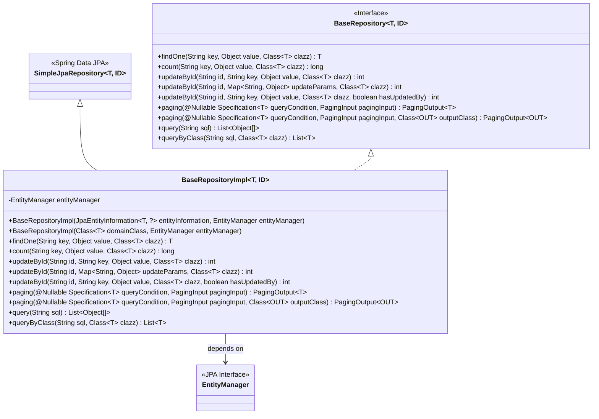

# Basic Information

|      |      |
|------|------|
| Name | BaseRepositoryImpl |
| Language | .java |
| Code Path | WeFe/fusion/fusion-service/src/main/java/com/welab/wefe/data/fusion/service/database/repository/base/BaseRepositoryImpl.java |
| Package Name | com.welab.wefe.data.fusion.service.database.repository.base |
| Dependencies | ['com.welab.wefe.common.web.util.CurrentAccountUtil', 'com.welab.wefe.data.fusion.service.dto.base.PagingInput', 'com.welab.wefe.data.fusion.service.dto.base.PagingOutput', 'org.apache.commons.collections4.CollectionUtils', 'org.springframework.data.domain.Page', 'org.springframework.data.jpa.domain.Specification', 'org.springframework.data.jpa.repository.support.JpaEntityInformation', 'org.springframework.data.jpa.repository.support.SimpleJpaRepository', 'org.springframework.lang.Nullable', 'javax.persistence.EntityManager', 'javax.persistence.Query', 'javax.persistence.criteria.CriteriaBuilder', 'javax.persistence.criteria.CriteriaQuery', 'javax.persistence.criteria.CriteriaUpdate', 'javax.persistence.criteria.Root', 'java.io.Serializable', 'java.util.Date', 'java.util.List', 'java.util.Map'] |
| Brief Description | BaseRepositoryImpl is the JPA base repository implementation class, providing generic CRUD operations including conditional queries, pagination, updates, and native SQL execution capabilities. |

# Description

BaseRepositoryImpl is a generic JPA repository implementation class that extends SimpleJpaRepository and implements the BaseRepository interface. It provides various data operation methods through EntityManager, including querying a single entity by conditions, counting records, updating single or multiple fields by ID, paginated queries, and executing native SQL queries. Update operations automatically set the update timestamp and optionally allow setting the updater. Paginated queries support direct entity returns or DTO conversion.

# Class Summary

| Name   | Type  | Description |
|-------|------|-------------|
| BaseRepositoryImpl | class | BaseRepositoryImpl is a JPA generic repository implementation class that provides query, update, pagination, and native SQL operation functionalities. It supports conditional search, counting, ID-based updates, and paginated queries. |

## Class BaseRepositoryImpl

|      |      |
|------|------|
| Access Modifier | public |
| Type | class |
| Name | BaseRepositoryImpl |
| Description | BaseRepositoryImpl is a JPA generic repository implementation class that provides query, update, pagination, and native SQL operation functionalities. It supports conditional search, counting, ID-based updates, and paginated queries. |

### UML Class Diagram

This code implements a custom repository base class based on Spring Data JPA, supporting operations for multiple entity types through generics. The class diagram shows that BaseRepositoryImpl inherits from SimpleJpaRepository and implements the BaseRepository interface, containing 12 core methods that primarily provide dynamic conditional querying, pagination, batch updates, and native SQL execution capabilities. It utilizes EntityManager to implement JPA standard query builder operations and supports automatic updates with audit fields, demonstrating advanced encapsulation and extension capabilities of the JPA specification.

### Internal Method Call Graph

```mermaid
graph TD
    A["Class BaseRepositoryImpl<T, ID>"]
    B["Property: EntityManager entityManager"]
    C["Constructor 1: BaseRepositoryImpl(JpaEntityInformation, EntityManager)"]
    D["Constructor 2: BaseRepositoryImpl(Class<T>, EntityManager)"]
    E["Method: T findOne(String key, Object value, Class<T> clazz)"]
    F["Method: long count(String key, Object value, Class<T> clazz)"]
    G["Method: int updateById(String id, String key, Object value, Class<T> clazz)"]
    H["Method: int updateById(String id, Map<String, Object> updateParams, Class<T> clazz)"]
    I["Method: int updateById(String id, String key, Object value, Class<T> clazz, boolean hasUpdatedBy)"]
    J["Method: PagingOutput<T> paging(Specification<T>, PagingInput)"]
    K["Method: PagingOutput<OUT> paging(Specification<T>, PagingInput, Class<OUT>)"]
    L["Method: List<Object[]> query(String sql)"]
    M["Method: List<T> queryByClass(String sql, Class<T> clazz)"]

    A --> B
    A --> C
    A --> D
    A --> E
    A --> F
    A --> G
    A --> H
    A --> I
    A --> J
    A --> K
    A --> L
    A --> M
```

This code represents a custom repository implementation class based on Spring Data JPA, providing CRUD operations for entity classes. The flowchart illustrates the class structure, including two constructors and multiple query/update methods. Core functionalities include: retrieving a single entity by condition (findOne), counting matching records (count), various ID-based update methods (updateById), paginated queries (paging), and native SQL queries (query/queryByClass). All operations are implemented through EntityManager, supporting generics and dynamic condition building.

### Field List

| Name  | Type  | Description |
|-------|-------|------|
| entityManager | EntityManager | A private immutable instance of the entity manager. |

### Method List

| Name  | Type  | Description |
|-------|-------|------|
| updateById | int | The method `updateById` updates the entity fields of a specified ID using the JPA Criteria API. If `hasUpdatedBy` is true, it sets `updatedBy` to the current user ID. It also updates the specified key fields and `updatedTime`, then executes the update operation and returns the number of affected rows. |
| updateById | int | This method updates specified field values of an entity by ID, automatically sets the update time and operator, and finally performs the update operation and returns the number of affected rows. |
| findOne | T | This method queries the database using the JPA Criteria API and returns the first entity object matching the specified field and value, or null if no results are found. |
| paging | PagingOutput<T> | This method implements pagination query functionality, accepting query conditions and pagination parameters, and returning paginated results. Internally, it calls findAll to retrieve data, then encapsulates both the total record count and current page data for return. |
| updateById | int | This method updates an entity by ID, uses CriteriaBuilder to set update parameters, automatically updates the modification time and operator ID, and finally executes the update operation and returns the number of affected rows. |
| paging | PagingOutput<OUT> | Pagination query method, retrieves paginated data based on conditions and converts it to the specified output class, returning the total record count and paginated result list. |
| query | List<Object[]> | Java Method: Execute native SQL query and return result list. |
| count | long | This method uses the JPA Criteria API to count the number of records that meet the specified conditions. It constructs query criteria by specifying field names and values, then returns the total count of matching records. |
| queryByClass | List<T> | This method queries the database using native SQL and returns a result list of the specified category. It creates and executes the query using the entity manager, then converts the results into a generic list. |

