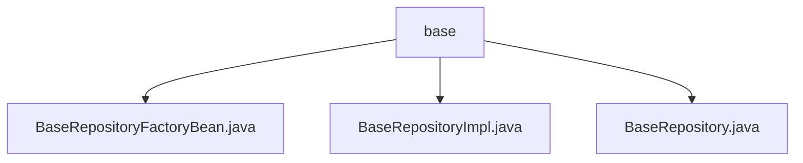

# Basic Information

|      |      |
|------|------|
| Name | base |
| Language | .java |
| Code Path | WeFe/fusion/fusion-service/src/main/java/com/welab/wefe/data/fusion/service/database/repository/base |
| Package Name | docs.fusion.fusion-service.src.main.java.com.welab.wefe.data.fusion.service.database.repository.base |
| Brief Description | BaseRepositoryFactoryBean extends JpaRepositoryFactoryBean to create custom JPA repository instances. BaseRepositoryImpl inherits from SimpleJpaRepository, providing various data operation methods. The BaseRepository interface extends JpaRepository, defining common data operation functionalities. |

# Description

## Overview  
This module is a generic repository framework extended around Spring Data JPA, with its core responsibility being the customized creation of JPA repository instances through the factory pattern, while providing rich CRUD operation capabilities. The interface specifications are unified to support conditional queries, pagination, field-level updates, and native SQL execution, while ensuring transactional consistency. Key data structures include generic entity classes, DTO conversion objects, and pagination parameter objects. External dependencies primarily consist of Spring Data JPA, EntityManager, and Hibernate. For example, BaseRepositoryFactoryBean dynamically generates BaseRepositoryImpl instances via MyRepositoryFactory.  

## Key Business Scenarios  
The module is suitable for scenarios requiring flexible manipulation of entity data, similar to an enhanced JPA template. The complete workflow includes: factory creation of customized repositories → implementation classes handling basic CRUD → interfaces exposing diverse queries. Typical interactions include automatically populating timestamps when updating fields by ID or converting DTOs during paginated queries. Integration examples cover conditional statistics, transactional updates, and native SQL mapping, such as executing custom SQL via the @Query annotation and returning entity lists.

### Package Internal Structure View

This flowchart illustrates the hierarchical relationship between three Java files under the base directory. BaseRepositoryFactoryBean.java, BaseRepositoryImpl.java, and BaseRepository.java are all directly subordinate to the base directory with no deeper nested structure. These three files belong to the same level and collectively form the core components of the base repository implementation.

# File List

| Name   | Type  | Description |
|-------|------|-------------|
| [BaseRepositoryFactoryBean.java](BaseRepositoryFactoryBean.md) | file | BaseRepositoryFactoryBean extends JpaRepositoryFactoryBean, customizing the factory to create BaseRepositoryImpl instances for specific JPA repository implementations. |
| [BaseRepositoryImpl.java](BaseRepositoryImpl.md) | file | BaseRepositoryImpl is the JPA base repository implementation class, providing generic CRUD operations including conditional queries, pagination, updates, and native SQL execution capabilities. |
| [BaseRepository.java](BaseRepository.md) | file | The BaseRepository interface extends JpaRepository and JpaSpecificationExecutor, providing functionalities for custom queries, updates, pagination, and native SQL operations. It supports field-based queries, statistics, transactional updates, and pagination conversion. |

