# Basic Information

|      |      |
|------|------|
| Name | dto |
| Language | .java |
| Code Path | WeFe/fusion/fusion-service/src/main/java/com/welab/wefe/data/fusion/service/dto |
| Package Name | docs.fusion.fusion-service.src.main.java.com.welab.wefe.data.fusion.service.dto |
| Brief Description | The account module handles data validation and desensitization, the federated learning module manages data and tasks, and the pagination module encapsulates pagination query functionality. |

# Description

## Overview  
This module serves as the core component of the federated learning system, responsible for data management, account processing, and paginated queries. It adopts a configuration-center-like pattern to uniformly manage various business entities. The interface specifications follow the Getter/Setter pattern, encompassing data validation and desensitization for AccountInput/Output, pagination encapsulation for PagingInput/Output, and business models such as Bloomfilter/Task. Key data structures include account fields (phoneNumber/nickname), pagination metadata (total/pageSize), and federated learning entities (DataSet/Bloomfilter). External dependencies are limited to Java base libraries and ModelMapper, such as using Masker for sensitive information handling and chained operations to load TaskDetail data.

## Key Business Scenarios  
The module supports full lifecycle management of federated learning, with typical workflows including: 1) Account registration validation (InputModel format verification → OutputModel desensitization return); 2) Paginated queries (PagingInput parameters → PagingOutput packaging); 3) Data fusion (Bloomfilter creation → PSI role assignment). The interaction mode employs DTO object transmission, resembling microservice governance solutions, such as tracking asynchronous task progress via TaskOutput and validating RSA public keys with MemberInfoModel. Functional completeness is reflected in covering three major scenarios—configuration management (GlobalConfigInput), state tracking (DataSetStateOutput), and audit analysis (OperationLogOutput)—forming an event-bus-like processing system.

### Package Internal Structure View

```mermaid
graph TD
    dto --> vo
    dto --> entity
    dto --> base
    vo --> AccountInputModel.java
    vo --> AccountOutputModel.java
    entity --> bloomfilter
    entity --> globalconfig
    entity --> dataset
    entity --> DataSourceOverviewOutput.java
    entity --> TaskOverviewOutput.java
    entity --> OperationLogOutputModel.java
    entity --> PartnerOutputModel.java
    entity --> AbstractOutputModel.java
    entity --> TaskOutput.java
    bloomfilter --> BloomfilterOutputModel.java
    bloomfilter --> BloomfilterDetailOutputModel.java
    globalconfig --> GlobalConfigInput.java
    globalconfig --> MemberInfoModel.java
    globalconfig --> FusionConfigModel.java
    dataset --> DataSetOutputModel.java
    dataset --> DataSetPreviewOutputModel.java
    dataset --> DataSetDetailOutputModel.java
    dataset --> DataSetStateOutputModel.java
    base --> PagingOutput.java
    base --> PagingInput.java
```

This flowchart illustrates the complete hierarchical structure of the dto directory under the fusion-service module in the WeFe project. The root node dto contains three main subdirectories: vo, entity, and base. The entity directory is further divided into subdirectories such as bloomfilter, globalconfig, and dataset. Each subdirectory includes corresponding Java class files, such as account models under the vo directory, various output models under entity, and pagination-related classes under the base directory. The entire structure clearly reflects the organization of the Data Transfer Object (DTO) layer.

# File List

| Name   | Type  | Description |
|-------|------|-------------|
| [base](base/_module.md) | package | PagingOutput is a pagination result class containing total and list attributes, providing static factory methods to create instances or automatically map DTOs. PagingInput is a pagination parameter class containing pageIndex and pageSize attributes, validating that the page number is not less than 0. |
| [entity](entity/_module.md) | package | Manage modules such as Bloom filters, global configurations, datasets, and tasks, providing data models, state tracking, and operation log functionalities to support the full lifecycle management of federated learning systems. |
| [vo](vo/_module.md) | package | The `AccountInputModel` class inherits from `AbstractApiInput` and includes mandatory fields such as phone number, nickname, password, and email, with format and length constraints. The `AccountOutputModel` class inherits from `AbstractOutputModel` and contains account attributes like phone number, email (masked), permission identifiers, status information, and activity time, providing getter/setter methods. |

