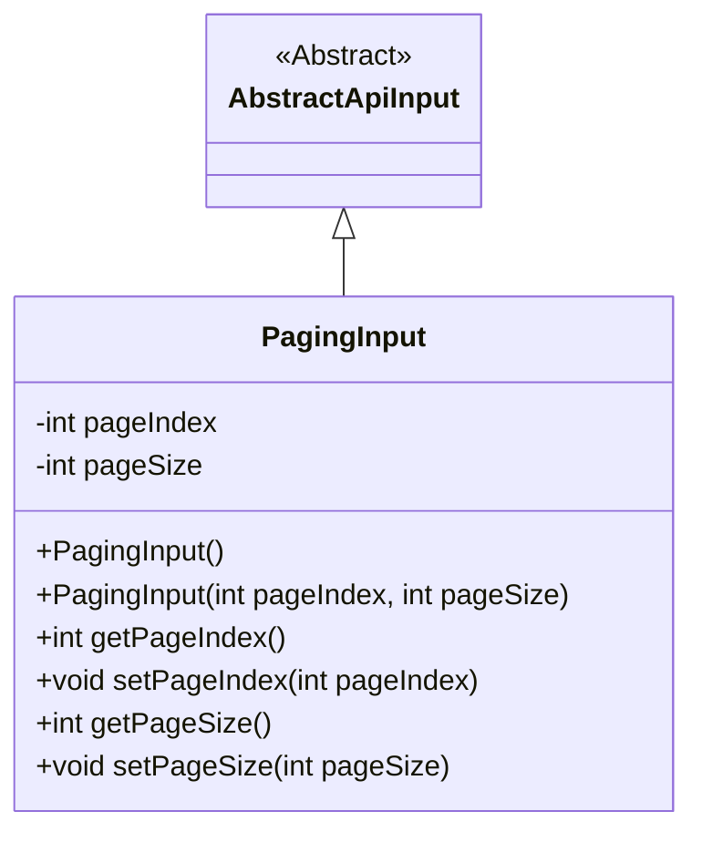
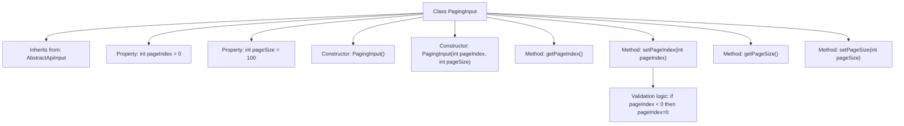

# Basic Information

|      |      |
|------|------|
| Name | PagingInput |
| Language | .java |
| Code Path | WeFe/fusion/fusion-service/src/main/java/com/welab/wefe/data/fusion/service/dto/base/PagingInput.java |
| Package Name | com.welab.wefe.data.fusion.service.dto.base |
| Dependencies | ['com.welab.wefe.common.fieldvalidate.annotation.Check', 'com.welab.wefe.common.web.dto.AbstractApiInput'] |
| Brief Description | Pagination input class, containing page number and page size attributes. The page number defaults to 0, and the page size defaults to 100. It provides constructors and getter/setter methods. |

# Description

PagingInput is a pagination input class that inherits from AbstractApiInput, designed to handle pagination query parameters. It includes two main attributes: pageIndex represents the page number, with 0 indicating the first page and a default value of 0; pageSize denotes the number of records per page, with a default value of 100. The class provides a no-argument constructor and a parameterized constructor, along with corresponding getter and setter methods. In the setPageIndex method, the input pageIndex is validated to ensure it is not less than 0.

# Class Summary

| Name   | Type  | Description |
|-------|------|-------------|
| PagingInput | class | Pagination input class, containing page number and page size, with the page number defaulting to 0 and the page size defaulting to 100, providing constructors and getter/setter methods. |

## Class PagingInput

|      |      |
|------|------|
| Access Modifier | public |
| Type | class |
| Name | PagingInput |
| Description | Pagination input class, containing page number and page size, with the page number defaulting to 0 and the page size defaulting to 100, providing constructors and getter/setter methods. |

### UML Class Diagram

This code defines a pagination input class `PagingInput`, which inherits from the abstract base class `AbstractApiInput`. The class contains two private fields: `pageIndex` representing the page number (0 for the first page) and `pageSize` representing the page size, with a default value of 100. It provides a no-argument constructor and a parameterized constructor, along with corresponding getter and setter methods. The `setPageIndex` method includes input validation to ensure the page number is not less than 0. This class is primarily used to encapsulate pagination query parameters, providing a standardized pagination input structure for API requests.

### Internal Method Call Graph

This code defines a pagination input class PagingInput, which inherits from AbstractApiInput. It contains two properties: page index and page size, provides a default constructor and a parameterized constructor, as well as getter and setter methods for the properties. When setting the page index, it validates whether the input value is less than 0, and automatically corrects it to 0 if it is. The flowchart illustrates the class inheritance relationship, properties, constructors, methods, and the invocation path of the validation logic.

### Field List

| Name  | Type  | Description |
|-------|-------|------|
| pageIndex = 0 | int | Page index, where 0 indicates the first page. |
| pageSize = 100 | int | Define a private integer variable pageSize with an initial value of 100. |

### Method List

| Name  | Type  | Description |
|-------|-------|------|
| getPageIndex | int | The method to obtain the current page number returns the value of the integer variable pageIndex. |
| getPageSize | int | Methods to obtain the current page size, returning an integer value pageSize. |
| setPageIndex | void | Set the page number, and automatically adjust it to 0 if it is less than 0. |
| setPageSize | void | The method to set the number of items displayed per page, with the parameter being pageSize. |

