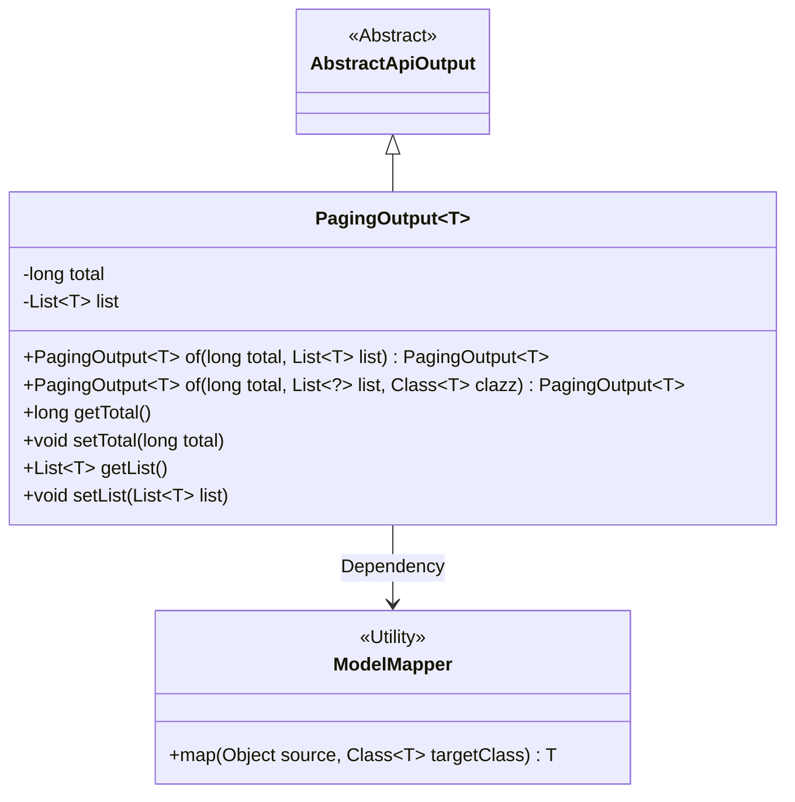
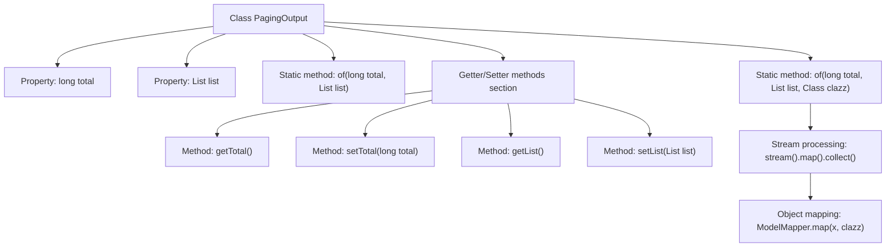

# Basic Information

|      |      |
|------|------|
| Name | PagingOutput |
| Language | .java |
| Code Path | WeFe/fusion/fusion-service/src/main/java/com/welab/wefe/data/fusion/service/dto/base/PagingOutput.java |
| Package Name | com.welab.wefe.data.fusion.service.dto.base |
| Dependencies | ['com.welab.wefe.common.web.dto.AbstractApiOutput', 'com.welab.wefe.common.web.util.ModelMapper', 'java.util.List', 'java.util.stream.Collectors'] |
| Brief Description | Pagination output class, containing total count and list data, supports direct creation or creation via mapping conversion. |

# Description

PagingOutput is a generic class that inherits from AbstractApiOutput, designed to encapsulate paginated query results. It contains two main attributes: `total` represents the total number of records, and `list` stores the data list of the current page. It provides two static factory methods: `of(long total, List<T> list)` for directly creating an instance, and `of(long total, List<?> list, Class<T> clazz)` for automatically mapping database entities to DTO objects via ModelMapper. The class also includes standard getter and setter methods for `total` and `list`.

# Class Summary

| Name   | Type  | Description |
|-------|------|-------------|
| PagingOutput | class | Pagination output class, containing total count and list data, provides two creation methods, supporting direct assignment or automatic mapping from entities to DTOs. |

## Class PagingOutput

|      |      |
|------|------|
| Access Modifier | public |
| Type | class |
| Name | PagingOutput |
| Description | Pagination output class, containing total count and list data, provides two creation methods, supporting direct assignment or automatic mapping from entities to DTOs. |

### UML Class Diagram

This code defines a generic class `PagingOutput<T>` for encapsulating paginated query results, including the total record count `total` and the current page data list `list`. The class provides two static factory methods `of()`, one of which supports automatic mapping of database entities to DTOs. The class inherits from the abstract class `AbstractApiOutput` and depends on the utility class `ModelMapper` for object mapping. This design simplifies the encapsulation of paginated data and type conversion, improving code reusability.

### Internal Method Call Graph

This flowchart illustrates the structure and key methods of the PagingOutput generic class. The class contains two core properties (total and list), two static factory methods (of), and standard getter/setter methods. Particularly noteworthy is the second of method, which implements automatic mapping conversion from database entities to DTOs through stream processing and ModelMapper, demonstrating the class's core functionality. The flowchart clearly presents the relationships between class members and the method invocation chain.

### Field List

| Name  | Type  | Description |
|-------|-------|------|
| list | List<T> | Private generic list variable list |
| total | long | Private long integer variable total, used to store the total count. |

### Method List

| Name  | Type  | Description |
|-------|-------|------|
| getTotal | long | A public method to get the total value, returning a long type. |
| of | PagingOutput<T> | This is a static generic method designed to create a paginated output object. The method accepts parameters including the total record count, data list, and target type, maps the list elements to the target type, and returns the encapsulated result. It handles empty list scenarios to ensure robustness. |
| setTotal | void | This is a Java method used to set the value of the class member variable `total`. The method accepts a parameter of type `long` named `total` and assigns it to the `total` property of the current object. |
| setList | void | This is a Java method used to set the List-type member variable `list` of a class. The method accepts a generic List parameter and assigns it to the `list` property of the current object. |
| of | PagingOutput<T> | The static method `of` creates a paginated output object, sets the total record count and data list, then returns it. |
| getList | List<T> | The get method of the list object. |

