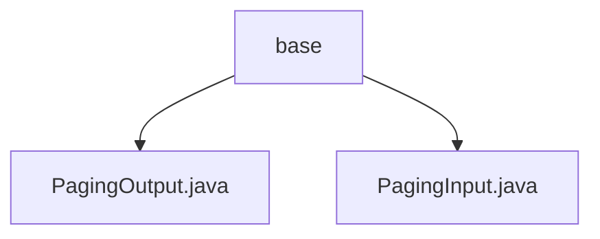

# Basic Information

|      |      |
|------|------|
| Name | base |
| Language | .java |
| Code Path | WeFe/fusion/fusion-service/src/main/java/com/welab/wefe/data/fusion/service/dto/base |
| Package Name | docs.fusion.fusion-service.src.main.java.com.welab.wefe.data.fusion.service.dto.base |
| Brief Description | PagingOutput is a pagination result class containing total and list attributes, providing static factory methods to create instances or automatically map DTOs. PagingInput is a pagination parameter class containing pageIndex and pageSize attributes, validating that the page number is not less than 0. |

# Description

## Overview  
This module provides standardized pagination query processing capabilities, with core responsibilities including encapsulating pagination request parameters (PagingInput) and response results (PagingOutput). The interface specification follows a unified input-output pattern, where PagingInput defines page number and page size parameters, and PagingOutput wraps the data list and total count. Key data structures include pagination metadata (total/pageIndex/pageSize) and a generic data list (list). Dependencies include ModelMapper for object mapping. For example, the of() factory method supports automatic DTO conversion.  

## Primary Business Scenarios  
The module is suitable for RESTful interface scenarios requiring paginated queries, similar to the pagination processing paradigm of backend CRUD operations. A typical workflow involves the frontend passing PagingInput parameters, and the backend returning paginated data wrapped in PagingOutput. For instance, a list query interface uses pageIndex/pageSize to control data segmentation and returns current-page data with total statistics. Integration examples include static factory methods to construct responses, supporting both direct parameter passing and entity-DTO mapping modes.

### Package Internal Structure View

This flowchart illustrates two Java files under the base directory: PagingOutput.java and PagingInput.java. Both files reside at the same level, directly subordinate to the base directory without any deeper nesting relationships. The diagram clearly presents this simple parent-child structural relationship, conforming to the given path information requirements.

# File List

| Name   | Type  | Description |
|-------|------|-------------|
| [PagingOutput.java](PagingOutput.md) | file | Pagination output class, containing total count and list data, supports direct creation or creation through mapping conversion. |
| [PagingInput.java](PagingInput.md) | file | Pagination input class, containing page number and page size attributes, with the page number defaulting to 0 and the page size defaulting to 100, providing constructor methods and getter/setter. |

