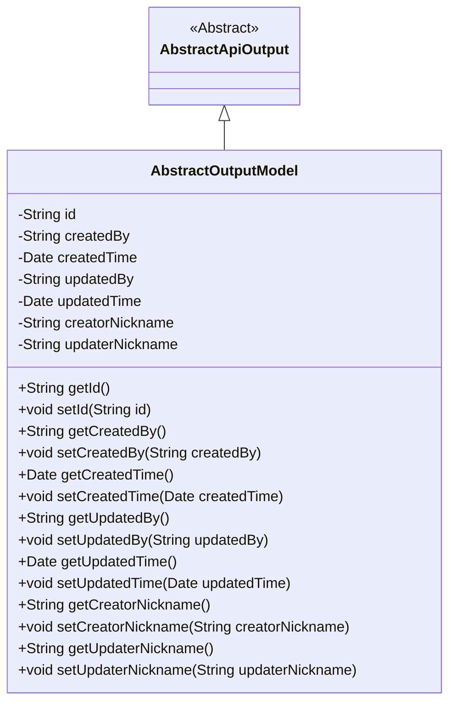

# Basic Information

|      |      |
|------|------|
| Name | AbstractOutputModel |
| Language | .java |
| Code Path | WeFe/fusion/fusion-service/src/main/java/com/welab/wefe/data/fusion/service/dto/entity/AbstractOutputModel.java |
| Package Name | com.welab.wefe.data.fusion.service.dto.entity |
| Dependencies | ['com.welab.wefe.common.fieldvalidate.annotation.Check', 'com.welab.wefe.common.web.dto.AbstractApiOutput', 'com.welab.wefe.data.fusion.service.service.CacheObjects', 'org.apache.commons.lang3.StringUtils', 'java.util.Date'] |
| Brief Description | The AbstractOutputModel class inherits from AbstractApiOutput and includes fields such as ID, creator, creation time, updater, and update time, while automatically setting the nicknames of the creator and updater. |

# Description

The `AbstractOutputModel` class inherits from `AbstractApiOutput` and includes fields such as `id`, `creator`, `creation time`, `updater`, `update time`, as well as the nicknames of the creator and updater. These attributes are managed through getter and setter methods, where setting the creator or updater automatically retrieves the nickname from the cache. If the nickname is empty, the default member name is used.

# Class Summary

| Name   | Type  | Description |
|-------|------|-------------|
| AbstractOutputModel | class | The `AbstractOutputModel` class inherits from `AbstractApiOutput` and includes fields such as ID, creator, creation time, updater, and update time, while automatically setting the nicknames of the creator and updater. |

## Class AbstractOutputModel

|      |      |
|------|------|
| Access Modifier | public |
| Type | class |
| Name | AbstractOutputModel |
| Description | The `AbstractOutputModel` class inherits from `AbstractApiOutput` and includes fields such as ID, creator, creation time, updater, and update time, while automatically setting the nicknames of the creator and updater. |

### UML Class Diagram

This code demonstrates an `AbstractOutputModel` class that inherits from `AbstractApiOutput`, primarily used for handling basic output of model data. The class contains multiple private fields such as unique identifiers, creation/update information, and related nicknames, along with corresponding getter and setter methods. Notably, the `setCreatedBy` and `setUpdatedBy` methods automatically update the corresponding nickname fields when setting values, using default member names if nicknames are empty. This design reflects considerations for data consistency and user experience.

### Internal Method Call Graph

```mermaid
graph TD
    A["Class AbstractOutputModel"]
    B["Inherits from: AbstractApiOutput"]
    C["Property: String id"]
    D["Property: String createdBy"]
    E["Property: Date createdTime"]
    F["Property: String updatedBy"]
    G["Property: Date updatedTime"]
    H["Property: @Check String creatorNickname"]
    I["Property: @Check String updaterNickname"]
    J["Method: get/set id"]
    K["Method: get/set createdBy"]
    L["Method: get/set createdTime"]
    M["Method: get/set updatedBy"]
    N["Method: get/set updatedTime"]
    O["Method: get/set creatorNickname"]
    P["Method: get/set updaterNickname"]
    Q["Logic: setCreatedBy invokes CacheObjects"]
    R["Logic: setUpdatedBy invokes CacheObjects"]

    A --> B
    A --> C
    A --> D
    A --> E
    A --> F
    A --> G
    A --> H
    A --> I
    A --> J
    A --> K
    A --> L
    A --> M
    A --> N
    A --> O
    A --> P
    K --> Q
    M --> R
```

This code defines an AbstractOutputModel class that inherits from AbstractApiOutput, containing multiple properties and their corresponding getter/setter methods. The setCreatedBy and setUpdatedBy methods invoke CacheObjects to retrieve nickname information when setting values, falling back to default member names if retrieval fails. The class primarily serves to encapsulate base fields for output models, including creation/update information and nickname fields with validation annotations.

### Field List

| Name  | Type  | Description |
|-------|-------|------|
| createdTime | Date | Creation time field, type is Date. |
| updaterNickname | String | The field `updaterNickname` is used to store the nickname of the modifier and is validated via the `@Check` annotation. |
| updatedBy | String | The field updatedBy records the information of the last modifier. |
| createdBy | String | Private string variable, records creator information. |
| updatedTime | Date | The field updatedTime is used to record the update time, with a type of Date. |
| creatorNickname | String | The field creatorNickname is used to verify the creator's nickname. |
| id | String | Private string type variable id. |

### Method List

| Name  | Type  | Description |
|-------|-------|------|
| getUpdaterNickname | String | The method to obtain the updater's nickname, which returns a nickname value of string type. |
| setCreatedBy | void | Set creator information, including ID and nickname. If the nickname is empty, the default member name will be used. |
| setId | void | Methods for setting the object ID: Assign the parameter `id` to the `id` property of the current object. |
| setUpdatedTime | void | Method to set the object update time, with the parameter being of Date type. |
| setCreatedTime | void | Method for setting object creation time, with the parameter being of Date type. |
| getCreatorNickname | String | The method to obtain the creator's nickname returns a string-type value of `creatorNickname`. |
| getCreatedBy | String | Methods to obtain creator information, returning a string-type variable `createdBy`. |
| getUpdatedTime | Date | Methods to obtain the update time, returning an updatedTime object. |
| getCreatedTime | Date | Method to get creation time, returns Date type. |
| setCreatorNickname | void | The method to set the creator's nickname assigns the parameter value to the class member variable `creatorNickname`. |
| getUpdatedBy | String | Methods to obtain the information of the updater, returning the value of the updatedBy field. |
| getId | String | The method getId returns a string-type id value. |
| setUpdatedBy | void | This method sets the updater information, including the updater ID and nickname. If the nickname is empty, the default member name will be used. |
| setUpdaterNickname | void | The method to set the updater's nickname assigns the parameter to the class member variable `updaterNickname`. |

