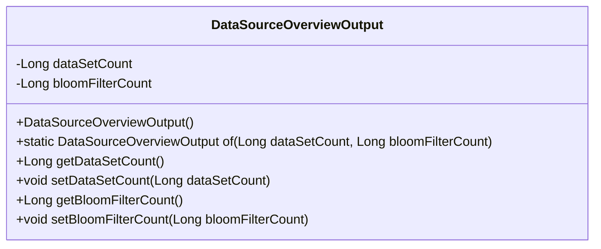
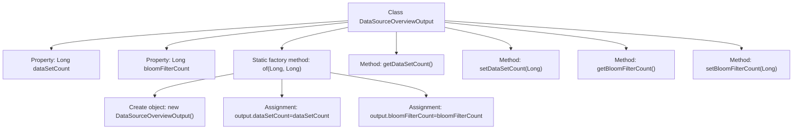

# Basic Information

|      |      |
|------|------|
| Name | DataSourceOverviewOutput |
| Language | .java |
| Code Path | WeFe/fusion/fusion-service/src/main/java/com/welab/wefe/data/fusion/service/dto/entity/DataSourceOverviewOutput.java |
| Package Name | com.welab.wefe.data.fusion.service.dto.entity |
| Dependencies | [] |
| Brief Description | The DataSourceOverviewOutput class includes dataset count and Bloom filter count attributes, providing constructor methods and getter/setter. |

# Description

The `DataSourceOverviewOutput` class is a Java class designed to encapsulate data source overview information. It contains two private `Long` type attributes: `dataSetCount` and `bloomFilterCount`, representing the dataset count and Bloom filter count, respectively. The class provides a static factory method `of` for instance creation and includes standard getter and setter methods for attribute access and modification.

# Class Summary

| Name   | Type  | Description |
|-------|------|-------------|
| DataSourceOverviewOutput | class | Java class DataSourceOverviewOutput, containing dataset count and Bloom filter count attributes, with constructor methods and getter/setter provided. |

## Class DataSourceOverviewOutput

|      |      |
|------|------|
| Access Modifier | public |
| Type | class |
| Name | DataSourceOverviewOutput |
| Description | Java class DataSourceOverviewOutput, containing dataset count and Bloom filter count attributes, with constructor methods and getter/setter provided. |

### UML Class Diagram

This code defines a class named DataSourceOverviewOutput, which encapsulates data source overview output information. The class contains two private Long-type attributes: dataSetCount (dataset count) and bloomFilterCount (Bloom filter count). It provides a static factory method of() for instance creation and standard getter/setter methods. The class diagram clearly illustrates the structure of this POJO class, including private fields, constructors, factory methods, and accessor methods.

### Internal Method Call Graph

This code defines a class named DataSourceOverviewOutput, containing two Long-type properties: dataSetCount and bloomFilterCount. The class provides a static factory method "of" for object creation and property initialization, along with standard getter and setter methods. The flowchart illustrates the class structure, properties, methods, and the internal object creation and property assignment flow within the factory method. This design pattern is commonly used for constructing immutable objects and is suitable for use as data transfer objects.

### Field List

| Name  | Type  | Description |
|-------|-------|------|
| dataSetCount | Long | Dataset count, long integer private variable. |
| bloomFilterCount | Long | Private long integer variable used for Bloom filter counting. |

### Method List

| Name  | Type  | Description |
|-------|-------|------|
| setDataSetCount | void | The method to set the number of datasets, with the parameter being the long integer dataSetCount, assigns the value to the class member variable. |
| getDataSetCount | Long | Methods for obtaining the dataset count, returns a long integer value dataSetCount. |
| of | DataSourceOverviewOutput | Create a DataSourceOverviewOutput instance, set the dataset count and Bloom filter count attributes, then return the object. |
| getBloomFilterCount | Long | Methods for obtaining the Bloom filter count value, with a return type of long integer. |
| setBloomFilterCount | void | Method to set the Bloom filter count value, with the parameter being a long integer bloomFilterCount. |

